# 个性化学习多智能体系统 — 详细设计规格说明书

| 文档版本 | 修订日期 | 修订人 | 修订说明 |
| --- | --- | --- | --- |
| V3.4 | 2026-06-18 | 团队 | 数据模型扩展：新增5.3 PostgreSQL全表设计(ER图+25张表SQL)、5.4 Redis缓存Key设计(12类)、5.5 向量存储Collections、5.6 三层存储一致性策略 |
| V3.5 | 2026-06-18 | 团队 | 修复评审发现的6项设计缺陷：①软删除与级联清理冲突（外键统一切换为 ON DELETE RESTRICT + StudentLifecycleService）；②关键事务 UPSERT 化（map_node_progress 改用 ON CONFLICT DO UPDATE）；③前端 localStorage 爆仓（map_cache / window_states 下沉 IndexedDB）；④藏宝图读路径加 Singleflight 防缓存击穿；⑤讯飞 ASR 改 Webhook 回调，释放 Agent 线程；⑥主键类型统一（levels.id 改 UUID + 唯一 slug） |

---

## 目录

- [第一部分：系统架构概览](#第一部分系统架构概览)
- [第二部分：智能体交互详细设计](#第二部分智能体交互详细设计)
  - [2.1 智能体通信架构](#21-智能体通信架构)
  - [2.2 消息协议设计](#22-消息协议设计)
  - [2.3 智能体生命周期管理](#23-智能体生命周期管理)
  - [2.4 核心协作流程](#24-核心协作流程)
  - [2.5 评审Agent审核协议](#25-评审agent审核协议)
  - [2.6 超时与降级策略](#26-超时与降级策略)
  - [2.7 用户资源注入后的Agent协作变更](#27-用户资源注入后的agent协作变更)
- [第三部分：页面交互逻辑详细设计](#第三部分页面交互逻辑详细设计)
  - [3.1 全局状态管理](#31-全局状态管理)
  - [3.2 窗口管理器](#32-窗口管理器)
  - [3.3 核心页面交互状态机](#33-核心页面交互状态机)
  - [3.4 右键菜单系统](#34-右键菜单系统)
  - [3.5 拖拽交互系统](#35-拖拽交互系统)
  - [3.6 流式渲染协议](#36-流式渲染协议)
  - [3.7 布局切换状态流转](#37-布局切换状态流转)
  - [3.8 键盘快捷键系统（含自定义）](#38-键盘快捷键系统含自定义)
  - [3.9 前端事件总线](#39-前端事件总线)
  - [3.10 用户偏好持久化](#310-用户偏好持久化)
  - [3.11 设置应用](#311-设置应用settings-app)
  - [3.12 关卡时间线外观设计](#312-关卡时间线藏宝图外观设计)
  - [3.13 AI 生成关卡的完整流程](#313-ai-生成关卡的完整流程)
  - [3.14 关卡数据格式规范](#314-关卡数据格式规范)
  - [3.15 九个核心应用窗口详细设计](#315-九个核心应用窗口详细设计)
  - [3.16 关卡主要形式与量化反馈设计](#316-关卡主要形式与量化反馈设计)
  - [3.17 讯飞生态集成（听见 ASR + 配音 TTS）](#317-讯飞生态集成听见-asr--配音-tts)
- [第四部分：接口设计](#第四部分接口设计)
  - [4.1 WebSocket 事件表](#41-websocket-事件表)
  - [4.2 REST API 端点](#42-rest-api-端点)
- [第五部分：数据模型](#第五部分数据模型)
  - [5.1 核心数据结构](#51-核心数据结构)
  - [5.2 前端本地存储（浏览器侧）](#52-前端本地存储浏览器侧)
  - [5.3 PostgreSQL 数据库设计（持久化主存储）](#53-postgresql-数据库设计持久化主存储)
  - [5.4 Redis 缓存设计（高性能读写 + 实时状态）](#54-redis-缓存设计高性能读写--实时状态)
  - [5.5 向量存储设计（Qdrant）](#55-向量存储设计qdrant)
  - [5.6 数据生命周期与一致性总结](#56-数据生命周期与一致性总结)

---

# 第一部分：系统架构概览

## 1.1 分层架构

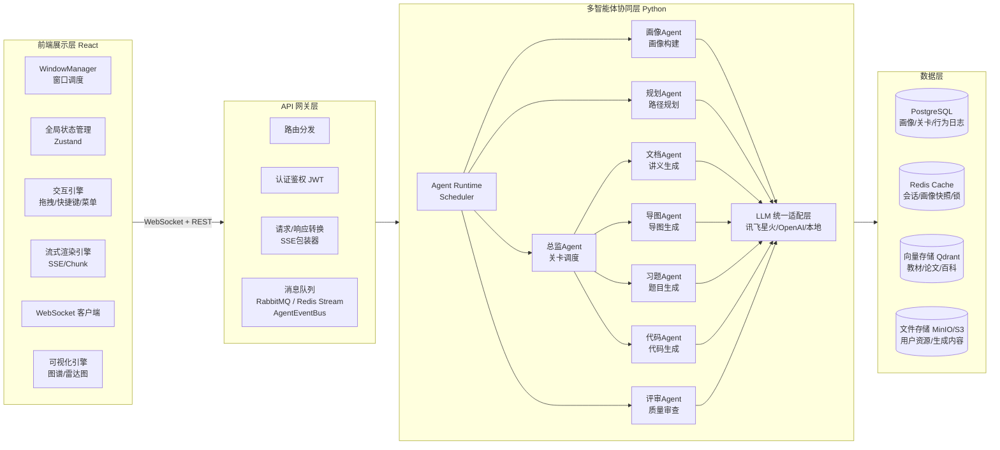

## 1.2 核心设计原则

1. **异步优先**：所有Agent间通信走消息队列，前端与后端之间走WebSocket/SSE，避免同步阻塞
2. **可观测性**：每条Agent消息都携带唯一TraceID，支持全链路追踪
3. **容错降级**：每类Agent都有超时熔断和降级方案，评审不通过可回退重试
4. **无状态Agent**：Agent实例本身无状态，上下文从消息体或Redis中加载，支持水平扩展
5. **Skill优先**：Agent能力的注册与发现基于Skill声明，调度器按Skill匹配而非按Agent类型硬编码
6. **前端局部更新**：任何交互只更新受影响的窗口状态，不刷新全页面

---

# 第二部分：智能体交互详细设计

## 2.1 智能体通信架构

### 2.1.1 通信拓扑

```
 ┌────────────────────────────────────────────────────────┐
 │              核心控制层（Master Agents）                 │
 │  ┌─────────┐    ┌─────────┐    ┌─────────┐             │
 │  │ 画像Agent│    │ 规划Agent│    │ 总监Agent│             │
 │  └────┬────┘    └────┬────┘    └────┬────┘             │
 └───────┼──────────────┼──────────────┼──────────────────┘
         │              │              │
         └──────────────┼──────────────┘
                        │ (pub/sub + rpc)
                ┌───────▼──────────────────────┐
                │     Agent Event Bus          │
                │  (RabbitMQ Topic交换器)       │
                │  routing_key = agent.type.action│
                └───────┬───────┬─────────────┘
                        │       │
 ┌──────────────────────┼───────┼─────────────────────────┐
 │              内容生成层（Sub Agents）                    │
 │  ┌─────────┐ ┌─────────┐ ┌─────────┐ ┌─────────┐      │
 │  │ 文档Agent│ │ 导图Agent│ │ 习题Agent│ │ 代码Agent│      │
 │  └────┬────┘ └────┬────┘ └────┬────┘ └────┬────┘      │
 └───────┼──────────┼──────────┼──────────┼──────────────┘
         │          │          │          │
         └──────────┴────┬─────┴──────────┘
                        │
                ┌───────▼──────────────────────┐
                │       评审Agent              │
                │    （防幻觉/安全审查）         │
                └─────────────────────────────┘

 ┌────────────────────────────────────────────────────────┐
 │              注册与发现层（Registry）                    │
 │  ┌──────────────┐ ┌──────────────┐ ┌──────────────┐    │
 │  │ Agent Registry│ │ Skill Registry│ │ MCP Tool Reg  │    │
 │  │  (Redis)      │ │  (Redis)      │ │  (Redis)      │    │
 │  └──────────────┘ └──────────────┘ └──────────────┘    │
 └────────────────────────────────────────────────────────┘

 ┌────────────────────────────────────────────────────────┐
 │            LLM 统一适配层 (LLM Gateway)                  │
 │       讯飞星火 / OpenAI / 本地模型  — 统一接口             │
 └────────────────────────────────────────────────────────┘
```

### 2.1.2 通信模式

| 模式 | 用途 | 实现 |
|------|------|------|
| **发布/订阅** | 广播事件（如"画像更新了""关卡完成"） | RabbitMQ Topic Exchange / Redis PubSub |
| **工作队列** | 任务分发（如"生成讲义""审查内容"） | RabbitMQ Work Queue + Skill匹配路由 |
| **RPC** | 同步查询（如"获取画像""查询知识库"） | RabbitMQ Direct Reply-To + 超时等待 |
| **流式推送** | 向前端推送生成进度 | WebSocket → SSE 适配层 |
| **MCP Invoke** | Agent间按MCP协议调用对方的工具 | MCP JSON-RPC over 消息队列 |

### 2.1.3 Agent 注册与发现

每个Agent启动时向 **Agent Registry**（基于Redis）注册：

```json
{
  "agent_id": "doc-agent-01",
  "agent_type": "document",
  "agent_version": "1.2.0",
  "status": "idle",
  "queue": "agent.document.work",
  "llm_model": "spark-4.0",
  "max_concurrency": 3,
  "last_heartbeat": "2026-06-18T10:00:00Z",
  "skills": ["skill.doc.generate", "skill.doc.summarize", "skill.doc.collate"],
  "mcp_tools": ["rag.query", "knowledge.retrieve", "template.render"]
}
```

- 心跳间隔：10秒，3次失联标记为下线
- 调度器根据Agent的 `skills` 和当前负载分发任务，而非按 `agent_type` 硬编码
- 支持同一技能注册多个Agent实例，实现负载均衡

### 2.1.4 Skill 技能注册机制

#### 设计目标

将Agent的能力从"按类型硬编码"升级为**按Skill声明式注册**，调度器根据任务的Skill需求动态匹配最合适的Agent。新增Agent只需注册Skill即可接入现有任务流，无需修改调度逻辑。

#### Skill 定义与注册

每个Skill遵循统一Schema，由Agent在启动时声明：

```json
{
  "skill_id": "skill.doc.generate",
  "name": "文档生成",
  "description": "根据知识点描述生成结构化Markdown讲义文档",
  "version": "1.0.0",
  "category": "content_generation",
  "tags": ["document", "markdown", "lecture"],
  "parameters": {
    "type": "object",
    "required": ["knowledge_point", "difficulty"],
    "properties": {
      "knowledge_point": { "type": "string", "description": "知识点名称" },
      "difficulty": { "type": "number", "description": "难度 0.0-1.0" },
      "style": { "type": "string", "enum": ["standard", "detailed", "concise"] }
    }
  },
  "output": {
    "type": "object",
    "properties": {
      "content": { "type": "string", "description": "Markdown格式讲义" },
      "word_count": { "type": "number" }
    }
  },
  "llm_required": true,
  "estimated_duration_ms": 8000
}
```

Agent注册Skill的伪代码：

```python
class BaseAgent:
    async def register_self(self):
        # 注册到 Agent Registry
        await agent_registry.register(agent_id, agent_type, status="idle", ...)
        # 注册所有声明的 Skill
        for skill in self.declare_skills():
            await skill_registry.register(skill)
        # 注册所有声明的 MCP Tool
        for tool in self.declare_mcp_tools():
            await mcp_tool_registry.register(tool)

class DocumentAgent(BaseAgent):
    def declare_skills(self) -> list[SkillDefinition]:
        return [
            SkillDefinition(
                skill_id="skill.doc.generate",
                name="文档生成",
                parameters={...},
                handler=self.handle_generate_doc
            ),
            SkillDefinition(
                skill_id="skill.doc.summarize",
                name="文档摘要",
                parameters={...},
                handler=self.handle_summarize
            ),
        ]
```

#### Skill 注册表数据结构

```json
// Redis Hash: skill:{skill_id}
{
  "skill_id": "skill.doc.generate",
  "name": "文档生成",
  "category": "content_generation",
  "description": "...",
  "parameters_schema": "{...}",       // JSON 序列化后的参数Schema
  "registered_agents": "[\"doc-agent-01\", \"doc-agent-02\"]",
  "total_invocations": 1247,
  "avg_duration_ms": 8200,
  "p99_duration_ms": 15000,
  "fail_rate": 0.02
}

// Redis Set: skill_category:{category}
// member = skill_id
// 用于按类别发现：列出 content_generation 类别的所有Skill
```

#### 基于Skill的任务路由

调度器不再写 `if agent_type == "document" then dispatch`，而是：

```python
class SkillBasedScheduler:
    async def dispatch(self, task: Task):
        # 1. 解析任务所需的 Skill
        required_skill = task.required_skill  # e.g. "skill.doc.generate"

        # 2. 查询 Skill 注册表，获取所有注册了该技能的 Agent
        candidates = await skill_registry.get_agents_for_skill(required_skill)

        # 3. 按负载和亲和度排序
        ranked = self.rank_by_load_and_affinity(candidates, task)

        # 4. 选择最优 Agent
        selected = ranked[0]

        # 5. 分发任务
        await self.send_to_agent(selected.agent_id, task)
```

#### 内置 Skill 清单

| Skill ID | 类别 | 描述 | 默认提供者 |
|----------|------|------|-----------|
| `skill.profile.build` | profile | 初始画像构建 | 画像Agent |
| `skill.profile.update` | profile | 画像维度更新 | 画像Agent |
| `skill.map.generate` | planning | 藏宝图生成 | 规划Agent |
| `skill.map.replan` | planning | 路径重规划 | 规划Agent |
| `skill.map.branch.sleep` | planning | 分支休眠 | 规划Agent |
| `skill.map.sprint` | planning | 突击模式路径抽取 | 规划Agent |
| `skill.level.start` | orchestration | 关卡启动与调度 | 总监Agent |
| `skill.doc.generate` | content_generation | 讲义文档生成 | 文档Agent |
| `skill.doc.summarize` | content_generation | 文档摘要 | 文档Agent |
| `skill.mindmap.generate` | content_generation | 思维导图生成 | 导图Agent |
| `skill.exercise.generate` | content_generation | 分层习题生成 | 习题Agent |
| `skill.code.generate` | content_generation | 代码/Notebook生成 | 代码Agent |
| `skill.review.content` | review | 内容审核与防幻觉 | 评审Agent |
| `skill.resource.parse` | resource | 上传文件解析与OCR | 文档Agent |
| `skill.resource.exercise` | resource | 从资料生成习题 | 习题Agent |

### 2.1.5 MCP 服务注册机制（Tool + Agent 统一暴露）

#### 设计目标

把 MCP（Model Context Protocol）定位为**统一的服务暴露协议**。在这个协议下有两类服务端点：

- **MCP Tool**：无状态、能力单一的原子操作（如"知识库检索"）
- **MCP Agent**：有状态、可维护会话的智能体服务（如"面试对话Agent"）

所有 MCP Server 都遵循同一套 JSON-RPC 2.0 调用协议，都注册到同一个 **MCP Registry**，由 **MCP Client**（内嵌在每个 Agent 中）发现并调用。这样无论调用方需要的是一个简单函数还是一个完整 Agent 能力，**调用形式完全一致**。

#### 两类 MCP Server 的差异

| 维度 | MCP Tool | MCP Agent |
|------|----------|-----------|
| 状态 | 无状态 | 有状态（维护 session / 对话历史 / 中间变量） |
| 协议方法 | `tools/call`（必选）<br>`tools/call_stream`（可选） | `tools/call`（必选）<br>`tools/call_stream`（可选）<br>`agent/resume`（恢复会话）<br>`agent/inspect`（查看状态） |
| 调用语义 | 函数式：输入→输出 | 协作式：可多轮、可中途插话、可注入上下文 |
| 注册示例 | `rag.query`、`template.render` | `interview.agent`、`tutor.agent` |
| 典型使用 | 资源生成、知识查询 | 面试陪练、互动辅导、苏格拉底引导 |

#### MCP Tool 定义

```json
{
  "server_id": "rag.query",
  "server_type": "tool",            // 必填，标识这是 Tool 类服务
  "name": "知识库检索",
  "description": "对权威知识库进行向量检索，返回最相关的N条知识片段",
  "owner_agent": "knowledge-agent-01",
  "version": "1.0.0",
  "tags": ["knowledge", "rag", "retrieval"],
  "input_schema": {
    "type": "object",
    "required": ["query", "top_k"],
    "properties": {
      "query": { "type": "string", "description": "检索查询文本" },
      "top_k": { "type": "integer", "default": 5, "maximum": 20 },
      "filter": { "type": "object", "description": "可选的元数据过滤条件" }
    }
  },
  "output_schema": {
    "type": "array",
    "items": {
      "type": "object",
      "properties": {
        "chunk_id": { "type": "string" },
        "content": { "type": "string" },
        "score": { "type": "number" },
        "source": { "type": "string" }
      }
    }
  },
  "execution": {
    "mode": "sync",
    "timeout_ms": 5000,
    "rate_limit": 100,
    "auth_required": false,
    "idempotent": true
  }
}
```

#### MCP Agent 定义

MCP Agent 是一种**有状态**的 MCP Server。除了输入输出 schema，还声明 session 管理能力。

```json
{
  "server_id": "interview.agent",
  "server_type": "agent",          // 关键差异：标识为 Agent
  "name": "AI 面试官",
  "description": "按预设岗位/难度，与学生进行多轮模拟面试，给出评分和改进建议",
  "owner_agent": "interview-agent-01",
  "version": "1.0.0",
  "tags": ["interview", "dialogue", "assessment"],

  // 启动参数：用于开启新会话
  "start_schema": {
    "type": "object",
    "required": ["student_id", "role"],
    "properties": {
      "student_id":        { "type": "string" },
      "role":              { "type": "string", "description": "目标岗位，如后端/算法/前端" },
      "difficulty":        { "type": "string", "enum": ["easy", "medium", "hard"] },
      "duration_minutes":  { "type": "integer", "default": 30 }
    }
  },
  // 启动响应：返回新会话的标识
  "start_response_schema": {
    "type": "object",
    "properties": {
      "session_id": { "type": "string" },
      "welcome":    { "type": "string", "description": "面试官的初始问候语" }
    }
  },
  // 单轮输入：用户/调用方发送的消息
  "input_schema": {
    "type": "object",
    "required": ["session_id", "message"],
    "properties": {
      "session_id": { "type": "string" },
      "message":    { "type": "string", "description": "学生回答" },
      "context":    { "type": "object", "description": "可选上下文注入" }
    }
  },
  // 单轮输出：Agent 的回复
  "output_schema": {
    "type": "object",
    "properties": {
      "reply":    { "type": "string" },
      "score":    { "type": "number", "description": "当前轮次评分 0-1" },
      "hints":    { "type": "array", "items": { "type": "string" } },
      "is_final": { "type": "boolean", "description": "是否结束面试" }
    }
  },
  // Agent 特有能力
  "agent_capabilities": {
    "supports_stream":         true,
    "supports_resume":         true,
    "supports_inspect":        true,
    "max_turns":               20,
    "max_session_ttl_minutes": 120
  },
  "execution": {
    "mode":          "stream",      // Agent 通常是流式的
    "timeout_ms":    60000,
    "rate_limit":    10,
    "auth_required": true
  }
}
```

#### MCP 调用协议

所有调用走 JSON-RPC 2.0。**Tool 与 Agent 共享 method 前缀** `tools/call`，调用方在 `params.server_id` 中指明目标。

```json
// 1. 调用 Tool（同步模式）
{
  "jsonrpc": "2.0",
  "method": "tools/call",
  "params": {
    "server_id": "rag.query",
    "arguments": {
      "query": "自注意力机制的数学定义",
      "top_k": 3
    }
  },
  "id": "req_001"
}
// 响应
{
  "jsonrpc": "2.0",
  "result": [
    {"chunk_id": "ch_001", "content": "...", "score": 0.95, "source": "教材/transformer/ch3.md"}
  ],
  "id": "req_001"
}

// 2. 调用 Tool（流式）
{
  "jsonrpc": "2.0",
  "method": "tools/call",
  "params": {
    "server_id": "chat.stream",
    "mode": "stream",
    "arguments": { "message": "解释自注意力机制", "session_id": "sess_001" }
  },
  "id": "req_002"
}
// 逐块响应
// {"jsonrpc":"2.0","result":{"chunk":"注意力机制的核心是..."},"id":"req_002"}
// {"jsonrpc":"2.0","result":{"chunk":"为每个词计算..."},"id":"req_002"}
// {"jsonrpc":"2.0","result":{"chunk":"","final":true},"id":"req_002"}

// 3. 调用 Agent（启动新会话）
{
  "jsonrpc": "2.0",
  "method": "tools/call",
  "params": {
    "server_id": "interview.agent",
    "operation": "start",           // Agent 特有：声明操作类型
    "arguments": {
      "student_id": "s1001",
      "role": "后端工程师",
      "difficulty": "medium"
    }
  },
  "id": "req_010"
}
// 响应
{
  "jsonrpc": "2.0",
  "result": {
    "session_id": "interview_sess_001",
    "welcome": "你好，我是面试官张三，今天我们来聊聊后端开发..."
  },
  "id": "req_010"
}

// 4. 调用 Agent（继续会话）
{
  "jsonrpc": "2.0",
  "method": "tools/call",
  "params": {
    "server_id": "interview.agent",
    "operation": "turn",            // 单轮交互
    "arguments": {
      "session_id": "interview_sess_001",
      "message": "请介绍一下 MySQL 的索引原理"
    }
  },
  "id": "req_011"
}

// 5. 恢复 Agent 会话（断线重连）
{
  "jsonrpc": "2.0",
  "method": "agent/resume",
  "params": {
    "server_id": "interview.agent",
    "session_id": "interview_sess_001"
  },
  "id": "req_012"
}

// 6. 查看 Agent 内部状态（调试/审查用）
{
  "jsonrpc": "2.0",
  "method": "agent/inspect",
  "params": {
    "server_id": "interview.agent",
    "session_id": "interview_sess_001"
  },
  "id": "req_013"
}
```

#### MCP Registry 数据结构

统一的注册表按 `server_type` 区分 Tool 和 Agent，但用同一份存储结构：

```json
// Redis Hash: mcp_server:{server_id}  (统一key，type在field中)
{
  "server_id":     "interview.agent",
  "server_type":   "agent",           // 关键：tool | agent
  "name":          "AI 面试官",
  "owner_agent":   "interview-agent-01",
  "input_schema":  "{...}",
  "output_schema": "{...}",
  "execution_mode":"stream",
  "timeout_ms":    60000,
  "tags":          "interview,dialogue"
}

// Redis Set: mcp_type:tool   → 所有 Tool 的 server_id
// Redis Set: mcp_type:agent  → 所有 Agent 的 server_id
// 按类型快速发现：
//   SMEMBERS mcp_type:agent → 列出所有 MCP Agent

// Redis Set: mcp_tag:{tag} → 该 tag 下所有 server_id
// 按标签发现：
//   SMEMBERS mcp_tag:interview → 找到所有与面试相关的服务
```

#### 内置 MCP Server 清单

##### MCP Tool（无状态）

| server_id | 提供者 | 模式 | 描述 |
|-----------|--------|------|------|
| `profile.query` | 画像Agent | sync | 查询当前画像快照 |
| `profile.update` | 画像Agent | sync | 推送画像更新 |
| `knowledge.retrieve` | 知识库服务 | sync | 知识库向量检索 |
| `knowledge.lookup` | 知识库服务 | sync | 按ID查询知识点详请 |
| `template.render` | 文档Agent | sync | Markdown模板渲染 |
| `code.execute` | 代码执行沙箱 | async | 安全执行用户代码并返回结果 |
| `chat.stream` | AI对话服务 | stream | 流式AI对话 |
| `file.store` | 文件服务 | async | 存储生成的文件 |
| `file.serve` | 文件服务 | sync | 提供文件下载URL |
| `mermaid.lint` | 评审Agent | sync | 对单段 mermaid 源码做语法检查，输出错误位置+修复建议（详见 2.5.3） |

##### MCP Agent（有状态）

| server_id | 提供者 | 模式 | 会话能力 | 描述 |
|-----------|--------|------|---------|------|
| `tutor.agent` | 辅导Agent | stream | 多轮答疑 | 上下文感知的个性化辅导，可中途插入讲义引用 |
| `interview.agent` | 面试Agent | stream | 模拟面试 | 多轮对话面试，自动评分与改进建议 |
| `socratic.agent` | 苏格拉底Agent | stream | 引导式提问 | 不直接给答案，通过反问引导学生思考 |
| `code_reviewer.agent` | 代码评审Agent | stream | 逐函数评审 | 接收代码段 → 给出可运行的评审反馈 |
| `language_practice.agent` | 口语陪练Agent | stream | 角色扮演 | 英语/技术名词口语对话陪练（加分项） |

#### 运行时服务发现与调用

```python
class MCPClient:
    """内嵌在每个Agent中的MCP调用客户端"""

    def __init__(self, agent_id: str):
        self.agent_id = agent_id
        self.cache = {}  # server_id → ServerDefinition

    async def discover_servers(
        self,
        server_type: str = None,        # 'tool' | 'agent' | None
        tag: str = None
    ) -> list[ServerDefinition]:
        """发现 MCP 服务"""
        return await mcp_registry.discover(
            server_type=server_type, tag=tag
        )

    async def call(self, server_id: str, arguments: dict, **opts) -> Any:
        """统一调用入口 — Tool 和 Agent 都走这个方法"""
        server_def = await self._resolve(server_id)
        if server_def.server_type == "tool":
            return await self._call_tool(server_def, arguments, **opts)
        elif server_def.server_type == "agent":
            op = opts.get("operation", "turn")  # turn | start | resume
            return await self._call_agent(server_def, op, arguments, **opts)

    async def call_stream(self, server_id: str, arguments: dict) -> AsyncIterator[dict]:
        """流式调用 — 适用于 chat.stream / tutor.agent / interview.agent"""
        server_def = await self._resolve(server_id)
        async for chunk in self._send_stream(server_def, {
            "jsonrpc": "2.0",
            "method": "tools/call",
            "params": {
                "server_id": server_id,
                "mode": "stream",
                "arguments": arguments
            }
        }):
            yield chunk
```

调用示例（调用方代码完全一致）：

```python
# 文档Agent 生成讲义时调用 Tool
chunks = await mcp_client.call("knowledge.retrieve", {
    "query": "自注意力机制", "top_k": 5
})

# 学生在讲义中划词 → 前端调用 Agent
async for chunk in mcp_client.call_stream("tutor.agent", {
    "session_id": "tutor_sess_001",
    "message": "请解释这段代码",
    "context": {"level_id": "lvl_transformer_01", "highlight": "..."}
}):
    push_to_frontend(chunk)
```

#### Skill、MCP Tool、MCP Agent 的三层关系

```
┌──────────────────────────────────────────────────────────────┐
│ 三者的层次关系：                                              │
│                                                              │
│  Skill（能力声明）  ──→  告诉调度器"我用什么能力做任务"           │
│         ↓ 实现                                               │
│  MCP Agent / Tool（实际服务）──→  对外提供可调用的服务         │
│         ↓ 调用                                               │
│  其他 Agent / 前端                                           │
└──────────────────────────────────────────────────────────────┘
```

**区别**：

| 维度 | Skill | MCP Tool | MCP Agent |
|------|-------|----------|-----------|
| 角色 | 能力声明 | 原子服务 | 智能体服务 |
| 状态 | 无 | 无 | 有 |
| 协议 | 注册到 Skill Registry | JSON-RPC `tools/call` | JSON-RPC `tools/call` + `agent/resume` |
| 消费者 | 调度器 | 其他 Agent/系统 | 其他 Agent/前端 |
| 多轮对话 | ❌ | ❌ | ✅（内置 session 机制） |

**联系**：

- 一个 Skill 的实现通常会**调用多个 MCP Server**（Tool 或 Agent）来完成工作
  e.g. `skill.doc.generate` 内部会调用 `knowledge.retrieve`(Tool) + `template.render`(Tool) + `tutor.agent`(Agent，用于审核润色)
- 一个 Agent **既注册 Skill**（供调度器派发任务），**也注册 MCP Server**（供其他 Agent 调用）
- 一个 MCP Server（无论 Tool 还是 Agent）**不注册 Skill**——它只暴露"我被调用的接口"，不参与任务调度分发

## 2.2 消息协议设计

### 2.2.1 统一消息信封

每条在Agent间传递的消息使用统一的JSON信封：

```json
{
  "header": {
    "message_id": "msg_20260618_a1b2c3d4",
    "trace_id": "trace_a1b2c3d4e5f6",
    "parent_message_id": "msg_20260618_z9y8x7w6",
    "source_agent": "planner-agent-01",
    "target_agent": "director-agent-01",
    "message_type": "request",
    "action": "level.start",
    "priority": 5,
    "ttl_ms": 60000,
    "timestamp": "2026-06-18T10:00:00.000Z"
  },
  "payload": { },
  "context": {
    "student_id": "s1001",
    "session_id": "sess_abc123",
    "level_id": "lvl_transformer_01",
    "profile_version": 3,
    "mode": "exploration"
  }
}
```

| 字段 | 说明 |
|------|------|
| `message_id` | 全局唯一消息ID (UUID v4) |
| `trace_id` | 全链路追踪ID，一次用户请求的全部分发共享同一trace_id |
| `parent_message_id` | 父消息ID，用于构建调用链 |
| `message_type` | `request` / `response` / `event` / `error` |
| `action` | 动作名称，Agent据此路由到具体处理函数 |
| `priority` | 优先级(1-10)，队列调度时高优先率先消费 |
| `ttl_ms` | 消息存活时间，超时未消费自动丢弃 |
| `context` | 跨Agent共享的上下文（学生ID、会话ID、模式等） |

### 2.2.2 消息类型定义

| 类型 | 方向 | 说明 |
|------|------|------|
| `request` | A → B | 请求B执行某个动作，B需回复response |
| `response` | B → A | 对request的执行结果回复 |
| `event` | A → Topic | 广播事件通知，无需回复 |
| `error` | 任意方向 | 错误信息，含错误码和可读描述 |

### 2.2.3 Agent间Action清单

| Action | 源Agent | 目标Agent/Skill | 说明 |
|--------|---------|-----------------|------|
| `profile.build` | 前端 | `skill.profile.build` | 请求初始画像构建 |
| `profile.update` | 事件总线 | `skill.profile.update` | 触发画像更新 |
| `profile.get` | 任意Agent | 画像Agent/MCP | RPC查询当前画像快照 |
| `map.generate` | 前端 | `skill.map.generate` | 生成初始藏宝图 |
| `map.replan` | 事件总线 | `skill.map.replan` | 触发路径重新规划 |
| `map.branch.sleep` | 前端 | `skill.map.branch.sleep` | 放弃某分支 |
| `map.branch.activate` | 前端 | `skill.map.branch.activate` | 重新激活休眠分支 |
| `map.sprint` | 前端 | `skill.map.sprint` | 发起突击模式 |
| `level.start` | 前端 | `skill.level.start` | 请求进入关卡并生成资源 |
| `level.resource.generate` | 总监Agent | `skill.doc/mindmap/exercise/code.*` | 按Skill分发资源生成任务 |
| `level.resource.review` | 总监Agent | `skill.review.content` | 请求内容审核 |
| `level.complete` | 前端 | 事件总线 | 通知关卡完成，触发后续更新 |
| `resource.upload` | 前端 | `skill.resource.parse` | 用户上传资源后通知解析 |
| `resource.bind` | 前端 | 总监Agent | 资源绑定到关卡 |
| `resource.summarize` | 前端 | `skill.doc.summarize` | 对上传文件生成摘要 |
| `resource.exercise.generate` | 前端 | `skill.resource.exercise` | 对上传文件生成习题 |

**注**：相较于V1，此清单将目标从"Agent类型"改为"Skill ID"，体现Skill优先的路由策略。调度器见不到Agent类型，只知道需要哪个Skill。

## 2.3 智能体生命周期管理

### 2.3.1 Agent状态机

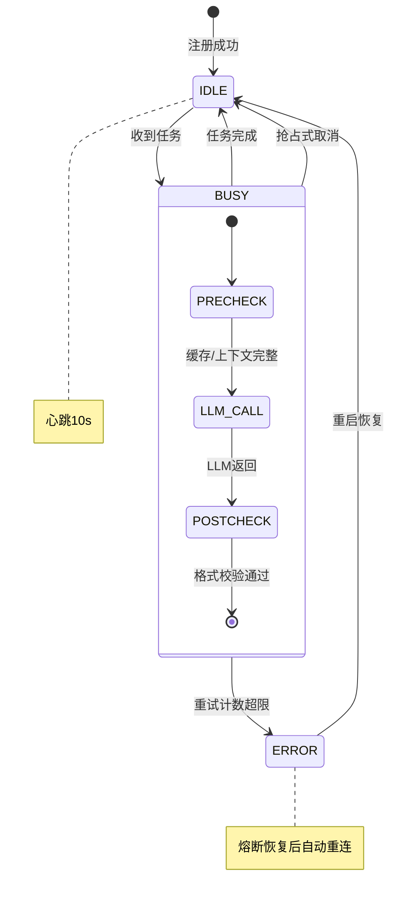

### 2.3.2 重试与熔断

| Agent类型 | 最大重试次数 | 重试间隔 | 熔断阈值 | 熔断恢复时间 |
|-----------|-------------|---------|---------|-------------|
| 文档Agent | 2次 | 指数退避(1s→3s) | 连续5次失败 | 30秒 |
| 习题Agent | 2次 | 指数退避(1s→3s) | 连续5次失败 | 30秒 |
| 代码Agent | 1次 | 2s | 连续3次失败 | 60秒 |
| 导图Agent | 2次 | 指数退避(1s→3s) | 连续5次失败 | 30秒 |
| 评审Agent | 无（幂等） | — | 连续10次失败 | 120秒 |

### 2.3.3 降级策略

当某个Agent熔断或不可用时：

| Agent | 降级方案 |
|-------|---------|
| 文档Agent | 返回知识库中的预置教材文本 + 引用列表，不做AI润色 |
| 习题Agent | 从题库中随机抽取同知识点题目 |
| 代码Agent | 返回代码模板框架 + 参考链接 |
| 导图Agent | 返回知识库预置的层级大纲文本 |
| 评审Agent | 降级为规则过滤（关键词/正则/字数校验），跳过语义审核 |

## 2.4 核心协作流程

### 2.4.1 初次登录 → 画像构建 → 藏宝图生成

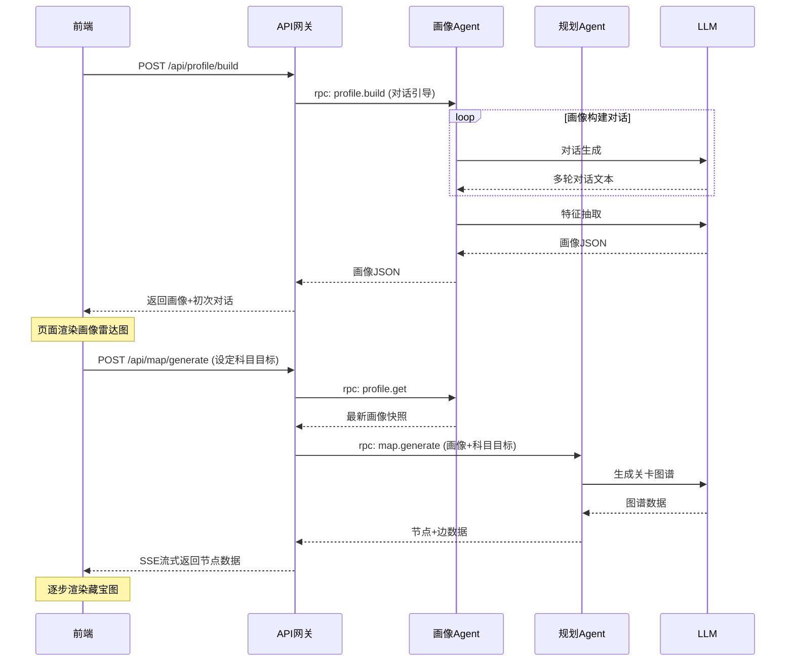

### 2.4.2 右键关卡节点 → 资源生成 → 窗口渲染（核心流程）

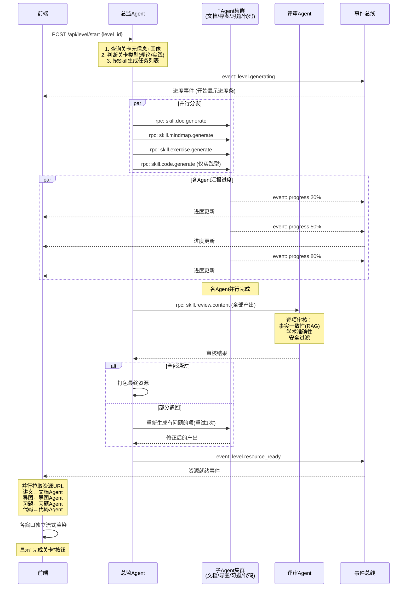

### 2.4.3 关卡完成 → 画像更新 → 藏宝图演化

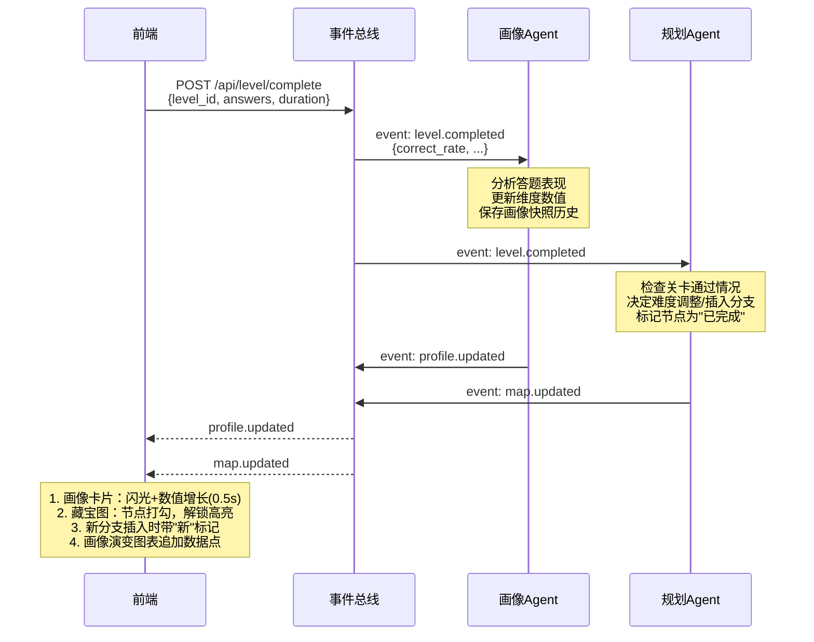

### 2.4.4 突击模式触发

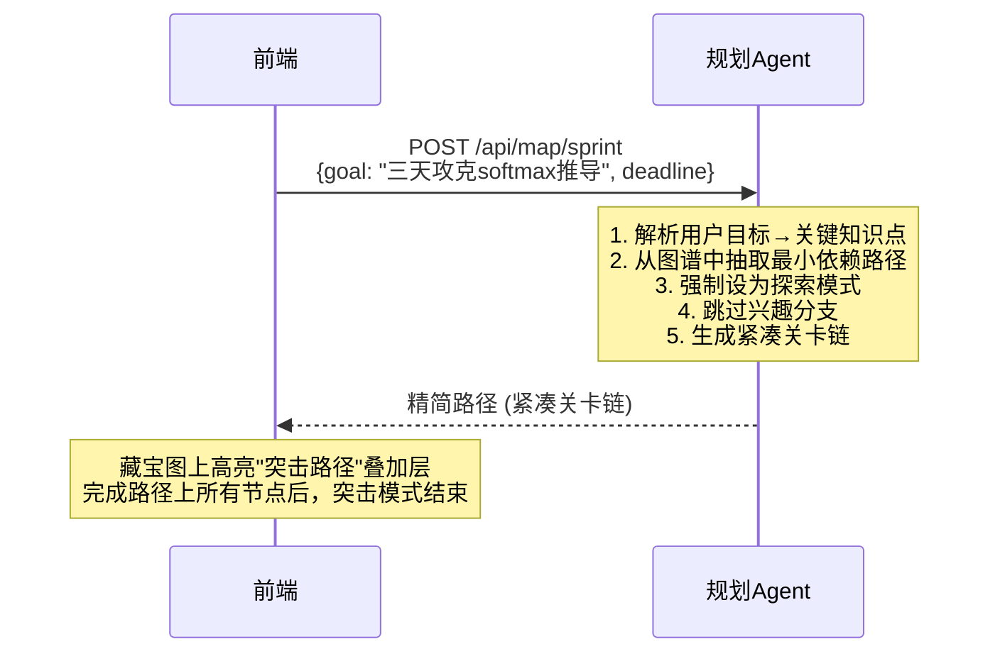

## 2.5 评审Agent审核协议

### 2.5.1 审核流程

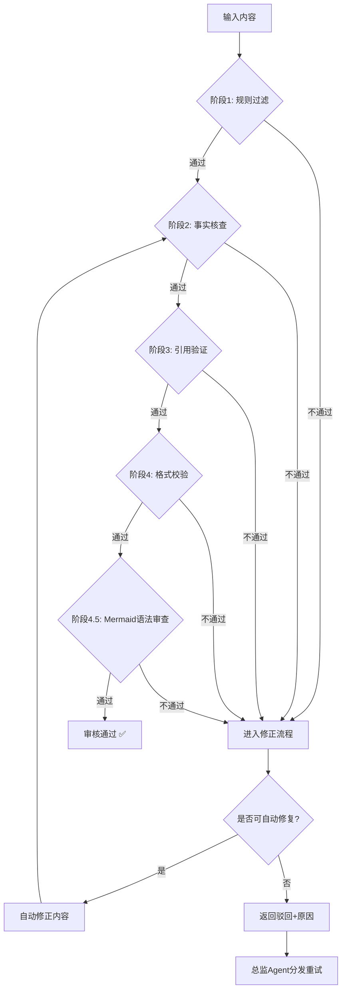

> 阶段 4.5 仅在内容包含 ```mermaid 代码块时触发；纯文本资源直接跳过。

### 2.5.2 审核结果格式

```json
{
  "review_id": "review_20260618_x1y2z3",
  "trace_id": "trace_a1b2c3d4e5f6",
  "status": "passed",
  "items": [
    {
      "item_id": "doc_001",
      "item_type": "document",
      "verdict": "pass",
      "issues": [],
      "confidence": 0.95,
      "citations": [
        {"source": "知识库/transformer/ch3.md", "content": "自注意力机制的定义..."}
      ]
    },
    {
      "item_id": "exer_003",
      "item_type": "exercise",
      "verdict": "fail",
      "issues": [
        {"severity": "error", "description": "题目答案与知识库不符", "detail": "预期B，生成答案为C"}
      ],
      "confidence": 0.3,
      "auto_fix": {
        "fixed": true,
        "changes": ["将答案从C改为B", "更新解析文本"]
      }
    }
  ],
  "summary": {
    "total": 5,
    "passed": 4,
    "auto_fixed": 1,
    "rejected": 0
  }
}
```

### 2.5.3 Mermaid 语法审查（生成式文档的必经环节）

#### 为什么需要单独的 Mermaid 审查

系统大量使用 LLM 生成 Markdown 文档，其中常常内嵌 `mermaid` 代码块。LLM 在生成时容易写出**渲染不出来的 mermaid 源码**——节点标签里带了换行 `Note over X:<br/>`、圆括号节点里嵌套了花括号、菱形 `{}` 被误用为文本容器等。这些错误在前端 GitHub/IDE 渲染时直接抛错，评委看到"parse error"会非常难堪。

因此**评审 Agent 必须在"格式校验"之后追加一道 mermaid 语法审查**，由专门的 MCP Tool 负责。

#### Mermaid 审查的 MCP Tool：`mermaid.lint`

```json
{
  "server_id": "mermaid.lint",
  "server_type": "tool",
  "name": "Mermaid 源码语法审查",
  "description": "解析一段 mermaid 源码，检测语法错误，输出错误位置和修复建议",
  "owner_agent": "review-agent-01",
  "execution_mode": "sync",
  "input_schema": {
    "type": "object",
    "required": ["source"],
    "properties": {
      "source":  { "type": "string", "description": "mermaid 代码块原文" },
      "diagram": { "type": "string", "enum": ["flowchart", "sequence", "state", "class", "er", "gantt", "auto"], "default": "auto", "description": "图类型，auto=自动推断" }
    }
  },
  "output_schema": {
    "type": "object",
    "properties": {
      "valid":      { "type": "boolean" },
      "errors":     { "type": "array", "items": { "$ref": "#/definitions/MermaidError" } },
      "warnings":   { "type": "array", "items": { "$ref": "#/definitions/MermaidError" } },
      "summary":    { "type": "string" }
    }
  }
}
```

输出 `MermaidError` 结构：

```json
{
  "line": 14,
  "column": 18,
  "severity": "error",
  "code": "BR_IN_NODE_TEXT",
  "message": "节点标签内不允许使用 <br/>，请用普通换行或换成可换行形状（如 subgraph 块）",
  "snippet": "    ALL -->|是| DONE[显示完成关卡按钮]    ALL -->",
  "fix_suggestion": "将节点 DONE[显示完成关卡按钮] 改为 DONE[显示完成关卡]  或  拆为两个独立节点"
}
```

调用示例（评审 Agent 在 review 阶段调用）：

```python
# 评审Agent 处理一个 markdown 文档
doc = get_doc_from_buffer(level_id="lvl_001")
for block in extract_mermaid_blocks(doc):
    lint_result = await mcp_client.call("mermaid.lint", {
        "source": block.source,
        "diagram": block.guessed_type
    })
    if not lint_result["valid"]:
        issues.extend([
            Issue(
                item_id=block.id,
                severity=e["severity"],
                description=e["message"],
                fix_suggestion=e["fix_suggestion"]
            )
            for e in lint_result["errors"]
        ])
```

#### 已知错误模式清单（Mermaid 编写规范）

以下为评审 Agent 长期积累的"AI 高频错模式"，会作为 lint 规则内置。生成方（无论是 LLM 还是开发者）写 mermaid 时都应规避：

| 错误码 | 触发条件 | 修复方式 |
|--------|---------|---------|
| `BR_IN_NODE_TEXT` | 节点标签 `[]` 内出现 `<br/>` | 改用 `\n` 换行，或把多行内容拆为子节点 |
| `CURLY_IN_NODE` | 节点标签 `[]` 内出现 `{` 或 `}` | 删除花括号或改用 `()` 包裹节点 |
| `DIAMOND_TEXT_MISUSE` | 用 `{...}` 写普通文字（解析器认为这是菱形判断） | 改用 `["..."]` 矩形节点 |
| `SUBGRAPH_NO_END` | `subgraph ... end` 块没闭合 | 检查并补上 `end` |
| `UNCLOSED_QUOTE` | 标签里出现成对 `"` 但解析失败 | 把 `"` 替换为 `'`，或全角 `""` |
| `INVALID_ARROW` | 使用 `-->` 之外的非法箭头语法 | 改为 `-->`, `---`, `-.->`, `==>` |
| `STATE_SYNTAX` | stateDiagram-v2 中写了 `Note over X:<br/>...` | 改用普通节点链：`X --> NOTE[内容] --> Y` |
| `SEQUENCE_ACTOR_DUP` | sequenceDiagram 重复定义 actor | 删除重复的 `participant` 行 |

#### LLM 生成 Prompt 中的强制要求

在文档生成 Agent（文档Agent、规划Agent 等）的 system prompt 中，必须注入以下规范，让 LLM **在生成时就避免错误**：

```
【Mermaid 编写铁律】
1. 节点文本严禁包含 <br/>，需要换行请直接换行（多行字符串）
2. 节点文本严禁包含 { } " 这三个字符，需要时使用全角或替换词
3. 圆角节点 ()、矩形 []、菱形 {}、六角形 {{}}、圆形 (( ))，按语义选对形状
4. 任何 subgraph 必须有配对的 end
5. 箭头只用 -->、---、-.->、==> 四种，其他不写
6. sequenceDiagram 里所有 Note 写在一行内，禁止 <br/>
7. stateDiagram 里禁止 Note over ...: 语法，改用普通节点链
8. 渲染前先在脑中模拟：把所有 <br/>、花括号、引号都删掉能否跑通
```

#### 文档生成的端到端审查流程

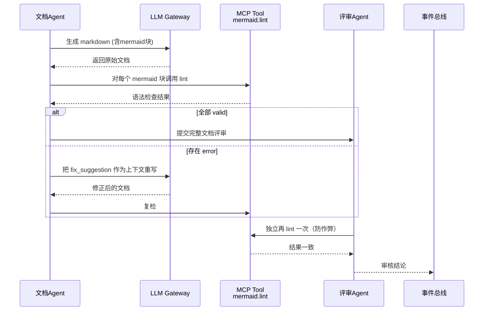

**关键设计**：
- 文档Agent **生成时**先自查，评审Agent **审查时**再查一次（独立验证）
- 评审 Agent **不直接修改文档**（如用户要求"只检测不修复"），只输出修复建议
- 修复动作由文档Agent或运维Agent根据 `fix_suggestion` 执行
- 全部通过后才允许前端展示

#### 客户端渲染保障

由于评审 Agent 负责守好"语法正确"这一关，前端在展示 AI 生成的 mermaid 块时只需做轻量兜底：

| 渲染端 | 兜底策略 |
|--------|---------|
| GitHub / IDE | 原生 mermaid 渲染，评审 Agent 已确保语法正确 |
| 自研 Web 阅读器 | 使用 mermaid.js v10+，捕获 `mermaid.parseException`，失败时降级为带"图示渲染失败，请参见上方文字描述"提示的占位块 |
| 文档打印 / 导出 PDF | 评审通过后导出，绕过客户端问题 |

## 2.6 超时与降级策略

| 场景 | 超时阈值 | 动作 |
|------|---------|------|
| 子Agent生成资源 | 15秒 | 返回当前已生成的部分，标记缺失项为"生成失败—使用预置内容" |
| 评审Agent审核 | 10秒 | 跳过语义审核，仅保留规则过滤结果 |
| 画像Agent对话回复 | 5秒 | 返回"正在思考…"占位符，继续等待（对话通道保持打开） |
| 规划Agent路径调整 | 8秒 | 退化为基于规则的简单调整（仅修改难度标记，不重新规划拓扑） |
| LLM调用 | 30秒（总时长） | 熔断，切换到备用模型或降级 |
| MCP Tool调用 | 按Tool定义（默认5秒） | 返回超时错误，调用方自行降级 |

## 2.7 用户资源注入后的Agent协作变更

当用户将"我的资源库"中的文件拖拽绑定到关卡节点后，资源生成流程发生以下变更：

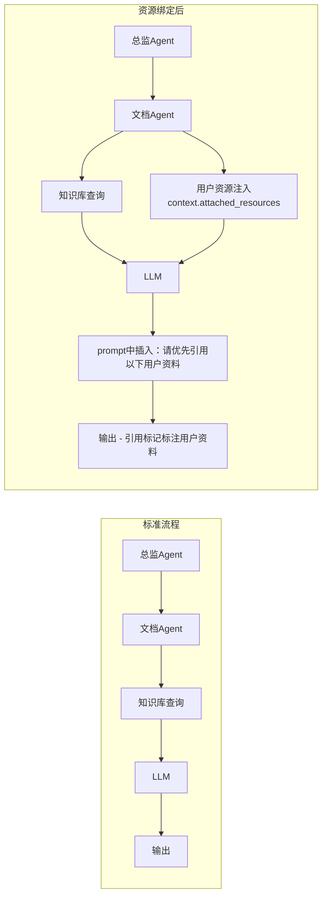

**具体变更点**：

1. **总监Agent**在创建资源生成任务时，从关卡绑定记录中查询关联资源，将文件摘要/全文片段注入到每个子Agent的 `context` 中
2. **文档Agent**：prompt中加入"用户提供了以下资料，请优先引用并基于这些资料组织讲解"，LLM输出时引用标记会标注"用户资料"
3. **习题Agent**：优先从用户资料中提取知识点出题
4. **评审Agent**：对引用用户资料的内容放宽"来源验证"要求（用户资料不在知识库中，但属于可信私域内容）

---

# 第三部分：页面交互逻辑详细设计

## 3.1 全局状态管理

使用 **Zustand** 管理前端全局状态。状态切片如下：

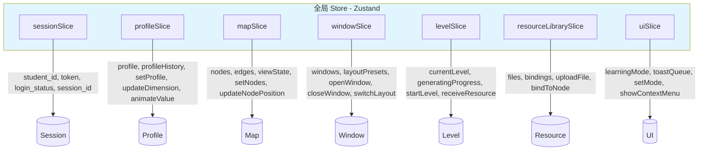

### 3.1.1 状态更新原则

1. **单向数据流**：用户操作 → dispatch action → 更新 store → React re-render
2. **局部订阅**：每个窗口订阅自己的切片，不触发全树渲染
3. **乐观更新**：拖拽节点位置先更新本地store，再异步持久化
4. **可追溯**：所有状态变更打上 timestamp，存入 action log（用于调试和回放）

## 3.2 窗口管理器（Window Manager）

### 3.2.1 窗口状态模型

```typescript
interface WindowState {
  id: string;                    // 唯一ID: 'window_doc_001'
  appId: AppId;                  // 应用标识: 'document' | 'exercise' | 'chat' | ...
  title: string;                 // 窗口标题
  position: { x: number; y: number };
  size: { width: number; height: number };
  zIndex: number;                // 层级
  minimized: boolean;            // 是否最小化
  maximized: boolean;            // 是否最大化
  contentState: Record<string, any>;  // 窗口内部状态（如翻滚位置、当前页码）
  metadata: {
    levelId?: string;            // 关联的关卡ID
    resourceId?: string;         // 关联的资源ID（如当前查看的讲义ID）
    transient?: boolean;         // 是否为临时窗口（自动关闭阈值）
  };
  // ★ 新增：置顶机制
  pinLevel: 'none' | 'normal' | 'top' | 'always';
  // none: 不置顶（默认）
  // normal: 普通层级（受其他窗口影响）
  // top: 用户置顶（始终高于普通窗口，但低于 always 置顶的系统级窗口）
  // always: 系统级置顶（AI对话浮窗等，跨布局场景都需要可见）
}

type AppId = 'treasure_map' | 'chat' | 'document' | 'exercise'
           | 'code_editor' | 'notebook' | 'mind_map'
           | 'resource_library' | 'dashboard' | 'settings';
```

### 3.2.2 窗口管理器核心逻辑

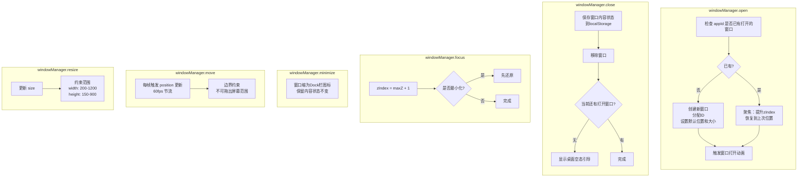

### 3.2.3 窗口层级管理

z-index 分配策略：

| 层级 | z-index 范围 | 说明 |
|------|-------------|------|
| 桌面背景 | 0 | — |
| Dock栏 | 100 | — |
| 最小化图标区域 | 200 | — |
| 普通窗口 | 1000-5000 | 每个新窗口取当前最大+10 |
| 拖拽中窗口 | +1000 | 临时提升 |
| 用户置顶窗口（normal） | 5100-5500 | 用户主动置顶（不影响 always 类） |
| 上下文菜单 | 9999 | — |
| Toast/通知 | 10000 | — |
| AI对话悬浮窗（always 系统置顶） | 11000 | 始终在最前，跨布局场景保留 |

### 3.2.4 窗口布局快照

布局快照用于"一键切换布局"功能：

```typescript
interface LayoutSnapshot {
  id: string;                    // 'reading' | 'practice' | 'coding'
  label: string;                 // '阅读模式' | '刷题模式' | '代码实验模式'
  icon: string;                  // '📖' | '✏️' | '💻'
  isCustom: boolean;             // true = 用户自定义覆盖，false = 系统预设
  windows: Array<{
    appId: AppId;
    position: { x: number; y: number };
    size: { width: number; height: number };
    metadata?: Partial<WindowState['metadata']>;
  }>;
}
```

### 3.2.5 窗口置顶机制

#### 置顶的三档语义

| 档位 | 触发方式 | 行为 | 典型用途 |
|------|---------|------|---------|
| `none` | 默认 | 受 zIndex 排序影响，可能被其他窗口遮挡 | 大多数普通窗口 |
| `normal` | 用户主动操作（点击图钉图标 / 标题栏右键 → 置顶） | 始终位于普通窗口之上，但被 `always` 系统级窗口覆盖 | 用户临时想"盯着看"的窗口，如讲义、笔记 |
| `always` | 系统设定，App 注册时声明 | 跨布局场景也保留，不会被布局切换隐藏 | AI 对话悬浮窗（学习时常驻） |

#### 视觉标识

```
┌──────────────────────────────┐
│ 📖 自注意力机制 [📌 已置顶]    │   ← 标题栏出现图钉徽章
├──────────────────────────────┤
│   ...讲义内容...             │
└──────────────────────────────┘
```

- **未置顶**：标题栏无特殊标记
- **normal 置顶**：标题栏左侧出现 📌 图标（蓝色填充）
- **always 系统置顶**：标题栏左侧出现 🔒 锁定图标（灰色，不可手动解除）

#### 交互入口

**方式 A：标题栏右键菜单**

```
┌──────────────────┐
│ 📌 置顶窗口       │
│ 📍 取消置顶       │  ← 当前已置顶时显示
│ ─────────        │
│ ⬜ 最小化         │
│ ⬛ 最大化         │
│ ❌ 关闭窗口       │
└──────────────────┘
```

**方式 B：标题栏左侧"图钉"图标**（默认隐藏，悬停标题栏时显示）

**方式 C：命令面板**（`Ctrl+Shift+P`）→ 输入"置顶：当前窗口"

#### zIndex 重排算法

每次窗口聚焦事件 / 置顶状态变化 / 布局切换时触发：

```typescript
function reorderZIndex(windows: WindowState[]): WindowState[] {
  // 1. 分桶
  const buckets = {
    always: [],     // always 置顶
    topUser: [],    // 用户置顶
    normal: []      // 普通窗口
  };

  for (const w of windows) {
    if (w.pinLevel === 'always') buckets.always.push(w);
    else if (w.pinLevel === 'top') buckets.topUser.push(w);
    else buckets.normal.push(w);
  }

  // 2. 桶内按 zIndex 升序
  for (const key of Object.keys(buckets)) {
    buckets[key].sort((a, b) => a.zIndex - b.zIndex);
  }

  // 3. 桶间分配基础 zIndex
  const result: WindowState[] = [];
  let base = 1000;

  for (const w of buckets.normal) {
    result.push({ ...w, zIndex: base++ });
  }
  for (const w of buckets.topUser) {
    result.push({ ...w, zIndex: 5100 + (base++ - 1000) });  // 5100-5500
  }
  for (const w of buckets.always) {
    result.push({ ...w, zIndex: 11000 });  // always 类统一最高层
  }

  return result;
}
```

#### 置顶与布局切换的交互

布局切换时会重新打开 / 移动窗口，置顶状态需要保留：

```
用户切换到阅读模式：
  1. 读取阅读模式快照
  2. 关闭不在快照中的窗口（保留置顶状态到 localStorage）
  3. 按快照创建/移动窗口
  4. 对每个目标窗口应用之前保存的 pinLevel
     → 如果当前是"置顶讲义 + 切到刷题模式"，讲义依然置顶
```

#### 置顶状态持久化

```typescript
// 用户偏好中新增
interface UserPreferences {
  // ...
  windowPinStates: {
    [windowId: string]: 'none' | 'normal' | 'top';
  };
}
```

- 仅 `none` 和 `normal` 用户可控，`always` 由系统决定不可改
- 持久化到 `localStorage.window_pin_states` + 后端同步
- "重置所有偏好"按钮也会清空此字段

#### 与快捷键系统联动

- 系统快捷键 `shortcut.window.pin`（默认 `Ctrl+Shift+P` …… 但已被命令面板占用，改为 `Ctrl+.`）→ 切换当前聚焦窗口的置顶状态
- 用户可在快捷键设置中改绑此快捷键

#### 与状态机集成

扩展 `window.focused` 事件 payload：

```typescript
interface WindowFocusedEvent {
  windowId: string;
  pinLevel: PinLevel;
  // 如果是用户置顶窗口被聚焦，不触发 zIndex 重新分配（避免覆盖用户意图）
  preserveTopOrder: boolean;
}
```

## 3.3 核心页面交互状态机

### 3.3.1 桌面主界面状态机

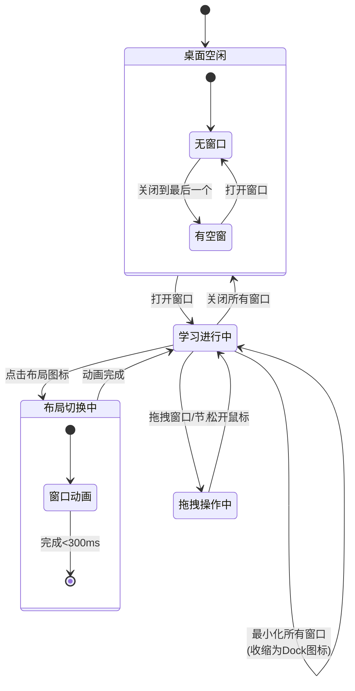

### 3.3.2 资源生成状态机（关键交互）

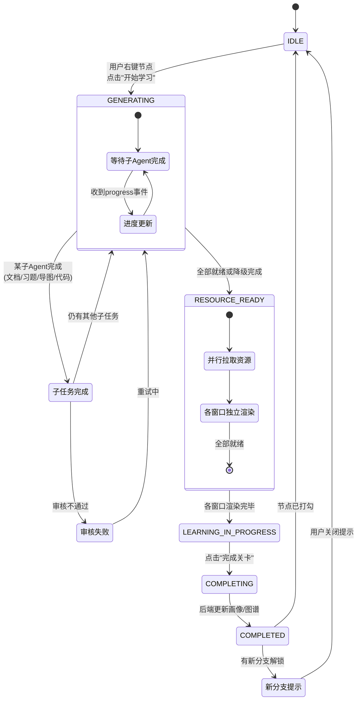

### 3.3.3 藏宝图交互状态机

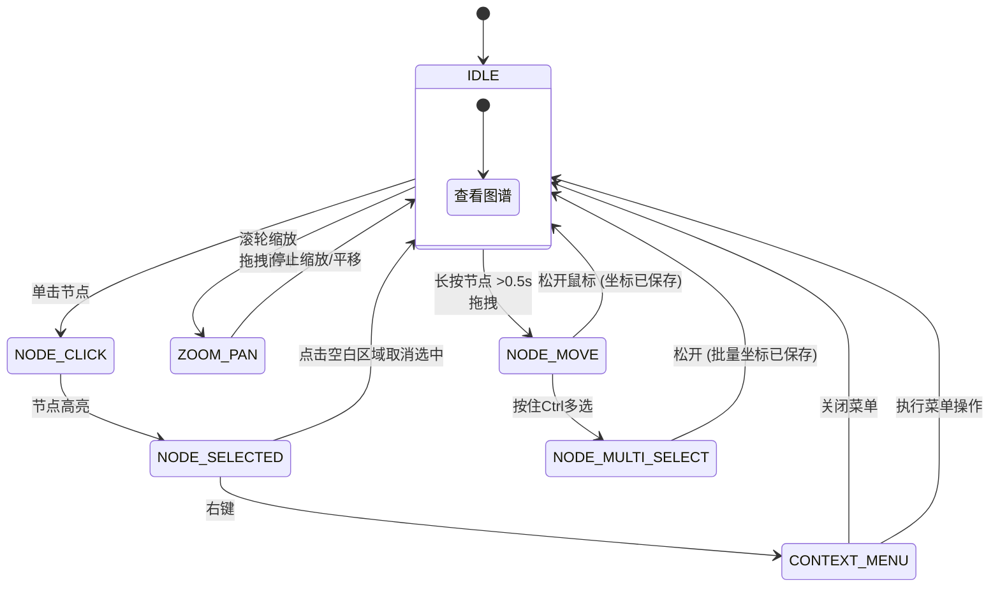

## 3.4 右键菜单系统

### 3.4.1 菜单数据模型

```typescript
interface ContextMenuState {
  visible: boolean;
  position: { x: number; y: number };
  items: ContextMenuItem[];
  targetType: 'map_node' | 'file' | 'text_selection' | 'window_title';
  targetId: string | null;
}

type ContextMenuItem = SeparatorItem | ActionItem | SubmenuItem;

interface ActionItem {
  type: 'action';
  label: string;
  icon?: string;
  shortcut?: string;         // 快捷键显示
  disabled?: boolean;
  action: () => void;
  danger?: boolean;          // 危险操作用红色
}

interface SeparatorItem {
  type: 'separator';
}

interface SubmenuItem {
  type: 'submenu';
  label: string;
  icon?: string;
  items: ContextMenuItem[];
}
```

### 3.4.2 各场景右键菜单

**藏宝图节点右键**：
```
┌──────────────────────────┐
│ 📖 开始学习               │
├──────────────────────────┤
│ ⭐ 标记为重点              │
│ 🏷️ 添加到今日计划          │
├──────────────────────────┤
│ 📄 查看详情               │
│ 💤 放弃此分支     (兴趣分支)│
│ 🔄 重新激活分支  (休眠节点) │
├──────────────────────────┤
│ 📎 关联资源...             │
└──────────────────────────┘
```

**我的资源库 - 文件右键**：
```
┌──────────────────────────┐
│ 📂 关联到关卡...           │
├──────────────────────────┤
│ 📝 生成该文件的习题        │
│ 📋 总结该文件内容          │
├──────────────────────────┤
│ 🏷️ 编辑标签               │
│ ❌ 删除文件       (红色)   │
└──────────────────────────┘
```

**文本选中后右键（任意窗口内）**：
```
┌──────────────────────────┐
│ 🤖 问AI: 解释选中内容     │
│ 🤖 问AI: 生成图解         │
│ 🤖 问AI: 提供相似例题     │
├──────────────────────────┤
│ 📝 添加到笔记             │
│ 📌 高亮/标注               │
└──────────────────────────┘
```

### 3.4.3 右键菜单触发与关闭

```
触发：
  → 节点上 contextmenu 事件（原生右键）
  → 阻止默认浏览器菜单
  → 计算菜单位置（考虑视口边界，自动调整方向）
  → 设置 visible=true, 渲染菜单

关闭：
  → 点击菜单项 → 执行 action → visible=false
  → 点击菜单外部区域 → visible=false
  → 按 Escape → visible=false
  → 再次右键 → 旧菜单关闭，新菜单弹出
```

## 3.5 拖拽交互系统

### 3.5.1 三类拖拽场景

| 场景 | 触发 | 行为 | 关联数据 |
|------|------|------|---------|
| **窗口拖拽** | 拖拽窗口标题栏 | 移动窗口位置 | windowSlice.moveWindow() |
| **节点拖拽** | 长按藏宝图节点>0.5s后拖动 | 改变节点视觉坐标 | mapSlice.updateNodePosition() |
| **资源绑定** | 从资源库拖拽文件到藏宝图节点 | 建立绑定关系 | resourceLibrarySlice.bindToNode() |

### 3.5.2 节点拖拽实现细节

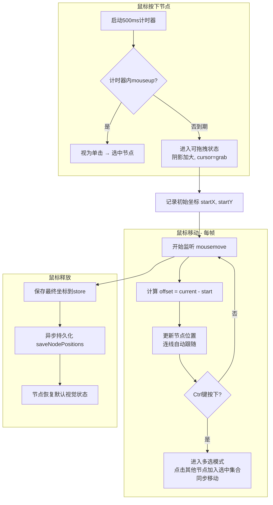

### 3.5.3 资源绑定拖拽实现细节

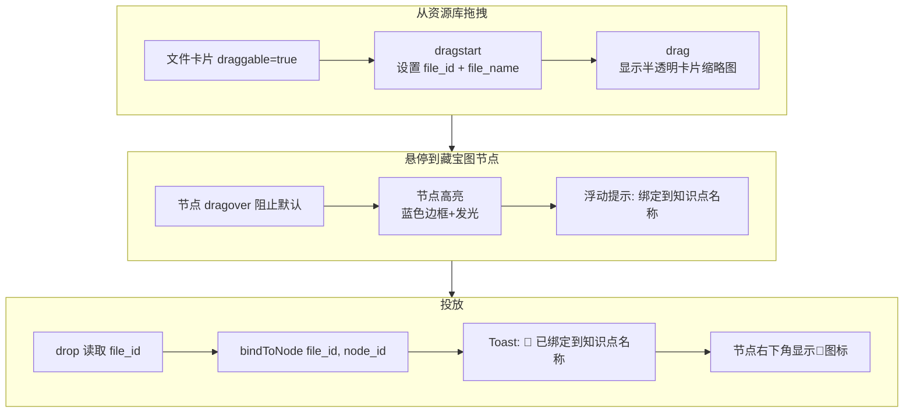

### 3.5.4 拖拽边界与性能

```
边界约束：
  节点拖拽：不可超出画布边界（留20px内边距）
  窗口拖拽：窗口至少保留标题栏在屏幕可见范围内
  多选拖拽：以选中集合的包围盒为整体施加边界约束

性能优化：
  - 拖拽中使用 transform: translate(X, Y) 而非修改 left/top
  - mousemove 事件用 requestAnimationFrame 节流
  - 拖拽结束前不触发 store 持久化（仅在 mouseup 时写入）
```

## 3.6 流式渲染协议

### 3.6.1 WebSocket 事件通道

```
WebSocket 连接路径: /ws/student/{student_id}

消息格式 (所有消息遵循统一信封):
{
  "type": "event_type",
  "trace_id": "trace_xxx",
  "payload": { },
  "timestamp": "2026-06-18T10:00:00.000Z"
}
```

### 3.6.2 资源生成事件流

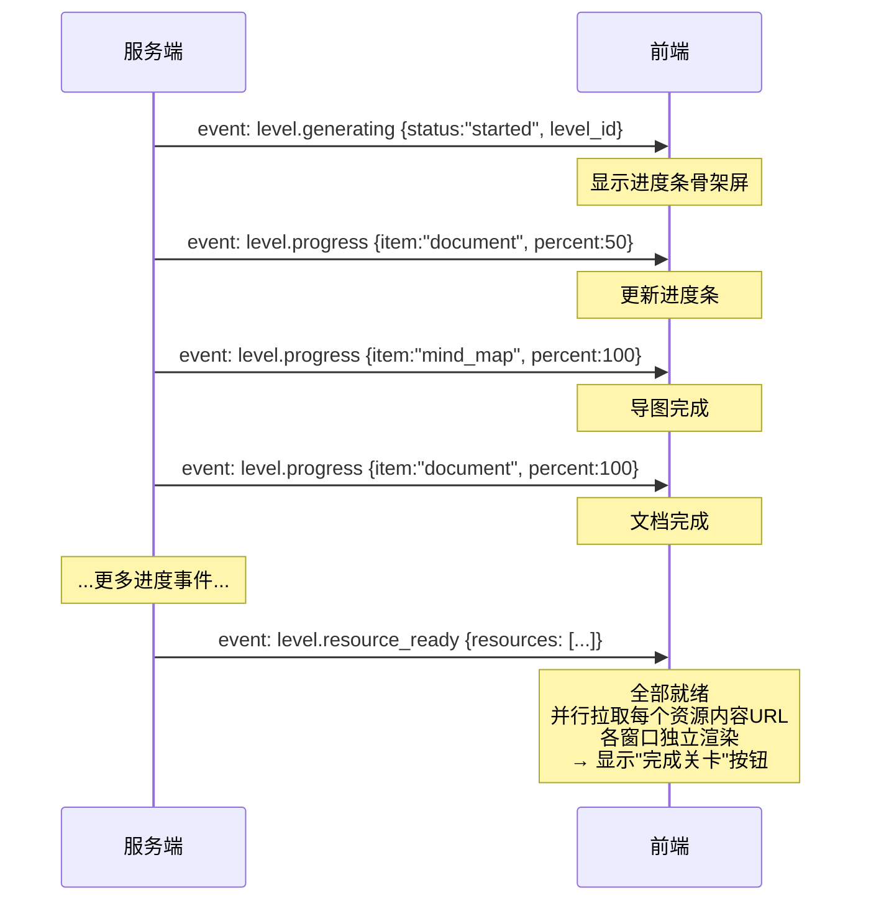

### 3.6.3 AI对话流式输出

AI对话通过独立的 WebSocket 或 SSE 通道：

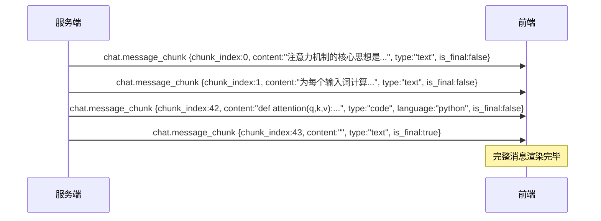

### 3.6.4 流式渲染管线

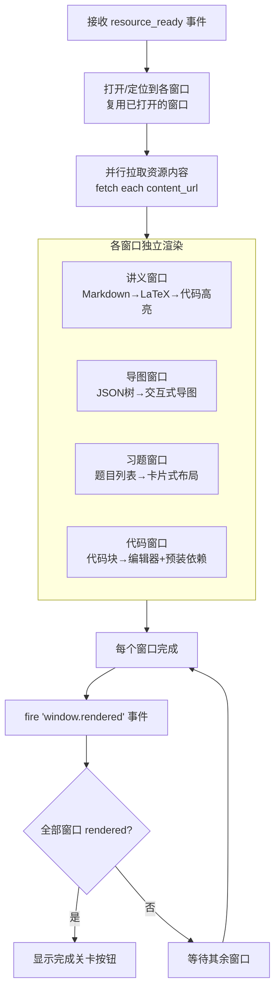

## 3.7 布局切换状态流转

### 3.7.1 切换流程

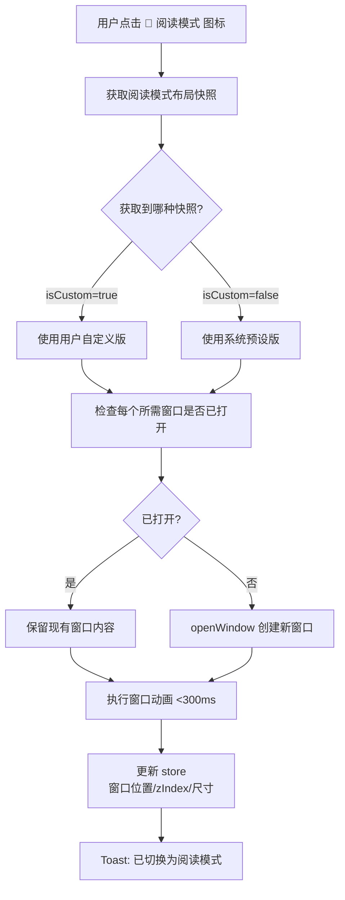

### 3.7.2 自定义保存流程

```mermaid
flowchart TD
    HOLD[用户长按 📖 图标]

    T0[0ms: 开始计时]
    T300[300ms: 图标周围出现环形进度反馈]
    T1500[1500ms: 环形进度80%<br/>图标轻微震动]
    T2000[2000ms: 计时到期]

    HOLD --> T0 --> T300 --> T1500 --> T2000

    T2000 --> DIALOG[弹出确认框<br/>是否将当前布局保存为阅读模式？]

    DIALOG --> YES{点击?}
    YES -->|是| SAVE[读取当前所有窗口<br/>appId, position, size]
    SAVE --> OVERWRITE[覆盖 localStorage 中的快照<br/>isCustom = true]
    OVERWRITE --> TOAST[Toast: ✅ 阅读模式已更新]

    YES -->|否| CANCEL[关闭确认框<br/>不做修改]
    YES -->|Escape| CANCEL
```

### 3.7.3 布局切换与窗口内容的隔离

```
重要原则：布局切换只改变窗口的位置和尺寸，不改变窗口内部内容。

实现方式：
  - 窗口组件的 key 使用 appId + levelId 复合键（如 "document|transformer_01"）
  - 布局切换只触发 position/size props 变更
  - 窗口内部 contentState 保持在 store 中，切换时复用

示例：
  用户在"transformer_01"关卡的讲义中翻到第5页
  → contentState: {document|transformer_01: {scrollY: 2400, currentPage: 5}}
  → 切换到阅读模式 → 讲义窗口移到左侧
  → 内容仍然在第5页，scrollY=2400
  → 再切换回刷题模式 → 讲义窗口回到原来的位置和大小
  → 内容还是第5页（进度不丢失）
```

## 3.8 键盘快捷键系统（含自定义）

### 3.8.1 快捷键注册机制

```typescript
// 系统出厂快捷键（只读，用户不能改逻辑，只能改绑定）
interface SystemShortcut {
  id: string;                  // 'shortcut.ai.chat', 'shortcut.layout.reading'
  action: string;              // 调用的 action id，如 'open_chat', 'switch_layout:reading'
  defaultBinding: KeyCombo;    // 系统默认绑定
  label: string;               // '唤起AI对话'
  category: string;            // 'AI 助手' | '布局' | '编辑' | '窗口' | '系统'
  scope: string;               // 'global' | 'treasure_map' | 'code_editor' | ...
  enabled: () => boolean;
  customizable: boolean;       // true=允许改键，false=锁定（如 Ctrl+W 关闭窗口）
}

// 用户自定义覆盖
interface UserShortcutOverride {
  shortcutId: string;          // 对应 SystemShortcut.id
  customBinding: KeyCombo | null;  // null 表示禁用该快捷键
  updatedAt: string;
}

// 键盘组合的规范化表示
interface KeyCombo {
  key: string;                 // 'k', 'Enter', 'F1', 'ArrowUp', '?'
  ctrl: boolean;
  meta: boolean;               // macOS 的 Cmd
  alt: boolean;
  shift: boolean;
  // 显示形式
  display: string;             // 'Ctrl+K', '⌘+K', 'Ctrl+Shift+F'
}
```

### 3.8.2 系统出厂快捷键清单

| 快捷键 id | 默认绑定 | 作用域 | 功能 | 可改键 |
|-----------|---------|--------|------|--------|
| `shortcut.ai.chat` | `Ctrl+K` | global | 唤起AI对话悬浮窗 | ✅ |
| `shortcut.layout.reading` | `Ctrl+1` | global | 切换阅读模式 | ✅ |
| `shortcut.layout.practice` | `Ctrl+2` | global | 切换刷题模式 | ✅ |
| `shortcut.layout.coding` | `Ctrl+3` | global | 切换代码实验模式 | ✅ |
| `shortcut.layout.cycle` | `Ctrl+Tab` | global | 循环切换布局 | ✅ |
| `shortcut.notebook.save` | `Ctrl+S` | notebook | 保存当前笔记 | ✅ |
| `shortcut.search.in_window` | `Ctrl+F` | global | 当前窗口内搜索 | ✅ |
| `shortcut.search.global` | `Ctrl+Shift+F` | global | 全局搜索 | ✅ |
| `shortcut.notebook.undo` | `Ctrl+Z` | notebook | 撤销笔记编辑 | ✅ |
| `shortcut.exercise.submit` | `Ctrl+Enter` | exercise | 提交当前习题答案 | ✅ |
| `shortcut.code.run` | `Ctrl+Enter` | code_editor | 运行代码 | ✅ |
| `shortcut.dialog.close` | `Escape` | global | 关闭顶层弹窗/菜单 | ✅ |
| `shortcut.help.shortcuts` | `?` | global | 打开快捷键帮助面板 | ✅ |
| `shortcut.window.close` | `Ctrl+W` | window | 关闭当前窗口 | ✅ |
| `shortcut.treemap.undo_move` | `Ctrl+Shift+Z` | treasure_map | 撤销节点移动 | ✅ |
| `shortcut.treemap.search` | `Ctrl+F` | treasure_map | 藏宝图内搜索节点名 | ✅ |
| `shortcut.app.settings` | `Ctrl+,` | global | 打开设置应用 | ✅ |
| `shortcut.command_palette` | `Ctrl+Shift+P` | global | 打开命令面板 | ✅ |

### 3.8.3 作用域管理

```
快捷键的"作用域"决定了哪些快捷键在当前上下文中生效：

global (始终有效) → 所有 scope='global' 的快捷键

当藏宝图窗口聚焦时 → global + treasure_map 作用域
  - 新增：Ctrl+F (藏宝图内搜索)
  - 新增：Ctrl+Shift+Z (撤销节点移动)
  - 行为变更：Ctrl+F 在其他窗口是"当前窗口内搜索"

当代码编辑器聚焦时 → global + code_editor 作用域
  - 行为变更：Ctrl+Enter 在编辑器是"运行代码"
  - 行为变更：Ctrl+S 在编辑器是"保存代码"

作用域优先级：当前聚焦窗口 > 全局
冲突时按"更具体的作用域 > 更通用的作用域"取用
```

### 3.8.4 快捷键自定义流程

#### 触发方式
- **方式A**：在设置应用 → 快捷键页 改（详见 3.11 设置应用）
- **方式B**：命令面板（`Ctrl+Shift+P`）→ 输入"快捷键: 修改..."
- **方式C**：快捷键帮助面板（`?`）→ 点击任意快捷键 → 弹出"重新绑定"入口

#### 单个快捷键的修改交互

```mermaid
sequenceDiagram
    participant U as 用户
    participant SK as ShortcutPanel
    participant DB as 快捷键设置
    participant TC as TestCatcher
    participant ST as ShortcutStore

    U->>SK: 点击某条快捷键的"修改"按钮
    SK->>DB: 进入"录制中"状态
    SK->>U: 显示提示"请按新快捷键，Esc 取消"

    U->>TC: 按下 Ctrl+D
    TC->>TC: 解析按键 = Ctrl+D

    alt Esc 取消
        U->>TC: 按 Esc
        TC->>SK: 取消
    else 无冲突
        TC->>DB: 提议 Ctrl+D
        DB->>DB: 冲突检查：未占用
        DB->>U: 提示"将改为 Ctrl+D，确定？"
        U->>DB: 确认
        DB->>ST: save(customBinding={key:d, ctrl:true})
        ST->>SK: 关闭面板
    else 已被占用
        TC->>DB: 提议 Ctrl+K
        DB->>DB: 冲突检查：被 ai.chat 占用
        DB->>U: 提示"与「唤起AI对话」冲突"
        DB->>U: 提供两个选项<br/>[1] 替换并禁用原快捷键<br/>[2] 重新选择
    end
```

#### 冲突检测规则

```typescript
// 冲突类型
enum ConflictType {
  NONE,                       // 无冲突
  SAME_ACTION_DIFFERENT_KEY,  // 同一 action 被绑了两次
  DIFFERENT_ACTION_SAME_KEY,  // 不同 action 抢同一个键
  RESERVED,                   // 系统保留键（Ctrl+Alt+Del 等）
  SCOPE_OVERLAP               // 同作用域内冲突
}

function detectConflict(newBinding: KeyCombo, current: SystemShortcut[]): ConflictType {
  // 1. 保留键检查
  if (isReserved(newBinding)) return ConflictType.RESERVED;

  // 2. 查找同 key+modifiers 的其他快捷键
  const collide = current.find(s =>
    s.id !== this.id &&
    s.customBinding?.equals(newBinding) ||
    s.defaultBinding?.equals(newBinding)
  );
  if (collide) return ConflictType.DIFFERENT_ACTION_SAME_KEY;

  return ConflictType.NONE;
}
```

#### 持久化

```typescript
interface ShortcutPreferences {
  version: 1;
  overrides: {
    [shortcutId: string]: {
      customBinding: KeyCombo | null;   // null = 显式禁用
      updatedAt: string;
    }
  };
  presets: {                              // 用户可保存多套预设
    name: string;
    overrides: ShortcutPreferences['overrides'];
  }[];
  activePreset: string;                   // 'default' | 自定义
}
```

存储位置：`localStorage.shortcut_prefs` + 后端 `user.shortcut_prefs`（多端同步）。

#### 快捷键预设的导入导出

```
导出：菜单"快捷键 → 导出预设" → 生成 JSON 文件
导入：菜单"快捷键 → 导入预设" → 选择 JSON 文件
      → 弹出"覆盖当前"或"另存为新预设"
```

### 3.8.5 命令面板

`Ctrl+Shift+P` 唤起命令面板，提供模糊搜索 + 键盘派发一切可执行操作：

```
┌────────────────────────────────────────────────┐
│ 🔍 输入命令…                                     │
├────────────────────────────────────────────────┤
│ ⭐ 学习模式：切换为精通模式                      │
│ 📖 布局：切换为阅读模式       (Ctrl+1)            │
│ ✏️ 布局：切换为刷题模式       (Ctrl+2)            │
│ 💻 布局：切换为代码实验模式   (Ctrl+3)            │
│ 🗺️ 打开：藏宝图                                │
│ 🤖 打开：AI对话                 (Ctrl+K)         │
│ 📚 打开：我的资源库                              │
│ 📊 打开：学习仪表盘                              │
│ ⚙️ 打开：设置                   (Ctrl+,)         │
│ 🔄 重新生成当前关卡资源                          │
│ 🧹 关闭所有窗口                                 │
│ 📥 导出当前布局快照                              │
│ 🔁 重置所有偏好                                  │
└────────────────────────────────────────────────┘
```

命令注册表（与应用层动作解耦）：

```typescript
interface Command {
  id: string;                  // 'cmd.layout.reading'
  label: string;               // '布局：切换为阅读模式'
  category: string;            // '布局' | '学习' | '视图' | '设置'
  icon?: string;
  shortcutId?: string;         // 关联的系统快捷键（如有）
  action: (ctx) => Promise<void>;
  when?: () => boolean;        // 启用条件
  keywords: string[];          // 模糊搜索关键词
}
```

## 3.9 前端事件总线

### 3.9.1 事件列表

| 事件名 | 触发者 | 消费者 | 说明 |
|--------|--------|--------|------|
| `window.opened` | WindowManager | 各窗口订阅者 | 窗口打开时广播 |
| `window.closed` | WindowManager | 各窗口订阅者 | 窗口关闭时广播 |
| `window.focused` | WindowManager | 快捷键系统 | 聚焦窗口变更时更新快捷键作用域 |
| `layout.changed` | WindowManager | 动画系统 | 布局切换完成时广播 |
| `level.started` | levelSlice | 资源渲染引擎 | 开始生成关卡资源 |
| `level.progress` | WebSocket | 进度条组件 | 资源生成进度更新 |
| `level.ready` | WebSocket | 窗口渲染系统 | 资源就绪，开始填充内容 |
| `level.completed` | levelSlice | 画像更新监听器 | 关卡完成触发后续更新 |
| `profile.updated` | WebSocket | 画像卡片组件 | 画像变更后触发动画 |
| `profile.animated` | 画像卡片 | — | 动画完成后触发（供测试用） |
| `map.updated` | WebSocket | 藏宝图组件 | 图谱变更后触发重绘 |
| `map.node.moved` | 藏宝图组件 | 持久化服务 | 节点位置变更后触发保存 |
| `resource.bound` | resourceLibrarySlice | 藏宝图组件 | 资源绑定后更新节点图标 |
| `mode.changed` | uiSlice | 全局组件 | 学习模式切换后广播 |
| `shortcut.triggered` | 快捷键系统 | 帮助面板 | 快捷键触发时记录（用于帮助面板高亮） |

### 3.9.2 事件总线接口

```typescript
// 使用 mitt 实现轻量级事件总线
import mitt from 'mitt';

type Events = {
  'window.opened': WindowState;
  'window.closed': { windowId: string };
  'layout.changed': LayoutSnapshot;
  'level.progress': { levelId: string; item: string; percent: number };
  'profile.updated': Profile;
  'map.updated': { nodes: LevelNode[]; edges: Edge[] };
  'mode.changed': 'exploration' | 'proficiency';
  // ... (其余事件)
};

const eventBus = mitt<Events>();

// 发布
eventBus.emit('level.progress', { levelId: 'lvl_001', item: 'document', percent: 100 });

// 订阅
eventBus.on('level.progress', (data) => { /* 更新进度条 */ });

// 取消订阅
eventBus.off('level.progress', handler);
```

## 3.10 用户偏好持久化

系统自动记录的用户偏好数据存放在 `localStorage`：

```typescript
interface UserPreferences {
  version: 2;                                // 数据版本号（用于迁移）
  // 窗口布局偏好：学习模式窗口组合
  windowPreferences: {
    [theoryLevelAutoOpen]: {
      document: true,
      mind_map: false,                        // 用户连续关闭导图3次 → 默认不开
      exercise: true
    },
    [practiceLevelAutoOpen]: {
      document: true,
      code_editor: true,
      terminal: true
    }
  };
  // 窗口位置记忆
  windowPositions: {
    [windowId: string]: { width, height, x, y }
  };
  // 自定义布局快照
  customLayouts: {
    [layoutId: string]: LayoutSnapshot
  };
  // 学习模式记忆
  lastLearningMode: 'exploration' | 'proficiency';
  // 其他设置
  settings: {
    fontSize: 14,
    theme: 'light',
    autoSaveInterval: 30,
    showProfileAnimation: true
  };
}
```

## 3.11 设置应用（Settings App）

设置应用是 **第 10 个核心应用窗口**，负责管理系统级与个人级的所有可配置项，避免散落在各个组件中的"小齿轮"难以维护。

### 3.11.1 应用形态

- **窗口类型**：常驻单实例窗口（同一时刻只能打开一个）
- **默认打开方式**：`Ctrl+,` 或 Dock 栏点击"⚙️ 设置"图标
- **布局**：左侧导航 + 右侧内容（标准设置应用范式）

```
┌─ 设置 ────────────────────────────────────────────┐
│ ┌────────────┐ ┌──────────────────────────────┐   │
│ │ 🧍 个人     │ │   个人中心                    │   │
│ │ ⌨️ 快捷键   │ │                              │   │
│ │ 🎨 外观     │ │   头像 / 昵称 / 学习目标      │   │
│ │ 🪟 布局     │ │   当前学习模式  [🎯][🔭]      │   │
│ │ 🤖 AI 行为  │ │   难度偏好     [滑块]          │   │
│ │ 📚 学习     │ │   资源自动应用  [开关]         │   │
│ │ 🔔 通知     │ │                              │   │
│ │ 🔌 数据     │ │   [重置个人偏好]              │   │
│ │ 🛡️ 隐私     │ │                              │   │
│ │ 📖 关于     │ │                              │   │
│ └────────────┘ └──────────────────────────────┘   │
└───────────────────────────────────────────────────┘
```

### 3.11.2 十大设置模块

| 模块 | 主要内容 | 对应 Store/Service |
|------|---------|-------------------|
| **🧍 个人** | 头像、昵称、学习目标、当前学习模式、难度偏好 | `profileSlice` |
| **⌨️ 快捷键** | 18 个系统快捷键的查看、改键、冲突解决、导入导出预设 | `shortcutStore` |
| **🎨 外观** | 主题(浅/深/跟随系统)、字体、字号、圆角、密度、动画开关 | `uiSlice.settings` |
| **🪟 布局** | 默认布局、窗口大小记忆、动画时长、自动开窗偏好（智能记忆 3 次后的状态显示） | `windowSlice` + `uiSlice` |
| **🤖 AI 行为** | AI 主动提问频率、首次访问提示、是否允许 AI 调取本地笔记、**语言风格、口吻、详细度、回复长度限制、术语处理、表情使用等** | `aiBehaviorSlice` |
| **📚 学习** | 自动保存间隔、关卡完成时是否生成总结、错题自动收集 | `learningSlice` |
| **🔔 通知** | 桌面通知开关、新分支解锁提醒、模式变更提醒 | `notificationSlice` |
| **🔌 数据** | 导出/导入全部偏好、清空学习历史、清理缓存 | 多 Slice 联合 |
| **🛡️ 隐私** | 数据脱敏开关、上传匿名行为统计、清除画像历史 | `privacySlice` |
| **📖 关于** | 版本号、开源协议、第三方依赖列表、反馈入口 | 静态 |

### 3.11.3 通用交互模式

- **左导航选中高亮**：当前模块高亮，内容区滚动到顶部
- **即时保存**：所有变更实时写入 store + 自动持久化，无需"保存"按钮
- **变更检测**：进入"个人/快捷键/外观"模块时自动检测未保存变更（虽然即时保存，但有些操作如导入预设需要二次确认）
- **回退路径**：每个危险操作都有"撤销"或"二次确认"
- **搜索**：`Ctrl+F` 在设置内快速定位任意设置项

### 3.11.4 设置 ↔ Store 双向同步

```
设置应用组件 ──── 修改 ────→ Zustand Slice ──── 自动 ────→ localStorage
   ↑                                                       │
   └──────── 订阅响应式更新 ────────────────────────────────┘
                       ↕ 同步
                后端 PUT /api/preferences  (多端同步)
```

设置应用本身不持有状态，所有变更都走标准 Slice。设置应用组件只是 Slice 的"管理员视图"。

### 3.11.5 关键交互细节

#### 快捷键改键
- 点击某条快捷键的"修改"按钮 → 进入录制状态（参考 3.8.4 流程）
- 同时支持搜索快捷键（"输入 layout 找到布局相关"）

#### 布局默认值
- 用户可选择"使用系统预设"或"使用最近一次自定义布局"
- 提供"重置所有自定义布局"按钮

#### AI 行为（3 套预设 + 1 个自定义 prompt）

设计原则：**不暴露过多可调项，避免用户选择疲劳**。用户只需要"选一个语气"或"写一段话告诉 AI 怎么跟我说话"。

##### 三大预设（开箱即用）

| 预设 | 适用场景 | 关键特征 | 示例回复（同一问"解释自注意力"） |
|------|---------|---------|-------------------------------|
| **😊 友好派** | 兴趣入门、首次接触 | 温和鼓励、比喻+例子、适当表情 | "想象你正在读一段话，每个词都在悄悄观察其他词 🪞，看看谁跟自己关系最近……这样每个词都能'看到'整句话的上下文！" |
| **🎓 学术派** | 考研、科研 | 严谨准确、术语规范、引用来源 | "自注意力机制（Self-Attention, Vaswani et al. 2017）通过计算序列内 Q/K/V 三组向量的相似度实现上下文建模。其数学形式为 Attention(Q,K,V) = softmax(QKᵀ/√d)V。" |
| **⚡ 简洁派** | 熟练学生、快问快答 | 短句直陈、不展开 | "自注意力 = 序列内部的相关性加权聚合。Q/K/V 分别代表查询/键/值。" |

##### 交互形式

```
┌─ AI 行为 ──────────────────────────────────────────┐
│                                                     │
│  选择 AI 的说话方式：                                │
│  ┌──────────┐ ┌──────────┐ ┌──────────┐             │
│  │ 😊 友好派  │ │ 🎓 学术派  │ │ ⚡ 简洁派  │             │
│  │  [当前]   │ │          │ │          │             │
│  └──────────┘ └──────────┘ └──────────┘             │
│                                                     │
│  ─── 或者 —— 写一段你自己的指示：                    │
│  ┌─────────────────────────────────────────┐       │
│  │ 你是一位耐心的物理老师，喜欢用生活中的     │       │
│  │ 例子解释抽象概念，多用"想象一下…"。        │       │
│  │ 回答时先给直觉，再给公式，最后给例子。     │       │
│  │                                          │       │
│  └─────────────────────────────────────────┘       │
│  字数: 0 / 500                                       │
│                                                     │
│  [预览效果]                                          │
│  ┌─────────────────────────────────────────┐       │
│  │ Q: 解释自注意力                            │       │
│  │ A: [实时按当前设置渲染]                     │       │
│  └─────────────────────────────────────────┘       │
│                                                     │
│  ⚠️ 开启自定义后，3 套预设将被忽略                   │
│  [清除自定义]                                         │
└─────────────────────────────────────────────────────┘
```

##### 行为规则

- **三选一**：单选友好派 / 学术派 / 简洁派
- **或自填 prompt**：文本框（最多 500 字）填写后即覆盖预设
- **不并存**：选择预设会清空自定义 prompt；填入自定义 prompt 会取消预设选中
- **实时预览**：下方"预览效果"实时用当前设置 + 一段示例问题渲染回复
- **预览用本地 mock LLM**：低延迟、低成本、不消耗真实 API 配额

##### 持久化结构

```typescript
interface AIBehaviorPreferences {
  // 3 选 1：预设
  preset: 'friendly' | 'academic' | 'concise' | null;
  // null 表示使用自定义 prompt

  // 或自定义 prompt（与 preset 互斥）
  customPrompt: string;

  // 同步时间戳
  updatedAt: string;
}
```

简单到只有 2 个字段。

##### 与 Agent 的联动

```mermaid
flowchart LR
    A[AIBehaviorPreferences] --> B{preset 为 null?}
    B -->|否| C[读取预设模板]
    C --> D[组装 system_prompt]
    B -->|是| E[使用 customPrompt]
    E --> D
    D --> F[注入到全部 Agent]
```

预设实现为 3 个内置 prompt 模板，存放在后端 `config/ai_presets/`：

```yaml
# config/ai_presets/friendly.yaml
name: 友好派
system_prompt: |
  你是一位耐心的学习伙伴，习惯用生活中的例子解释抽象概念。
  - 回答时多用比喻、类比、想象
  - 适当使用 emoji 增加亲和力（每段最多 1-2 个）
  - 先讲直觉，再讲细节
  - 鼓励学生："你这样想就很好" "差一点就对了"
  - 避免堆砌术语

# config/ai_presets/academic.yaml
name: 学术派
system_prompt: |
  你是一位严谨的领域专家。
  - 回答准确、术语规范
  - 涉及概念时引用来源（教材/论文）
  - 使用 LaTeX 表达公式
  - 不使用 emoji，语体学术化
  - 给出来源链接或文献引用

# config/ai_presets/concise.yaml
name: 简洁派
system_prompt: |
  你是一位高效的助手，回答极简。
  - 默认不超过 100 字
  - 直接给答案，不寒暄
  - 不用比喻、不展开
  - 一次只答一件事
```

3 个模板是**只读**的，用户能改的是 `customPrompt` 字段。**仅这一个字段**影响 AI 说话方式。

##### 设计取舍说明

之前 v3.1 设计了 5 大分组共 25+ 配置项，**违背"3 套预设"的简洁性**。本节简化为：

| 维度 | v3.1（废弃） | v3.2（当前） |
|------|-------------|-------------|
| 语气调整项 | 10 项滑块/单选 | 0（通过预设切换） |
| 自定义能力 | 无 | 1 个 500 字 prompt 框 |
| 配置项总数 | 25+ | 1 |
| 用户认知负担 | 高 | 极低 |
| 边界安全 | 分散在 5 个分组 | 默认安全（不允许调"严格RAG"等） |

**不暴露的安全相关项**（主动提问频率、严格 RAG、AI 数据访问范围、隐私脱敏）仍然存在，但**不再让用户调整**——它们由系统根据画像自动决定，或在隐私设置中独立控制。#### 数据模块的危险操作
| 操作 | 二次确认 | 撤销机制 |
|------|---------|---------|
| 导出偏好 | 无 | 重新导入即可 |
| 导入偏好 | "覆盖当前"vs"另存为新预设" | 重新导入原文件 |
| 清空学习历史 | 需输入"确认清空" | 不可撤销 |
| 清理缓存 | 需二次确认 | 不可撤销（仅清理临时文件） |

## 3.12 关卡时间线（藏宝图）外观设计

### 3.12.1 整体定位

"藏宝图"是系统的**核心导航与学习规划视图**，本质是一张**水平时间线 + 兴趣分支**的可视化图谱：
- 主轴是**学习路径**（从左到右的时间推进）
- 上方/下方挂载**兴趣分支**（休眠或活跃）
- 节点大小、颜色、位置都承载信息密度

### 3.12.2 画布坐标系统

```
                                      主轴
                       时间线 ──────────────────────────→  X+
                          (从左到右代表学习进度)
                    │
                    │  Y+（兴趣分支向上）
                    │
                    │
                    │  
                    │
                    │  Y-（兴趣分支向下）
                    ▼

坐标系：世界坐标 (world coords)
  - 1 单位 = 16px（一个节点的标准宽度）
  - 原点 (0,0) 在第一条主线节点的中心
  - 所有节点按世界坐标存储位置
```

### 3.12.3 节点视觉规范

| 节点状态 | 形状 | 填充色 | 边框 | 文字 | 附加标识 |
|---------|------|--------|------|------|---------|
| **未解锁** | 圆角矩形 80×60 | 浅灰 #E5E7EB | 1px 灰 #9CA3AF | 灰 #6B7280 | 🔒 锁图标 |
| **当前解锁** | 圆角矩形 80×60 | 白 #FFFFFF | 2px 蓝 #3B82F6 (发光) | 黑 #111827 | 脉冲光圈（呼吸动画 2s） |
| **进行中** | 圆角矩形 80×60 | 浅蓝 #DBEAFE | 2px 蓝 #3B82F6 | 黑 #111827 | ⏱ 进度条 |
| **已完成** | 圆角矩形 80×60 | 浅绿 #D1FAE5 | 1px 绿 #10B981 | 黑 #111827 | ✓ 勾 |
| **兴趣分支** | 圆角矩形 80×60 | 浅紫 #EDE9FE | 1px 紫 #8B5CF6 | 黑 #111827 | ⭐ 兴趣图标 |
| **休眠分支** | 圆角矩形 80×60 | 透明 | 1px 灰虚线 | 灰 #9CA3AF | 💤 半透明 60% |
| **突击模式** | 圆角矩形 80×60 | 浅橙 #FED7AA | 2px 橙 #F59E0B | 黑 #111827 | 🎯 突击徽章 |
| **新解锁（动效）** | 圆角矩形 80×60 | 白 | 1px 金 #FBBF24 | 黑 | ✨ 闪烁 1.5s |

```
[示例：典型藏宝图节点视觉]

未解锁：   ┌──────────┐
          │  词嵌入  │ 🔒
          │  ⏱ 30min │
          └──────────┘
            浅灰填充

当前解锁： ╔══════════╗   ← 蓝色发光边框
          ║ 注意力   ║   ← 白色填充
          ║ ⏱ 45min  ║   ← 脉冲光圈（外圈2-4px）
          ╚══════════╝

已完成：   ┌──────────┐
          │✓ RNN    │   ← 绿色填充 + 勾
          │ ⏱ 25min  │
          └──────────┘
```

### 3.12.4 连线样式

| 连线类型 | 颜色 | 样式 | 含义 |
|---------|------|------|------|
| 主线依赖 | #6B7280 | 实线 2px | 必须完成的前置 |
| 兴趣分支 | #8B5CF6 | 虚线 1.5px | 可选探索 |
| 突击路径 | #F59E0B | 实线 3px + 阴影 | 突击模式下的核心路径 |
| 休眠分支 | #9CA3AF | 虚线 1px 50% 透明 | 已休眠的分支 |
| 反向链接 | #9CA3AF | 单点线 1px | 较弱关联 |

连线交互：
- 悬停高亮（4px 蓝色光带 + 显示该边的"前置完成情况"）
- 点击边跳转到源/目标节点的详情卡

### 3.12.5 缩放级别（5 档）

| 缩放档 | 缩放比 | 节点显示 | 信息可见度 |
|--------|--------|---------|-----------|
| **0.25x** | 0.25 | 节点 20×15 | 只见点，不见名（全局概览） |
| **0.5x** | 0.5 | 节点 40×30 | 节点名可见，无难度标签 |
| **1.0x** | 1.0 | 节点 80×60 | 标准视图，所有标签可见 |
| **1.5x** | 1.5 | 节点 120×90 | 节点 + 时长 + 标签 |
| **2.0x** | 2.0 | 节点 160×120 | 节点 + 时长 + 资源图标 + 状态徽章 |

缩放切换：滚轮/Ctrl+滚轮/工具栏按钮。自动适配视口（双击空白处触发）。

### 3.12.6 兴趣分支布局

主轴上下两行分支：

```
                ┌─ 视觉Transformer ─┐
                │   (兴趣分支)         │
                └────────┬───────────┘
                         │ 虚线
[主轴] 词嵌入 ──→ 自注意力 ──→ Transformer ──→ RLHF
                         │
                         │ 虚线
                ┌────────▼───────────┐
                │ 经典RNN (兴趣分支)   │
                └────────────────────┘
```

- 分支入口：主轴节点上方/下方 80px 处
- 分支深度：最多 3 层（避免无限嵌套）
- 同一节点的分支均匀分布在两侧（奇数：上下都有；偶数：单边）

### 3.12.7 工具栏

```
┌──────────────────────────────────────────────────┐
│ [🔍+][🔍-][适应窗口]  [仅主线][仅兴趣][全部]      │
│                                                  │
│ [布局: 水平 ⇄]  [筛选: ☐可学习 ☐已完成 ☐休眠]    │
│                                                  │
│                          [📊 数据视图] [⚙️ 设置]  │
└──────────────────────────────────────────────────┘
```

### 3.12.8 节点详情卡（悬停/点击展开）

悬停 300ms 触发详情卡（侧边浮出，不打断导航）：

```
┌─ 节点详情 ──────────────────────┐
│ 📌 自注意力机制                    │
├──────────────────────────────────┤
│ 类型: 理论型    难度: ⭐⭐⭐ (0.7) │
│ 时长: 45 min   状态: 当前解锁     │
│ 前置: 词嵌入 ✓                   │
│ 后继: 多头注意力, Transformer块  │
├──────────────────────────────────┤
│ 📎 已绑定 2 份资源                │
│   - Transformer论文笔记.pdf       │
│   - Self-Attention公式推导.md    │
├──────────────────────────────────┤
│  本关卡要求:                      │
│   • 理解 Q/K/V 的几何含义          │
│   • 推导出 Scaled Dot-Attention   │
│   • 完成 3 道基础题 + 2 道挑战题   │
└──────────────────────────────────┘
```

### 3.12.9 响应式行为

- **桌面（≥1280px）**：藏宝图占主区域宽度的 50%
- **平板（768-1279px）**：藏宝图全屏，缩放级别默认 0.75x
- **手机（<768px）**：藏宝图切到单页全屏模式（见需求 3.1），可竖直滚动

## 3.13 AI 生成关卡的完整流程

### 3.13.1 触发方式

| 场景 | 触发动作 | 输入 |
|------|---------|------|
| 初始生成 | 学生首次设定科目 + 目标 | `subject`, `goal`, `current_profile` |
| 突击模式 | 学生输入突击目标 | `sprint_goal`, `deadline` |
| 兴趣扩展 | 学生在某节点表达深入兴趣 | `source_level_id`, `interest_keywords` |
| 难度补强 | 学生频繁出错某知识点 | `failing_level_id`, `error_pattern` |
| 重规划 | 系统检测到路径失衡 | `trigger_event`, `context` |

### 3.13.2 总体流程

```mermaid
flowchart TD
    A[用户触发] --> B[读取画像 + 上下文]
    B --> C[目标解析]
    C --> D[知识图谱检索]
    D --> E[抽取候选知识点]
    E --> F[构建依赖图]
    F --> G[难度评估 + 模式应用]
    G --> H[分支插入决策]
    H --> I[关卡数据生成]
    I --> J[评审Agent审查]
    J -->|通过| K[入库 + 通知前端]
    J -->|驳回| L[返回重试]
    L --> I
```

### 3.13.3 各阶段详细

#### 阶段 1：读取画像 + 上下文

规划 Agent 从 Redis 拉取：
- 当前画像快照（dimensions + tags）
- 学习历史（已完成的关卡、最近的错题）
- 当前学习模式（精通/探索）
- 突击模式标记（如果已激活）

```python
context = await mcp_client.call("profile.query", {
    "student_id": "s1001",
    "include_history": True,
    "limit": 50  # 最近50条
})
```

#### 阶段 2：目标解析

**输入**：`{subject, goal, mode, sprint_goal?}`

**LLM 处理**：把用户口语化目标解析为结构化的 `LearningGoal`：

```json
{
  "goal_id": "goal_001",
  "raw_text": "我想搞懂 Transformer 的注意力机制",
  "parsed": {
    "primary_knowledge": ["自注意力机制", "Transformer 架构"],
    "secondary_knowledge": ["Q/K/V", "多头注意力", "位置编码"],
    "depth": "comprehension",            // awareness | comprehension | mastery
    "estimated_hours": 8,
    "preferred_style": "visual_then_practice"  // 来自画像
  }
}
```

#### 阶段 3：知识图谱检索

调用 `knowledge.retrieve` Tool 检索候选知识点：

```python
candidates = await mcp_client.call("knowledge.retrieve", {
    "query": "自注意力机制 Transformer",
    "top_k": 20,
    "filter": {"course": "大语言模型原理与实践"}
})
```

#### 阶段 4：抽取候选知识点 + 构建依赖图

```
原始知识点列表
    │
    ▼
知识图谱引擎（基于预置 course_graph）
    │
    ├─ 抽取：从大图中取"目标相关"的子图
    │  （深度2-3层，宽度按画像的 breadth_preference）
    │
    ├─ 加边：补全内部依赖关系
    │  剪枝：移除明显无关的边
    │
    └─ 排序：拓扑排序，得到学习顺序
```

#### 阶段 5：难度评估 + 模式应用

每个候选节点根据画像打分：

```python
def estimate_difficulty(knowledge_point, profile) -> float:
    base = knowledge_point.intrinsic_difficulty  # 来自知识库，0-1

    # 根据画像调整
    if profile.dimensions.knowledge_base < 0.5:
        base += 0.1  # 基础弱，提升难度
    if knowledge_point.matches(profile.preferred_style):
        base -= 0.05  # 风格匹配，降低感知难度

    return clamp(base, 0.1, 0.9)
```

应用学习模式：
- **精通模式**：根据最近表现动态调整（同 V2.0）
- **探索模式**：所有节点用基础难度
- **突击模式**：跳过兴趣分支，只保留核心依赖链

#### 阶段 6：分支插入决策

基于以下信号决定是否插入兴趣分支：

| 信号 | 触发条件 | 插入动作 |
|------|---------|---------|
| 用户提问 | 学生在某节点反复追问关联领域 | 自动生成"兴趣分支"，带"新"标记 |
| 画像标签 | 画像有"Python熟练""数学较好"等 | 在适合的节点加 Python/数学关联 |
| 行为预测 | 系统推断学生可能想探索 | 在主线旁加 1-2 个"探索点" |
| 突击模式 | sprint_goal 含相关词 | 不插入分支 |

#### 阶段 7：关卡数据生成

循环每个节点，生成完整 `LevelData`（结构见 3.14）：

```python
for node in sorted_topological(nodes):
    level = LevelData(
        id=f"lvl_{course_id}_{node.slug}",
        name=node.name,
        type=classify_type(node),         # theory | practice | mixed
        difficulty=estimate_difficulty(node, profile),
        estimated_minutes=estimate_time(node, profile),
        dependencies=[n.id for n in node.prerequisites],
        branch_type=classify_branch(node),  # core | interest
        initial_resources=plan_resources(node, type)
    )
    levels.append(level)
```

#### 阶段 8：评审 Agent 审查

调用 `skill.review.content` 检查：
- 知识准确性（RAG 对比）
- 难度合理性（是否符合画像）
- 依赖关系无环（拓扑校验）
- 名称/描述无敏感词
- 资源清单完整性

#### 阶段 9：入库 + 通知前端

```python
# 持久化
await mcp_client.call("level.batch_create", {"levels": levels})

# 广播事件
await event_bus.emit("map.updated", {
    "nodes": [l.to_node_dict() for l in levels],
    "edges": extract_edges(levels)
})
```

### 3.13.4 失败与重试

| 失败点 | 重试策略 | 降级方案 |
|--------|---------|---------|
| 目标解析失败 | 重新调用 LLM 1 次 | 询问用户澄清 |
| 知识图谱无结果 | 扩大检索范围 | 给出空结果 + 提示调整目标 |
| 依赖图有环 | 自动检测并报环节点 | 移除可疑边后重新生成 |
| 评审不通过 | 重试 1 次（带反馈） | 标注"未审查"，交给人工 |

## 3.14 关卡数据格式规范

### 3.14.1 顶层结构

```typescript
interface LevelData {
  // 基础标识
  id: string;                       // 'lvl_transformer_01'
  course_id: string;                // 'course_llm_2026'
  slug: string;                     // 'self-attention'

  // 展示信息
  name: string;                     // '自注意力机制'
  short_desc: string;               // '理解 Q/K/V 与 scaled dot-product'
  long_desc: string;                // 富文本（可选）

  // 分类
  type: LevelType;                  // theory | practice | mixed
  branch_type: BranchType;          // core | interest
  branch_status?: BranchStatus;     // active | sleeping（仅 interest 节点）

  // 难度与时间
  difficulty: number;               // 0.0-1.0
  estimated_minutes: number;        // 5-180
  mastery_threshold: number;        // 通过分数门槛 0-1，默认 0.7

  // 依赖与拓扑
  dependencies: string[];           // ['lvl_word_embedding']
  successors: string[];             // 自动计算（缓存）
  layer: number;                    // 拓扑层级（用于布局），自动计算

  // 资源清单
  initial_resources: ResourceSpec[]; // 出生即生成的资源

  // 知识内容
  knowledge_meta: {
    knowledge_point_id: string;     // 对应知识库的 ID
    keywords: string[];             // ['attention', 'Q/K/V', 'scaled dot-product']
    r_related: string[];            // 关联知识点
    r_chapter: string;              // 所在章节
  };

  // 状态机字段
  status: LevelStatus;              // locked | unlocked | in_progress | completed | mastered
  completion_data: CompletionData;  // 见下

  // 评估维度（用于画像更新）
  evaluation_dimensions: string[];  // ['knowledge_base', 'analytic_style']

  // 版本与历史
  version: number;
  created_at: string;
  updated_at: string;
  generated_by: string;             // 'planner-agent-01' + trace_id

  // 突击模式
  sprint?: {
    is_sprint_path: boolean;
    sprint_id: string;
  };
}

type LevelType = 'theory' | 'practice' | 'mixed';
type BranchType = 'core' | 'interest';
type BranchStatus = 'active' | 'sleeping';
type LevelStatus = 'locked' | 'unlocked' | 'in_progress' | 'completed' | 'mastered';

interface CompletionData {
  attempts: number;                 // 尝试次数
  best_score: number;               // 0-1
  first_started_at: string | null;
  completed_at: string | null;
  time_spent_seconds: number;
  error_pattern: string[];          // ['conceptual', 'computational']
  hint_used: number;                // 用了多少次提示
  code_submissions: number;         // 实践型关卡：代码提交次数
}

interface ResourceSpec {
  type: ResourceType;               // 'document' | 'mind_map' | 'exercise' | 'code' | 'video' | 'extension'
  generation: 'ai' | 'predefined' | 'user_bound';
  // 'ai' = 关卡生成时由 Agent 即时生成
  // 'predefined' = 知识库预置
  // 'user_bound' = 用户绑定到节点

  // 生成参数
  generation_params?: {
    skill_id: string;               // e.g. 'skill.doc.generate'
    difficulty_target: number;
    style_target: string;
    required_sections: string[];
  };

  // 已生成的资源实例 ID（生成后填充）
  generated_id?: string;

  // 用户资源绑定（仅 type=user_bound）
  bound_file_ids?: string[];

  // UI 提示
  ui: {
    title: string;                  // '讲义' / '思维导图'
    icon: string;                   // '📖' / '🧠'
    default_position: 'left' | 'right' | 'top' | 'bottom' | 'floating';
    required: boolean;              // 是否必开（影响自动开窗）
  };
}

type ResourceType = 'document' | 'mind_map' | 'exercise' | 'code' | 'video' | 'extension';
```

### 3.14.2 节点在地图中的显示数据（`MapNode`）

`LevelData` 是数据库存储形态；地图渲染时还需要一些衍生字段：

```typescript
interface MapNode {
  // 来源
  level_id: string;

  // 位置（用户可拖拽）
  position: { x: number; y: number };

  // 视觉状态
  visual: {
    size: { width: number; height: number };
    color: string;                  // 覆盖默认色（手动标记重点时）
    badge: 'star' | 'sprint' | 'new' | null;
  };

  // 锁定/解锁状态
  locked: boolean;
  unlock_requirements: string[];   // 锁住时显示的提示

  // 关系
  in_degree: number;
  out_degree: number;

  // 元信息（点击时显示）
  meta: {
    total_resources: number;
    completed_resources: number;
    estimated_minutes: number;
  };
}
```

### 3.14.3 关卡状态机

```mermaid
stateDiagram-v2
    [*] --> locked: 创建时默认
    locked --> unlocked: 前置关卡全部完成
    unlocked --> in_progress: 用户开始学习
    in_progress --> completed: 通过考核
    in_progress --> unlocked: 中途放弃（不计入完成）
    completed --> mastered: 连续2次通过+无错
    completed --> unlocked: 用户重置进度
    mastered --> in_progress: 用户重做
```

### 3.14.4 关系类型

| 关系 | 含义 | 表达 |
|------|------|------|
| **强依赖** `A → B` | A 完成是 B 解锁的硬条件 | `dependencies: ['A']` |
| **弱依赖** `A ⇢ B` | A 推荐但非必须 | `soft_dependencies: ['A']` |
| **可替代** `A ⟷ B` | A 或 B 完成一个即可 | `alternatives: ['B']` |
| **前置资源** | 完成 A 解锁 B 的高级资源 | `unlocks: [{level: 'B', resource: 'extension'}]` |

### 3.14.5 关卡数据示例

```json
{
  "id": "lvl_transformer_01",
  "course_id": "course_llm_2026",
  "slug": "self-attention",
  "name": "自注意力机制",
  "short_desc": "理解 Q/K/V 与 scaled dot-product",
  "long_desc": "本关卡从 Q/K/V 的几何含义出发...",
  "type": "theory",
  "branch_type": "core",
  "branch_status": "active",
  "difficulty": 0.7,
  "estimated_minutes": 45,
  "mastery_threshold": 0.7,
  "dependencies": ["lvl_word_embedding"],
  "successors": ["lvl_multi_head", "lvl_transformer_block"],
  "layer": 3,
  "initial_resources": [
    {
      "type": "document",
      "generation": "ai",
      "generation_params": {
        "skill_id": "skill.doc.generate",
        "difficulty_target": 0.7,
        "style_target": "detailed",
        "required_sections": ["定义", "公式推导", "几何解释", "PyTorch示例"]
      },
      "ui": {
        "title": "讲义",
        "icon": "📖",
        "default_position": "left",
        "required": true
      }
    },
    {
      "type": "mind_map",
      "generation": "ai",
      "generation_params": {"skill_id": "skill.mindmap.generate"},
      "ui": {"title": "导图", "icon": "🧠", "default_position": "right", "required": true}
    },
    {
      "type": "exercise",
      "generation": "ai",
      "generation_params": {
        "skill_id": "skill.exercise.generate",
        "difficulty_target": 0.7,
        "count_per_level": 5
      },
      "ui": {"title": "习题", "icon": "✏️", "default_position": "right", "required": true}
    }
  ],
  "knowledge_meta": {
    "knowledge_point_id": "kp_attention_001",
    "keywords": ["attention", "Q/K/V", "scaled dot-product"],
    "r_related": ["multi-head attention", "positional encoding"],
    "r_chapter": "Transformer原理 > 自注意力"
  },
  "status": "unlocked",
  "completion_data": {
    "attempts": 0,
    "best_score": 0,
    "first_started_at": null,
    "completed_at": null,
    "time_spent_seconds": 0,
    "error_pattern": [],
    "hint_used": 0,
    "code_submissions": 0
  },
  "evaluation_dimensions": ["knowledge_base", "analytic_style"],
  "version": 1,
  "created_at": "2026-06-18T10:00:00Z",
  "updated_at": "2026-06-18T10:00:00Z",
  "generated_by": "planner-agent-01:trace_a1b2c3d4"
}
```

## 3.15 九个核心应用窗口详细设计

每个窗口都有统一的元信息：定位、入口、布局、状态、典型操作、错误处理。

### 3.15.1 1️⃣ 藏宝图窗口（`appId: treasure_map`）

| 项 | 详情 |
|----|------|
| **唯一性** | 单实例；首次打开时创建 |
| **入口** | 系统初始化时自动打开；Dock 栏固定图标 |
| **默认位置** | 主区中央，宽 60% 高 70% |
| **核心状态** | 缩放级别、视口偏移、选中节点、筛选器 |
| **关键操作** | 缩放/平移/拖拽节点/右键菜单/筛选/搜索 |
| **错误处理** | 节点数据缺失：显示"地图数据加载失败 [重试]" |

### 3.15.2 2️⃣ AI 对话悬浮窗（`appId: chat`）

| 项 | 详情 |
|----|------|
| **唯一性** | 多实例（每个会话一个） |
| **入口** | `Ctrl+K` / Dock 栏图标 / 任意文本右键"问AI" |
| **默认位置** | 屏幕右下角浮窗 400×600 |
| **核心状态** | session_id、对话历史、当前上下文注入、滚动位置 |
| **关键操作** | 输入消息、上传文件、新建会话、切换会话、置顶 |
| **上下文注入** | 当前关卡 ID、当前选中文本、当前关卡关联资源 |
| **错误处理** | 流式中断：保留已接收内容 + 提示"已断开，可继续追问" |

### 3.15.3 3️⃣ 讲义阅读器（`appId: document`）

| 项 | 详情 |
|----|------|
| **唯一性** | 多实例（每个关卡一份） |
| **入口** | 右键节点"开始学习" / 顶栏"📖 打开讲义" |
| **默认位置** | 主区左半 |
| **核心状态** | 当前关卡 ID、滚动位置、笔记高亮、目录展开项 |
| **关键操作** | 翻页、目录跳转、字体缩放、夜间模式、问 AI 选中段 |
| **格式** | Markdown → 渲染为 LaTeX/Mermaid/代码高亮 |
| **错误处理** | Markdown 解析失败：原样显示 + 顶部黄色提示 |

### 3.15.4 4️⃣ 习题练习面板（`appId: exercise`）

| 项 | 详情 |
|----|------|
| **唯一性** | 多实例（每个关卡一份） |
| **入口** | 右键节点"开始学习" / Dock 栏图标 |
| **默认位置** | 主区右半 |
| **核心状态** | 当前题目索引、答案缓存、计时器、错题本 |
| **题型** | 选择/填空/简答/编程/拖拽排序 |
| **关键操作** | 答题、提交、查看解析、收藏错题、请求类似题 |
| **批改** | 客观题自动；主观题 AI 批改 + 置信度展示 |
| **错误处理** | 提交失败：保留答案 + 离线缓存，待恢复后重试 |

### 3.15.5 5️⃣ 代码编辑器 + 运行终端（`appId: code_editor`）

| 项 | 详情 |
|----|------|
| **唯一性** | 多实例（每个关卡一份） |
| **入口** | 实践型关卡自动打开 / Dock 栏图标 |
| **默认位置** | 主区中心，宽 50% 高 70% |
| **核心状态** | 代码内容、运行历史、依赖状态、当前光标 |
| **语言支持** | Python（带 Jupyter）、JavaScript、SQL、Shell |
| **关键操作** | 编辑、运行（`Ctrl+Enter`）、保存、调试、查看历史运行 |
| **依赖管理** | 关卡预装依赖，运行前自动 pip install |
| **错误处理** | 运行超时：30s 后强制终止 + 显示已输出 |

### 3.15.6 6️⃣ 笔记本 / 批注工具（`appId: notebook`）

| 项 | 详情 |
|----|------|
| **唯一性** | 单实例（全局一份） |
| **入口** | Dock 栏图标 / `Ctrl+S` 在讲义中保存 |
| **默认位置** | 主区右侧，宽 25% |
| **核心状态** | 笔记条目列表、当前编辑项、标签 |
| **关键操作** | 新建/编辑笔记、关联到关卡、加标签、全文搜索、导出 |
| **自动保存** | 30s 间隔（可设置） |
| **错误处理** | 写入失败：保留草稿在内存 + 红色"未保存"指示 |

### 3.15.7 7️⃣ 思维导图查看器（`appId: mind_map`）

| 项 | 详情 |
|----|------|
| **唯一性** | 多实例（每个关卡一份） |
| **入口** | 右键节点"开始学习" / Dock 栏 |
| **默认位置** | 浮动小窗，可锚定到主区边缘 |
| **核心状态** | 展开/折叠节点、当前焦点节点 |
| **关键操作** | 展开/折叠、点击跳转讲义、导出为图片/`.mm` |
| **错误处理** | 导图数据损坏：显示"重新生成"按钮 |

### 3.15.8 8️⃣ 我的资源库（`appId: resource_library`）

| 项 | 详情 |
|----|------|
| **唯一性** | 单实例 |
| **入口** | Dock 栏图标 |
| **默认位置** | 主区中央，宽 50% 高 80% |
| **核心状态** | 文件列表、当前筛选、当前预览 |
| **关键操作** | 上传（拖拽/点击）、预览、关联关卡、生成摘要/习题、编辑标签 |
| **视图** | 列表/网格切换 |
| **错误处理** | 上传失败：保留本地文件 + 重试按钮 |

### 3.15.9 9️⃣ 学习仪表盘（`appId: dashboard`）

| 项 | 详情 |
|----|------|
| **唯一性** | 单实例 |
| **入口** | Dock 栏图标 / 顶栏"📊 仪表盘" |
| **默认位置** | 主区中央，宽 70% 高 80% |
| **核心状态** | 时间范围筛选、当前显示的图表 |
| **关键操作** | 切换时间范围、点击图表钻取、导出报告 |
| **图表** | 总览卡片 / 趋势 / 画像演变 / 错题雷达 |
| **错误处理** | 数据加载失败：图表显示"暂无数据"占位 |

### 3.15.10 🔟 设置应用（`appId: settings`）— 详见 3.11

| 项 | 详情 |
|----|------|
| **唯一性** | 单实例 |
| **入口** | `Ctrl+,` / Dock 栏"⚙️"图标 |
| **默认位置** | 主区中央，宽 60% 高 80% |
| **核心状态** | 当前选中的设置模块、未保存提示 |
| **关键操作** | 左导航切换、即时保存、危险操作二次确认、搜索 |
| **错误处理** | 持久化失败：toast 提示 + 重试按钮 |

## 3.16 关卡主要形式与量化反馈设计

### 3.16.1 关卡的四种主要形式

系统支持以下 4 种关卡形式，规划 Agent 在生成关卡时根据知识点特征自动选择最合适的形式（也支持手动指定）。

| 形式 | 名称 | 适用知识点 | 核心交互 | 主要资源窗口 |
|------|------|-----------|---------|-------------|
| 📖 | **阅读+练习型** | 概念性、记忆性 | 先看讲义 → 做习题巩固 | 讲义 + 习题 |
| 🤖 | **阅读+AI 辅导型** | 抽象概念、难理解 | 边读讲义边和 AI 对话，由 AI 主动提问引导 | 讲义 + AI 对话（强制置顶） |
| 💻 | **代码实操型** | 编程类、算法类 | 在代码编辑器中边做边学，AI 隐藏为辅助 | 代码编辑器 + 终端 + 讲义 |
| 🎯 | **任务挑战型** | 综合应用、场景化 | AI 扮演一个角色（如面试官/客户），学生完成实际任务 | AI 对话 + 笔记本（任务记录） |

#### 形式 1：📖 阅读 + 练习型（课程单元）

**适用**：词嵌入、RNN/LSTM、各种定义性概念

```
┌────────────────┬─────────────────┐
│  讲义窗口       │   习题窗口        │
│  (左半)         │   (右半)         │
│                 │                 │
│  Markdown 渲染  │   第 3 / 5 题     │
│  LaTeX 公式     │                 │
│  目录跳转       │   ○ 选择题       │
│  阅读进度条     │   ● 简答题       │
│                 │                 │
│                 │   [上一题][下一题] │
└────────────────┴─────────────────┘
              [完成关卡]
```

**量化指标**：
- 阅读完成度（滚动到底部计 100%）
- 习题正确率（基础 60% + 进阶 30% + 挑战 10% 的加权）
- 完成时间 vs 预计时间

---

#### 形式 2：🤖 阅读 + AI 辅导型（AI 陪伴阅读）

**适用**：自注意力机制、Transformer 原理、贝叶斯推断等抽象概念

```
┌────────────────┬─────────────────┐
│  讲义窗口       │   AI 对话（强制置顶）│
│  (左半)         │   (右半)         │
│                 │                 │
│  Markdown 渲染  │   AI: 这段读懂了 │
│                 │       吗？       │
│                 │                 │
│  滚动位置 60%   │   你: 是不是说每个│
│                 │       词都看一下 │
│                 │       整句话？    │
│                 │                 │
│                 │   AI: 对！这就是 │
│                 │       self-...   │
└────────────────┴─────────────────┘
        [完成关卡 - 显示本次阅读互动统计]
```

**特殊机制**：
- AI 对话窗口**强制 always 置顶**（不可取消）
- AI 在讲义滚动到关键位置时**主动发起提问**（根据 3.16.4 量化模型判断时机）
- 学生可随时选中讲义内容 → 问 AI

**量化指标**：
- 阅读完成度（滚动到底部计 100%）
- AI 提问被回答率（80% 以上算合格）
- 学生主动发起 AI 对话次数
- 单次讲义停留时间

---

#### 形式 3：💻 代码实操型（边做边学）

**适用**：PyTorch 实现 Transformer、写训练循环、实现 RAG 等

```
┌────────────────────────────────────────────┐
│  代码编辑器 (主区)                            │
│  ────────────────────────────────────       │
│  1  import torch                            │
│  2  # TODO: 实现 Self-Attention            │
│  3  def attention(q, k, v):                  │
│  4      ...                                 │
│                                                │
│  [▶ 运行] [保存] [提示] [查看参考解]            │
├──────────────────────────────┬──────────────┤
│  终端输出                       │  讲义窗口     │
│                                │  (右侧)       │
│  > Running tests...            │              │
│  > Test 1: PASS                │  公式推导     │
│  > Test 2: FAIL                │  参考实现     │
│    expected: 0.5               │  提示等级     │
│    got:      0.0               │              │
│                                │              │
└──────────────────────────────┴──────────────┘
              [完成关卡]
```

**量化指标**：
- 代码提交次数
- 自动测试通过率
- 代码质量评分（AI 评审给出）
- 完成时间 vs 预计时间

---

#### 形式 4：🎯 任务挑战型（场景化任务）

**适用**：综合项目、面试模拟、调试一段"真实代码"

```
┌────────────────────────────────────────────┐
│  任务描述                                     │
│  ────────────────────────────────────       │
│  角色: 你是某 AI 公司的算法工程师              │
│  任务: 排查并修复下面这段推理代码的 bug       │
│  截止: 30 分钟                                │
│                                                │
│  场景上下文（你接收的代码段、报错日志等）         │
├──────────────────────────────┬──────────────┤
│  AI 对话                       │  笔记本       │
│  (扮演客户/面试官)              │  (任务笔记)    │
│                                │              │
│  客户: 这段代码运行后报错了，    │  TODO:       │
│       你能帮我看看吗？          │  - 查文档     │
│                                │  - 写思路     │
│  你: 让我先看下报错...          │  - 测试       │
│                                │              │
└──────────────────────────────┴──────────────┘
              [提交任务]
```

**量化指标**：
- 任务完成度（AI 评估产出物）
- 关键问题命中率
- AI 评分（基于预设 rubric）
- 提交代码/方案的质量

### 3.16.2 形式的自动选择策略

规划 Agent 根据以下信号自动选择关卡形式：

| 知识点特征 | 优先选择 | 备选 |
|-----------|---------|------|
| 概念定义、记忆类 | 📖 阅读+练习 | 🤖 辅导 |
| 含大量公式、抽象推理 | 🤖 辅导 | 📖 阅读 |
| 含 PyTorch/Python/代码片段 | 💻 实操 | 🤖 辅导 |
| 含"项目/任务/面试"等场景词 | 🎯 挑战 | 💻 实操 |

在 `LevelData` 字段（见 3.14.1）增加 `subtype: 'reading_practice' | 'reading_tutor' | 'coding_lab' | 'task_challenge'`。

### 3.16.3 通用关卡完成判定（量化）

每个关卡完成时，系统必须采集以下量化数据：

```typescript
interface LevelCompletionMetrics {
  // 时间维度
  startedAt: string;             // 开始时间
  completedAt: string;           // 完成时间
  durationSeconds: number;       // 总耗时

  // 进度维度
  completionPercent: number;     // 0-100

  // 表现维度
  score: number;                 // 综合得分 0-1
  scoreBreakdown: {              // 分项得分
    reading: number;             // 阅读完成度
    exercise: number;            // 习题正确率
    code: number;                // 代码测试通过率
    interaction: number;         // AI 对话质量
    speed: number;               // 完成速度 vs 预计
  };

  // 行为维度
  attempts: number;              // 尝试次数
  hintsUsed: number;             // 提示使用次数
  errorsBeforeSuccess: number;   // 成功前的错误次数
  resourcesOpened: string[];    // 打开了哪些资源窗口
  helpSought: boolean;           // 是否寻求 AI 帮助

  // 元数据
  mode: 'exploration' | 'proficiency';   // 学习模式
  subtype: string;                       // 关卡子类型
  levelId: string;
  studentId: string;
}
```

### 3.16.4 AI 主动提问的量化触发模型（针对 🤖 辅导型）

AI 不是每次滚动都问，**而是在关键概念节点问**。触发逻辑：

```
[节点概念权重计算]
  每个讲义节点（h2/h3 标题）有 weight ∈ [0, 1]：
    - 抽象概念首次出现（如"自注意力"）→ 0.9
    - 关键公式推导 → 0.8
    - 新术语定义 → 0.6
    - 例题讲解 → 0.4
    - 复习巩固 → 0.2

[触发条件] 当用户滚动到 weight ≥ 0.7 的节点时：
  IF 用户已停留 ≥ 30 秒
  AND 上次提问间隔 ≥ 60 秒
  → 触发 AI 主动提问

[提问内容生成]
  - 引用当前节点的核心概念
  - 提出 1 个简短理解题（"这段是在说什么？"）
  - 等用户回答后再讲解
```

### 3.16.5 关卡量化反馈 UI

完成关卡时弹出"成绩单"窗口（不可跳过，自动浮现 3 秒后允许关闭）：

```
┌─ 自注意力机制 · 完成成绩单 ─────────────────┐
│                                              │
│  综合得分  84 / 100                           │
│                                              │
│  ┌────────────────────────────────────┐   │
│  │  阅读完成度        100%             │   │
│  │  习题正确率        80%              │   │
│  │  代码测试通过率    N/A              │   │
│  │  AI 互动质量       90%              │   │
│  │  完成速度          110% (快于预计)   │   │
│  └────────────────────────────────────┘   │
│                                              │
│  本次亮点：                                   │
│  - 正确回答了 3/4 道练习题                    │
│  - 与 AI 的互动质量高（4 次问答都答到了点）    │
│                                              │
│  待改进：                                      │
│  - 第 3 题错了，AI 建议复习"Q/K/V 的几何含义"│
│                                              │
│  画像更新：                                    │
│  - knowledge_base: 0.65 → 0.72               │
│  - analytic_style: 0.5 → 0.55                │
│                                              │
│  [下一关] [回顾错题] [重新挑战]                 │
└──────────────────────────────────────────────┘
```

### 3.16.6 量化数据驱动的画像更新

`LevelCompletionMetrics` 是画像 Agent 更新学生画像的核心输入：

| 指标 | 影响的画像维度 | 更新规则 |
|------|---------------|---------|
| score | knowledge_base | 0.6-0.8 加 0.05，0.8-1.0 加 0.1，<0.6 不加 |
| durationSeconds vs estimatedMinutes | focus_duration | 实际/预计 = 0.5-1.5 加 0.05，>1.5 或 <0.3 减 |
| hintsUsed | analytic_style | 0 提示加 0.05，每用 1 次减 0.02 |
| errorsBeforeSuccess | error_prone_type | 0 错加 0.05，>3 错标记为 conceptual |
| helpSought | visual_preference | 主动问 AI 加 0.02（说明在学习） |
| mode | — | 不影响画像 |

画像更新公式（伪代码）：

```python
def update_profile(profile, metrics):
    delta = 0.0

    # 知识基础
    if metrics.score >= 0.8:
        delta = 0.1
    elif metrics.score >= 0.6:
        delta = 0.05
    profile.dimensions.knowledge_base = clamp(
        profile.dimensions.knowledge_base + delta, 0, 1
    )

    # 专注耐性
    actual_vs_expected = metrics.durationSeconds / (metrics.estimatedMinutes * 60)
    if 0.5 <= actual_vs_expected <= 1.5:
        profile.dimensions.focus_duration = min(
            profile.dimensions.focus_duration + 0.05, 1.0
        )

    # 其他维度类似
    return profile
```

### 3.16.7 与 9 个应用窗口的对应

每种关卡形式 + 应用窗口对应关系（哪些是 required、哪些是 optional）：

| 关卡形式 | 必开 | 可选 |
|---------|------|------|
| 📖 阅读+练习 | 讲义、习题 | 思维导图、笔记本 |
| 🤖 阅读+辅导 | 讲义、AI 对话(always) | 思维导图、笔记本 |
| 💻 代码实操 | 代码编辑器、终端 | 讲义、AI 对话、笔记本 |
| 🎯 任务挑战 | AI 对话、笔记本 | 讲义、习题、资源库 |

由 `LevelData.initial_resources` 中的 `ui.required` 字段控制右键进入关卡时自动开窗（详见 3.15）。

### 3.16.8 4 种形式在藏宝图上的视觉区分

在藏宝图节点上增加形式图标角标（参考 3.12.3）：

| 形式 | 节点角标 | 节点主色微调 |
|------|---------|------------|
| 📖 阅读+练习 | 📖 讲义图标 | 主色 + 蓝色调 |
| 🤖 阅读+辅导 | 🤖 AI 图标 | 主色 + 紫色调 |
| 💻 代码实操 | 💻 终端图标 | 主色 + 绿色调 |
| 🎯 任务挑战 | 🎯 靶心图标 | 主色 + 橙色调 |

用户从视觉上即可区分每种关卡的形式。

---
---

## 3.17 讯飞生态集成（听见 ASR + 配音 TTS）

### 3.17.1 集成原则

- **听见 ASR**：用于把用户上传的音频/视频转成文本，作为讲义或习题素材的来源
- **配音 TTS**：选择性使用，**严格控制调用次数**（API 较贵），仅在关键场景使用
- **接入方式**：通过 **LLM 统一适配层** 转发，不让业务代码直接调讯飞 SDK
- **能力暴露**：作为 **MCP Tool** 注册到 Registry（详见 2.1.5），其他 Agent 或前端可发现并调用
- **降级优先**：调用失败必须降级到纯文本，不能阻塞主流程

### 3.17.2 集成的两个 MCP Tool

#### Tool 1：`iflyasr.transcribe_file`（听见 — 文件转写）

```json
{
  "server_id": "iflyasr.transcribe_file",
  "server_type": "tool",
  "name": "讯飞听见 - 文件转写",
  "description": "上传音频/视频文件到讯飞听见，转写为带时间戳和说话人标记的文本",
  "owner_agent": "asr-bridge-01",
  "tags": ["asr", "transcribe", "audio", "video", "iflytek"],
  "input_schema": {
    "type": "object",
    "required": ["file_url", "language"],
    "properties": {
      "file_url":   { "type": "string", "description": "已上传到对象存储的文件 URL" },
      "language":   { "type": "string", "enum": ["zh", "en", "ja", "ko", "ru", "auto"], "default": "auto" },
      "domain":     { "type": "string", "enum": ["general", "education", "finance", "legal", "medical"], "default": "education" },
      "enable_speaker": { "type": "boolean", "default": true, "description": "是否区分说话人" },
      "enable_ai_summary": { "type": "boolean", "default": true, "description": "是否生成 AI 总结" },
      "callback_url": { "type": "string", "description": "讯飞任务完成时的 Webhook 回调地址（必填，避免 Agent 长轮询）" }
    }
  },
  "output_schema": {
    "type": "object",
    "properties": {
      "task_id":      { "type": "string" },
      "status":       { "type": "string", "enum": ["pending", "processing", "done", "failed"] },
      "duration_sec": { "type": "number" },
      "transcript":   { "type": "string", "description": "完整转写文本" },
      "segments":     { "type": "array", "items": { "type": "object" }, "description": "带时间戳的分段" },
      "speakers":     { "type": "array", "items": { "type": "object" }, "description": "说话人列表" },
      "summary":      { "type": "string", "description": "AI 生成的纪要摘要" }
    }
  },
  "execution": {
    "mode": "async",
    "timeout_ms": 600000,
    "rate_limit": 5,
    "auth_required": true
  }
}
```

**调用流程（异步任务，Webhook 回调）**：

```mermaid
sequenceDiagram
    participant F as 前端
    participant DOC as 文档Agent
    participant FS as 文件存储
    participant ASR as iflyasr.transcribe_file
    participant IFY as 讯飞听见
    participant WH as Webhook Gateway
    participant MQ as 消息队列
    participant SL as 切片引擎

    F->>FS: 上传 mp4/mp3 文件
    FS-->>F: 返回 file_url
    F->>DOC: "把这节课转成讲义" {file_url}
    DOC->>ASR: MCP call (domain=education, enable_speaker=true, callback_url=WH)
    ASR->>IFY: POST 创建转写任务（含 callback_url）
    IFY-->>ASR: task_id
    ASR-->>DOC: 任务已创建 (status=pending)
    DOC->>F: 通知"转写中，约 1 小时音频需 5 分钟"
    Note over DOC,ASR: Agent 立刻释放资源，<br/>不再轮询

    IFY-->>WH: 转写完成 → POST callback_url {task_id, status=done, transcript}
    WH->>MQ: 投递消息 (task_id, transcript)
    MQ-->>DOC: 空闲 Agent 接手
    DOC->>SL: 切片为知识片段
    SL-->>DOC: 结构化分段
    DOC->>DOC: 包装为 LevelData 资源
    DOC->>F: 通过 WebSocket level.resource_ready 事件 推送讲义
```

#### Tool 2：`iflytts.synthesize`（配音 — 文本合成）

```json
{
  "server_id": "iflytts.synthesize",
  "server_type": "tool",
  "name": "讯飞配音 - 文本合成语音",
  "description": "把短文本合成真人质感音频，配音场景专用",
  "owner_agent": "tts-bridge-01",
  "tags": ["tts", "synthesize", "audio", "voice", "iflytek"],
  "input_schema": {
    "type": "object",
    "required": ["text", "voice_id"],
    "properties": {
      "text":         { "type": "string", "maxLength": 1000, "description": "待合成文本" },
      "voice_id":     { "type": "string", "default": "xiaoyan", "description": "音色 ID（新闻/纪录片/有声书等）" },
      "speed":        { "type": "number", "default": 1.0, "minimum": 0.5, "maximum": 2.0 },
      "language":     { "type": "string", "enum": ["zh", "en", "ja", "ko", "ru"], "default": "zh" },
      "output_format":{ "type": "string", "enum": ["mp3", "pcm", "opus"], "default": "mp3" }
    }
  },
  "output_schema": {
    "type": "object",
    "properties": {
      "audio_url": { "type": "string", "description": "云端音频 URL（短期 7 天有效）" },
      "duration_sec": { "type": "number" },
      "phoneme_timeline": { "type": "array", "items": { "type": "object" }, "description": "音素时间轴，可用于字幕" }
    }
  },
  "execution": {
    "mode": "sync",
    "timeout_ms": 15000,
    "rate_limit": 10,
    "auth_required": true
  }
}
```

### 3.17.3 业务场景：什么时候调？

#### 场景 A：上传音频转讲义（频繁，主要场景）

**触发**：学生在"我的资源库"上传一个 mp4/mp3（课程录屏、讲座录音、播客片段）
**流程**：
1. 文件存储返回 `file_url`
2. 资源库组件右键 → "提取为讲义" → 选目标关卡
3. 文档 Agent 调用 `iflyasr.transcribe_file`
4. 转写完成后切片为关卡讲义

**频率**：由用户主动触发，不自动跑

#### 场景 B：AI 语音回复（极少使用，仅关键场景）

**默认策略**：AI 对话只返回文字，**不主动配音**。TTS 调用必须满足以下条件之一才触发：

| 触发条件 | 典型场景 | 单关卡次数 |
|---------|---------|-----------|
| 学生明确说"用语音说一遍" | 听力型关卡 | 每关 ≤ 1 |
| 关卡形式 = 听力训练 | 听力关卡自动配音题干/选项 | 每题 1 次 |
| 学生打开"无障碍模式" | 视障辅助 | 每次回复都配音 |
| 学生主动点击 🔊 朗读按钮 | 任意关卡 | 按点击次数计 |

**系统级硬限制**（按月计）：
- 默认：每学生 ≤ 50 次/月（可设置）
- 余额不足时：返回 Toast "本月配音额度已用完，已切回文字回复"

#### 场景 C：听力型关卡（特殊关卡形式）

作为 3.16 中关卡形式的扩展，**新增 🎧 听力型**：

```
[听力题播放窗口]                    [答题区]
┌────────────────────┐              ┌────────────────┐
│  ▶  ▶────●─────    │              │ 1. 这段话的主旨│
│  00:05 / 00:30      │              │   ○ A. ...     │
│  0.75x  1x  1.5x 2x │              │   ● B. ...     │
│  [字幕][跟读][重播] │              │   ○ C. ...     │
│  🎤 你的跟读录音     │              │                │
│                    │              │ [下一题]       │
└────────────────────┘              └────────────────┘
```

**实现**：
- 题干 = TTS 合成音频（启动时调 1 次）
- 学生跟读 = ASR 转写（学生主动触发）
- 评分 = 文本相似度 + 流畅度

### 3.17.4 调用配额与计费

| 维度 | 限制 | 越界处理 |
|------|------|---------|
| **学生级月配额** | 默认 50 次 TTS / 不限 ASR | 配额用尽：返回 Toast，按钮变灰 |
| **关卡级 TTS 预算** | 听力关卡 ≤ 5 次/关卡 | 超出：第二次起降级为重复利用首次音频 |
| **教师级特权** | 管理员账号无上限 | 不限制 |
| **付费等级** | 套餐 A: 50次/月, 套餐 B: 200次/月, 套餐 C: 无限 | 套餐 C 自动放行 |

配额持久化：

```typescript
interface ASRUsageStats {
  studentId: string;
  periodMonth: string;       // "2026-06"
  asr: { calls: number; total_seconds: number };
  tts: { calls: number; total_chars: number; quota: number; remaining: number };
}
```

### 3.17.5 集成架构图

```mermaid
graph TB
    subgraph 业务侧[业务侧]
        F[前端]
        DA[文档Agent]
        TA[辅导Agent]
    end

    subgraph MCP层[MCP Tool 层]
        ASRT[iflyasr.transcribe_file]
        TTST[iflytts.synthesize]
        ASRB[ASR Bridge<br/>鉴权+重试+配额]
        TTSB[TTS Bridge<br/>鉴权+重试+配额]
    end

    subgraph 适配层[LLM 适配层 / API 网关]
        GW[API Gateway<br/>签名鉴权]
    end

    subgraph 讯飞云[讯飞云服务]
        IFY_ASR[听见 ASR API<br/>iflyrec.com]
        IFY_TTS[配音 TTS API<br/>peiyin.xunfei.cn]
    end

    subgraph 降级[降级方案]
        FALLBACK1[Whisper 本地模型<br/>ASR 降级]
        FALLBACK2[浏览器 SpeechSynthesis<br/>TTS 降级]
    end

    F --> DA
    F --> TA
    DA --> ASRT
    TA --> TTST
    ASRT --> ASRB
    TTST --> TTSB
    ASRB -.失败.-> FALLBACK1
    TTST -.失败.-> FALLBACK2
    ASRB --> GW --> IFY_ASR
    TTSB --> GW --> IFY_TTS
```

### 3.17.6 鉴权与连接管理

**鉴权方式**：讯飞采用 MD5 签名鉴权，每次请求生成临时签名：

```typescript
// 简化伪代码
function iflyAuthUrl(apiKey, apiSecret, requestUrl) {
  const ts = Math.floor(Date.now() / 1000);
  const signatureOrigin = `${apiKey}${ts}${requestUrl}`;
  const signature = md5(apiSecret + signatureOrigin + apiSecret);
  return `${requestUrl}?appid=${APP_ID}&ts=${ts}&signature=${signature}`;
}
```

**连接管理**：
- ASR 文件转写：HTTP 异步任务，无长连接
- ASR 实时流：WebSocket 长连接（按需启动）
- TTS 短文本：WebSocket 流式（每调用一次开一个）
- **连接复用池**：bridge 层维护 5-10 个空闲连接，避免频繁握手

### 3.17.7 失败降级策略

#### ASR 降级

| 失败情况 | 降级方案 | 用户感知 |
|---------|---------|---------|
| 讯飞鉴权失败 | 切本地 Whisper 模型 | "当前使用本地转写，准确率略低" |
| 网络超时 | 切本地 Whisper | "网络不佳，已切到本地转写" |
| 音频格式不支持 | 提示转码后重试 | "暂不支持该格式，请转码为 mp3/wav" |
| 配额耗尽 | 仅企业版有此限制 | "本月转写额度已用完" |

#### TTS 降级

| 失败情况 | 降级方案 | 用户感知 |
|---------|---------|---------|
| 讯飞服务异常 | 浏览器原生 SpeechSynthesis | 音色变差但能继续 |
| 配额耗尽 | 禁用 TTS 入口 | 按钮变灰 + Toast 提示 |
| 单次合成超时 | 切短文本版本 | 仅合成前 100 字 |
| 学生主动取消 | 不合成 | 静默 |

### 3.17.8 数据安全与合规

- **音频隐私**：学生上传的音频**仅在转写时经过讯飞云**，转写完成后删除临时缓存
- **不持久化**：原始音频文件不保存在讯飞端，30 分钟后自动清除
- **不训练**：协议声明讯飞**不会用用户音频训练模型**
- **可配置**：管理员可一键关闭讯飞通道，强制走本地降级

### 3.17.9 实施计划

| 阶段 | 内容 | 依赖 |
|------|------|------|
| 第一周 | 实现 `iflyasr.transcribe_file` Tool + Bridge | 讯飞 API 凭据、签名库 |
| 第二周 | 实现 `iflytts.synthesize` Tool + Bridge | 同上 |
| 第三周 | 接入文档 Agent，启用"音频转讲义"流程 | UI 组件配合 |
| 第四周 | 接入辅导 Agent（仅在用户主动请求时触发 TTS） | 配额管理 |
| 第五周 | 听力型关卡形式（可选） | TTS Bridge 稳定后 |

### 3.17.10 不在本期实现（未来扩展）

- ASR 实时同传（9 国语言同传）：需要 WebSocket 双向流 + 翻译模型
- TTS 声音克隆：需要用户上传样本 + 训练流程
- 私有化部署：需要部署讯飞完整套件
- 长音频转写 (>2 小时)：需要切片后并发调用

---
# 第四部分：接口设计

## 4.1 WebSocket 事件表

### 客户端 → 服务端

| 事件类型 | 载荷 | 说明 |
|---------|------|------|
| `chat.message` | `{session_id, content}` | 发送AI对话消息 |
| `chat.typing` | `{session_id}` | 用户正在输入指示器 |

### 服务端 → 客户端

| 事件类型 | 载荷 | 说明 |
|---------|------|------|
| `level.generating` | `{level_id, status: "started"}` | 资源生成启动 |
| `level.progress` | `{level_id, item, percent}` | 资源生成进度 |
| `level.resource_ready` | `{level_id, resources[]}` | 所有资源就绪 |
| `profile.updated` | `{profile, trigger_event?}` | 画像更新通知 |
| `map.updated` | `{nodes, edges, changes[]}` | 藏宝图变更通知 |
| `chat.message_chunk` | `{session_id, chunk_index, content, content_type, is_final}` | AI回复流式推送 |
| `notification` | `{type, title, message}` | 系统通知（如新分支解锁、模式变更） |

## 4.2 REST API 端点

| 方法 | 路径 | 说明 |
|------|------|------|
| POST | `/api/profile/build` | 初始画像构建 |
| GET | `/api/profile/{student_id}` | 获取当前画像 |
| GET | `/api/profile/{student_id}/history` | 获取画像演变历史 |
| PUT | `/api/profile/{student_id}/dimension` | 手动编辑画像维度 |
| POST | `/api/map/generate` | 生成初始藏宝图 |
| GET | `/api/map/{student_id}` | 获取当前藏宝图数据 |
| PUT | `/api/map/node/position` | 保存节点位置 |
| POST | `/api/map/branch/sleep` | 放弃某分支 |
| POST | `/api/map/branch/activate` | 重新激活分支 |
| POST | `/api/map/sprint` | 发起突击模式 |
| POST | `/api/level/start` | 启动关卡资源生成 |
| GET | `/api/level/{level_id}/resources` | 获取已生成的资源内容 |
| POST | `/api/level/complete` | 关卡完成上报 |
| POST | `/api/resource/upload` | 上传文件到资源库 |
| POST | `/api/resource/bind` | 绑定资源到关卡 |
| POST | `/api/resource/summarize` | 对资源生成摘要 |
| POST | `/api/resource/generate-exercise` | 对资源生成习题 |
| GET | `/api/dashboard/overview` | 获取学习仪表盘数据 |
| PUT | `/api/preferences` | 保存用户偏好 |

---

# 第五部分：数据模型

## 5.1 核心数据结构

### 画像

```json
{
  "student_id": "s1001",
  "dimensions": {
    "knowledge_base": 0.65,
    "visual_preference": 0.8,
    "analytic_style": 0.5,
    "goal_employment": 0.9,
    "error_prone_type": "conceptual",
    "focus_duration": 25
  },
  "tags": ["Python熟练", "数学较好", "注意力分散"],
  "last_updated": "2026-06-18T10:00:00Z",
  "history": [
    {"timestamp": "2026-06-18T09:00:00Z", "dimensions": {...}, "trigger": "init"},
    {"timestamp": "2026-06-18T10:00:00Z", "dimensions": {...}, "trigger": "level_complete:transformer_01"}
  ],
  "edit_log": [
    {"timestamp": "2026-06-18T10:30:00Z", "field": "tags", "old": "注意力分散", "new": "注意力集中", "source": "manual"}
  ]
}
```

### 藏宝图节点

```json
{
  "id": "lvl_transformer_01",
  "name": "自注意力机制",
  "type": "theory",
  "difficulty": 0.7,
  "estimated_minutes": 45,
  "status": "unlocked",
  "position": {"x": 320, "y": 240},
  "dependencies": ["lvl_word_embedding"],
  "children": ["lvl_multi_head", "lvl_transformer_block"],
  "branch_type": "core",
  "branch_status": "active",
  "resources": [
    {"type": "document", "generated_id": "doc_001"},
    {"type": "mind_map", "generated_id": "map_001"},
    {"type": "exercise", "generated_id": "exer_001"}
  ],
  "bound_files": ["file_001", "file_002"],
  "completion_data": {
    "attempts": 1,
    "best_score": 0.85,
    "completed_at": null,
    "time_spent_minutes": 0
  }
}
```

### 窗口快照

```json
{
  "window_id": "window_doc_001",
  "app_id": "document",
  "title": "自注意力机制 - 讲义",
  "position": {"x": 50, "y": 100},
  "size": {"width": 600, "height": 500},
  "z_index": 1010,
  "minimized": false,
  "maximized": false,
  "content_state": {
    "level_id": "lvl_transformer_01",
    "resource_id": "doc_001",
    "scroll_position": 1200,
    "current_page": 3
  }
}
```

### 资源绑定

```json
{
  "file_id": "file_001",
  "file_name": "Transformer论文笔记.pdf",
  "file_type": "pdf",
  "file_size": 2048576,
  "uploaded_at": "2026-06-18T10:00:00Z",
  "summary": "本文详细解释了Transformer架构中的自注意力机制...",
  "tags": ["期末考试重点", "Transformer"],
  "bound_to_levels": ["lvl_transformer_01", "lvl_multi_head"],
  "parsed_status": "completed",
  "parsed_content_url": "/parsed/file_001_content.json"
}
```

## 5.2 前端本地存储（浏览器侧）

前端使用 `localStorage` + `IndexedDB` 实现离线兼容和缓存。**`localStorage` 容量普遍仅 5MB 且为同步 API**，只用于轻量配置；**结构复杂、体量较大的数据全部下沉到 `IndexedDB`**。

| 存储键 | 存储位置 | 内容 | 策略 |
|--------|---------|------|------|
| `auth_token` | localStorage | 鉴权 Token | 登录后写入，刷新前有效 |
| `user_preferences` | localStorage | 用户偏好设置（轻量） | 每次变更时写入 |
| `shortcut_prefs` | localStorage | 快捷键用户覆盖 | 每次改键时写入 |
| `ui_pins` | localStorage | 窗口置顶状态（轻量枚举） | 窗口关闭时写入 |
| `profile_cache` | IndexedDB | 最新画像快照 | 每次更新时覆盖 |
| `map_cache_{course_id}` | IndexedDB | 藏宝图数据（节点+关系+布局，体量大） | 每次更新时覆盖 |
| `window_states_{layout_id}` | IndexedDB | 窗口位置/尺寸/层级快照（多套布局） | 窗口关闭时写入 |
| `chat_history_{session_id}` | IndexedDB | AI 对话历史 | 每轮对话追加 |
| `resource_cache_{level_id}` | IndexedDB | 关卡资源内容（讲义/导图/习题） | 资源就绪后缓存 |
| `action_log` | IndexedDB | 用户操作日志（用于错误重放） | 每次操作追加，上限 1000 条 |
| `level_metrics_buffer` | IndexedDB | 关卡完成指标（断网时缓存） | 上报成功后清除 |

> **存储分层原则**：
> - `localStorage` 仅放单条 < 4KB 的 KV；写入前调用 `safeSetItem()` 检测 `QuotaExceededError`，失败时降级到 `IndexedDB`。
> - 所有"藏宝图 / 窗口布局 / 资源"等可能超过 1MB 的数据**严禁写入 `localStorage`**，统一走 `IndexedDB` + 游标分页，避免浏览器 OOM。
> - 关键数据（`map_cache`、`window_states`）需实现 LRU 淘汰（按 `updated_at`），单 key 上限 50MB、总量上限 = 浏览器配额 - 100MB 安全余量。

---

## 5.3 PostgreSQL 数据库设计（持久化主存储）

本节定义所有需要长期持久化、跨设备同步、支持事务的数据表。命名约定：

- 表名：`snake_case` 复数（如 `students`, `level_completions`）
- 主键：UUID v4
- 时间字段：`created_at` / `updated_at`（TIMESTAMPTZ，DEFAULT now()）
- 软删除：保留 `deleted_at` 字段（业务关键数据用）
- **外键与软删除约束**：`students` 表使用 `deleted_at` 软删除，**所有引用 `students(id)` 的外键统一使用 `ON DELETE RESTRICT`**（拒绝数据库级物理级联），关联数据的清理与隐藏统一由业务层的"学生注销服务（StudentLifecycleService）"在事务中显式完成；查询侧必须经由统一的 `active_students` 视图或应用层全局作用域 `WHERE deleted_at IS NULL` 过滤，避免出现"主表已软删但下游表仍可见"的脏读。

### 5.3.1 实体关系总览（ER 图）

```mermaid
erDiagram
    STUDENTS ||--o{ PROFILE_HISTORY : 维度变更
    STUDENTS ||--o{ LEARNING_SESSIONS : 会话
    STUDENTS ||--o{ MAP_NODE_PROGRESS : 关卡进度
    STUDENTS ||--o{ RESOURCE_FILES : 上传
    STUDENTS ||--o{ NOTEBOOK_ENTRIES : 笔记
    STUDENTS ||--o{ CHAT_SESSIONS : 对话
    STUDENTS ||--o{ AI_PRESET_OVERRIDES : AI设置
    STUDENTS ||--o{ WINDOW_LAYOUTS : 布局
    STUDENTS ||--o{ SHORTCUT_OVERRIDES : 快捷键
    STUDENTS ||--o{ LEVEL_COMPLETIONS : 完成
    STUDENTS ||--o{ EXERCISE_ATTEMPTS : 答题
    STUDENTS ||--o{ ASR_USAGE : 讯飞统计

    COURSES ||--o{ LEVELS : 包含
    COURSES ||--o{ KNOWLEDGE_POINTS : 知识点

    LEVELS ||--o{ LEVEL_RESOURCES : 生成
    LEVELS ||--o{ LEVEL_DEPENDENCIES : 前置
    LEVELS ||--o{ LEVEL_COMPLETIONS : 被完成
    LEVELS ||--o{ LEVEL_BIND_FILES : 绑定资源
    LEVELS ||--o{ MAP_NODE_POSITIONS : 节点位置

    RESOURCE_FILES ||--o{ LEVEL_BIND_FILES : 被绑定
    RESOURCE_FILES ||--o{ ASR_TRANSCRIPTIONS : 转写结果

    MCP_SERVERS ||--o{ MCP_TOOL_STATS : 统计
    SKILLS ||--o{ SKILL_INVOCATIONS : 调用统计

    CHAT_SESSIONS ||--o{ CHAT_MESSAGES : 消息
```

### 5.3.2 核心表 Schema

#### 学生与画像

```sql
-- 学生账号
CREATE TABLE students (
  id UUID PRIMARY KEY DEFAULT gen_random_uuid(),
  external_id VARCHAR(64) UNIQUE NOT NULL,
  nickname VARCHAR(100),
  email VARCHAR(255) UNIQUE,
  avatar_url TEXT,
  role VARCHAR(20) DEFAULT 'student',
  created_at TIMESTAMPTZ DEFAULT now(),
  updated_at TIMESTAMPTZ DEFAULT now(),
  last_login_at TIMESTAMPTZ,
  deleted_at TIMESTAMPTZ
);
CREATE INDEX idx_students_email ON students(email) WHERE deleted_at IS NULL;

-- 画像（当前状态）
CREATE TABLE student_profiles (
  student_id UUID PRIMARY KEY REFERENCES students(id) ON DELETE RESTRICT,
  dimensions JSONB NOT NULL,
  tags TEXT[] NOT NULL DEFAULT '{}',
  learning_mode VARCHAR(20) DEFAULT 'exploration',
  preset_id VARCHAR(20) DEFAULT 'friendly',
  custom_prompt TEXT,
  updated_at TIMESTAMPTZ DEFAULT now()
);

-- 画像历史（每次关卡完成触发一次）
CREATE TABLE profile_history (
  id BIGSERIAL PRIMARY KEY,
  student_id UUID REFERENCES students(id) ON DELETE RESTRICT,
  dimensions_snapshot JSONB NOT NULL,
  trigger_event VARCHAR(100) NOT NULL,
  delta JSONB,
  recorded_at TIMESTAMPTZ DEFAULT now()
);
CREATE INDEX idx_profile_history_student_time ON profile_history(student_id, recorded_at DESC);
```

> **级联清理策略说明**：除两张"明细行级联"场景（`chat_messages → chat_sessions`、`exercise_attempts → level_completions`，仅用于父表归档时清理附属明细）外，所有引用 `students(id)` 与 `levels(id)` 的外键一律使用 `ON DELETE RESTRICT`，由 `StudentLifecycleService` 与 `LevelArchiveService` 在业务层显式完成"软删→隔离数据→延迟物理删除"三步走，避免软删除失效。

#### 课程与关卡

```sql
-- 课程
CREATE TABLE courses (
  id UUID PRIMARY KEY DEFAULT gen_random_uuid(),
  code VARCHAR(50) UNIQUE NOT NULL,
  title VARCHAR(200) NOT NULL,
  description TEXT,
  knowledge_graph JSONB,
  created_at TIMESTAMPTZ DEFAULT now()
);

-- 关卡（核心）
CREATE TABLE levels (
  id UUID PRIMARY KEY DEFAULT gen_random_uuid(),
  course_id UUID REFERENCES courses(id) ON DELETE RESTRICT,
  slug VARCHAR(100) NOT NULL,        -- 语义化 ID，如 lvl_transformer_01
  name VARCHAR(200) NOT NULL,
  short_desc TEXT,
  long_desc TEXT,
  type VARCHAR(20) NOT NULL,
  subtype VARCHAR(30) NOT NULL,
  branch_type VARCHAR(20) DEFAULT 'core',
  branch_status VARCHAR(20) DEFAULT 'active',
  difficulty REAL NOT NULL,
  estimated_minutes INT NOT NULL,
  mastery_threshold REAL DEFAULT 0.7,
  knowledge_point_id VARCHAR(100),
  keywords TEXT[],
  evaluation_dimensions TEXT[],
  initial_resources JSONB,
  version INT DEFAULT 1,
  generated_by VARCHAR(200),
  created_at TIMESTAMPTZ DEFAULT now(),
  updated_at TIMESTAMPTZ DEFAULT now(),
  UNIQUE (course_id, slug)           -- 同课程内 slug 唯一
);
CREATE INDEX idx_levels_course ON levels(course_id);
CREATE INDEX idx_levels_subtype ON levels(subtype);
CREATE INDEX idx_levels_branch_type ON levels(branch_type);
CREATE INDEX idx_levels_slug ON levels(slug);  -- 业务侧按 slug 检索

-- 关卡依赖关系（多对多）
CREATE TABLE level_dependencies (
  level_id UUID REFERENCES levels(id) ON DELETE RESTRICT,
  depends_on UUID REFERENCES levels(id) ON DELETE RESTRICT,
  dep_type VARCHAR(20) DEFAULT 'strong',
  PRIMARY KEY (level_id, depends_on)
);
CREATE INDEX idx_level_deps_depends ON level_dependencies(depends_on);
```

#### 关卡进度与完成

```sql
-- 关卡节点位置（用户可拖拽）
CREATE TABLE map_node_positions (
  student_id UUID REFERENCES students(id) ON DELETE RESTRICT,
  level_id UUID REFERENCES levels(id) ON DELETE RESTRICT,
  position_x REAL NOT NULL,
  position_y REAL NOT NULL,
  visual JSONB,
  updated_at TIMESTAMPTZ DEFAULT now(),
  PRIMARY KEY (student_id, level_id)
);

-- 关卡进度状态
CREATE TABLE map_node_progress (
  id BIGSERIAL PRIMARY KEY,
  student_id UUID REFERENCES students(id) ON DELETE RESTRICT,
  level_id UUID REFERENCES levels(id) ON DELETE RESTRICT,
  status VARCHAR(20) NOT NULL,
  attempts INT DEFAULT 0,
  best_score REAL DEFAULT 0,
  first_started_at TIMESTAMPTZ,
  completed_at TIMESTAMPTZ,
  time_spent_seconds INT DEFAULT 0,
  error_pattern TEXT[],
  hint_used INT DEFAULT 0,
  code_submissions INT DEFAULT 0,
  updated_at TIMESTAMPTZ DEFAULT now(),
  UNIQUE (student_id, level_id)
);
CREATE INDEX idx_progress_student_status ON map_node_progress(student_id, status);

-- 关卡完成记录（每次完成触发）
CREATE TABLE level_completions (
  id BIGSERIAL PRIMARY KEY,
  student_id UUID REFERENCES students(id) ON DELETE RESTRICT,
  level_id UUID REFERENCES levels(id) ON DELETE RESTRICT,
  session_id UUID,
  started_at TIMESTAMPTZ NOT NULL,
  completed_at TIMESTAMPTZ NOT NULL,
  duration_seconds INT NOT NULL,
  completion_percent REAL NOT NULL,
  score REAL NOT NULL,
  score_breakdown JSONB,
  attempts INT,
  hints_used INT,
  errors_before_success INT,
  resources_opened TEXT[],
  help_sought BOOLEAN DEFAULT false,
  mode VARCHAR(20),
  subtype VARCHAR(30),
  trace_id VARCHAR(100)
);
CREATE INDEX idx_completions_student_time ON level_completions(student_id, completed_at DESC);
CREATE INDEX idx_completions_level ON level_completions(level_id);

-- 答题记录（细粒度）
CREATE TABLE exercise_attempts (
  id BIGSERIAL PRIMARY KEY,
  completion_id BIGINT REFERENCES level_completions(id) ON DELETE CASCADE,
  student_id UUID REFERENCES students(id) ON DELETE RESTRICT,
  level_id UUID,
  question_id VARCHAR(100),
  user_answer JSONB,
  correct BOOLEAN,
  time_spent_seconds INT,
  hints_used INT,
  submitted_at TIMESTAMPTZ DEFAULT now()
);
CREATE INDEX idx_attempts_student ON exercise_attempts(student_id, submitted_at DESC);
```

#### 资源库与绑定

```sql
-- 资源文件
CREATE TABLE resource_files (
  id UUID PRIMARY KEY DEFAULT gen_random_uuid(),
  student_id UUID REFERENCES students(id) ON DELETE RESTRICT,
  file_name VARCHAR(500) NOT NULL,
  file_type VARCHAR(50) NOT NULL,
  file_size BIGINT NOT NULL,
  storage_url TEXT NOT NULL,
  parsed_content_url TEXT,
  summary TEXT,
  keywords TEXT[],
  tags TEXT[] DEFAULT '{}',
  parsed_status VARCHAR(20) DEFAULT 'pending',
  upload_session_id UUID,
  uploaded_at TIMESTAMPTZ DEFAULT now(),
  deleted_at TIMESTAMPTZ
);
CREATE INDEX idx_files_student ON resource_files(student_id) WHERE deleted_at IS NULL;
CREATE INDEX idx_files_tags ON resource_files USING GIN(tags);

-- 资源与关卡绑定（多对多）
CREATE TABLE level_bind_files (
  level_id UUID REFERENCES levels(id) ON DELETE RESTRICT,
  file_id UUID REFERENCES resource_files(id) ON DELETE RESTRICT,
  bound_at TIMESTAMPTZ DEFAULT now(),
  PRIMARY KEY (level_id, file_id)
);

-- ASR 转写结果
CREATE TABLE asr_transcriptions (
  id UUID PRIMARY KEY DEFAULT gen_random_uuid(),
  file_id UUID REFERENCES resource_files(id) ON DELETE RESTRICT,
  ifly_task_id VARCHAR(100),
  status VARCHAR(20) DEFAULT 'pending',
  transcript TEXT,
  segments JSONB,
  speakers JSONB,
  summary TEXT,
  language VARCHAR(10),
  domain VARCHAR(20),
  duration_sec INT,
  cost_seconds INT,
  created_at TIMESTAMPTZ DEFAULT now(),
  completed_at TIMESTAMPTZ
);
CREATE INDEX idx_asr_file ON asr_transcriptions(file_id);

-- 讯飞配额使用
CREATE TABLE asr_usage (
  id BIGSERIAL PRIMARY KEY,
  student_id UUID REFERENCES students(id) ON DELETE RESTRICT,
  period_month VARCHAR(7) NOT NULL,
  asr_calls INT DEFAULT 0,
  asr_total_seconds INT DEFAULT 0,
  tts_calls INT DEFAULT 0,
  tts_total_chars INT DEFAULT 0,
  tts_quota INT DEFAULT 50,
  UNIQUE (student_id, period_month)
);
```

#### 对话与笔记

```sql
-- 对话会话
CREATE TABLE chat_sessions (
  id UUID PRIMARY KEY DEFAULT gen_random_uuid(),
  student_id UUID REFERENCES students(id) ON DELETE RESTRICT,
  server_id VARCHAR(100) NOT NULL,
  level_id UUID,
  context JSONB,
  title VARCHAR(200),
  started_at TIMESTAMPTZ DEFAULT now(),
  last_active_at TIMESTAMPTZ DEFAULT now(),
  closed_at TIMESTAMPTZ
);
CREATE INDEX idx_chat_sessions_student ON chat_sessions(student_id, last_active_at DESC);

-- 对话消息
CREATE TABLE chat_messages (
  id BIGSERIAL PRIMARY KEY,
  session_id UUID REFERENCES chat_sessions(id) ON DELETE CASCADE,
  role VARCHAR(20) NOT NULL,
  content TEXT NOT NULL,
  content_type VARCHAR(20) DEFAULT 'text',
  metadata JSONB,
  created_at TIMESTAMPTZ DEFAULT now()
);
CREATE INDEX idx_messages_session_time ON chat_messages(session_id, created_at);

-- 笔记本
CREATE TABLE notebook_entries (
  id UUID PRIMARY KEY DEFAULT gen_random_uuid(),
  student_id UUID REFERENCES students(id) ON DELETE RESTRICT,
  level_id UUID,
  title VARCHAR(200),
  content_md TEXT NOT NULL,
  tags TEXT[] DEFAULT '{}',
  highlight_context JSONB,
  created_at TIMESTAMPTZ DEFAULT now(),
  updated_at TIMESTAMPTZ DEFAULT now(),
  deleted_at TIMESTAMPTZ
);
CREATE INDEX idx_notebook_student ON notebook_entries(student_id) WHERE deleted_at IS NULL;
```

#### 用户偏好

```sql
-- 窗口布局快照
CREATE TABLE window_layouts (
  id UUID PRIMARY KEY DEFAULT gen_random_uuid(),
  student_id UUID REFERENCES students(id) ON DELETE RESTRICT,
  layout_id VARCHAR(50) NOT NULL,
  is_custom BOOLEAN DEFAULT false,
  windows JSONB NOT NULL,
  is_active BOOLEAN DEFAULT false,
  created_at TIMESTAMPTZ DEFAULT now(),
  updated_at TIMESTAMPTZ DEFAULT now()
);
CREATE INDEX idx_layouts_student_active ON window_layouts(student_id, is_active);

-- 用户偏好（一行一学生）
CREATE TABLE user_preferences (
  student_id UUID PRIMARY KEY REFERENCES students(id) ON DELETE RESTRICT,
  theme VARCHAR(20) DEFAULT 'light',
  font_size INT DEFAULT 14,
  density VARCHAR(20) DEFAULT 'normal',
  animation_enabled BOOLEAN DEFAULT true,
  auto_save_interval INT DEFAULT 30,
  show_profile_animation BOOLEAN DEFAULT true,
  notification_enabled BOOLEAN DEFAULT true,
  notification_new_branch BOOLEAN DEFAULT true,
  notification_mode_change BOOLEAN DEFAULT true,
  updated_at TIMESTAMPTZ DEFAULT now()
);

-- 快捷键覆盖
CREATE TABLE shortcut_overrides (
  student_id UUID REFERENCES students(id) ON DELETE RESTRICT,
  shortcut_id VARCHAR(100) NOT NULL,
  custom_binding JSONB,
  updated_at TIMESTAMPTZ DEFAULT now(),
  PRIMARY KEY (student_id, shortcut_id)
);

-- 置顶状态
CREATE TABLE window_pin_states (
  student_id UUID REFERENCES students(id) ON DELETE RESTRICT,
  app_id VARCHAR(50) NOT NULL,
  pin_level VARCHAR(20) DEFAULT 'none',
  updated_at TIMESTAMPTZ DEFAULT now(),
  PRIMARY KEY (student_id, app_id)
);

-- AI 语气预设
CREATE TABLE ai_preset_overrides (
  student_id UUID PRIMARY KEY REFERENCES students(id) ON DELETE RESTRICT,
  preset VARCHAR(20),
  custom_prompt TEXT,
  updated_at TIMESTAMPTZ DEFAULT now()
);
```

#### 知识库与 MCP/Skill 元数据

```sql
-- 知识点
CREATE TABLE knowledge_points (
  id VARCHAR(100) PRIMARY KEY,
  course_id UUID REFERENCES courses(id),
  name VARCHAR(200) NOT NULL,
  content_summary TEXT,
  difficulty REAL,
  chapter VARCHAR(200),
  keywords TEXT[],
  related TEXT[],
  source TEXT,
  content_url TEXT,
  embedding_id VARCHAR(100),
  created_at TIMESTAMPTZ DEFAULT now()
);
CREATE INDEX idx_kp_course ON knowledge_points(course_id);

-- MCP Server 注册表
CREATE TABLE mcp_servers (
  id VARCHAR(100) PRIMARY KEY,
  server_type VARCHAR(20) NOT NULL,
  name VARCHAR(200),
  description TEXT,
  owner_agent VARCHAR(100),
  version VARCHAR(20),
  input_schema JSONB,
  output_schema JSONB,
  execution_mode VARCHAR(20),
  timeout_ms INT,
  rate_limit INT,
  tags TEXT[],
  status VARCHAR(20) DEFAULT 'active',
  registered_at TIMESTAMPTZ DEFAULT now()
);
CREATE INDEX idx_mcp_type ON mcp_servers(server_type);

-- MCP 调用统计
CREATE TABLE mcp_tool_stats (
  server_id VARCHAR(100) REFERENCES mcp_servers(id),
  date DATE NOT NULL,
  calls INT DEFAULT 0,
  avg_latency_ms INT,
  p99_latency_ms INT,
  errors INT DEFAULT 0,
  PRIMARY KEY (server_id, date)
);

-- Skill 注册表
CREATE TABLE skills (
  id VARCHAR(100) PRIMARY KEY,
  name VARCHAR(200),
  category VARCHAR(50),
  description TEXT,
  parameters_schema JSONB,
  output_schema JSONB,
  llm_required BOOLEAN DEFAULT true,
  estimated_duration_ms INT,
  version VARCHAR(20),
  created_at TIMESTAMPTZ DEFAULT now()
);
CREATE INDEX idx_skills_category ON skills(category);

-- Skill 调用统计
CREATE TABLE skill_invocations (
  id BIGSERIAL PRIMARY KEY,
  skill_id VARCHAR(100) REFERENCES skills(id),
  agent_id VARCHAR(100),
  student_id UUID,
  trace_id VARCHAR(100),
  duration_ms INT,
  success BOOLEAN,
  error_message TEXT,
  invoked_at TIMESTAMPTZ DEFAULT now()
);
CREATE INDEX idx_skill_inv_time ON skill_invocations(invoked_at DESC);
```

#### 行为日志

```sql
-- 用户行为日志
CREATE TABLE behavior_events (
  id BIGSERIAL PRIMARY KEY,
  student_id UUID REFERENCES students(id) ON DELETE RESTRICT,
  event_type VARCHAR(100) NOT NULL,
  event_data JSONB,
  session_id UUID,
  trace_id VARCHAR(100),
  recorded_at TIMESTAMPTZ DEFAULT now()
);
CREATE INDEX idx_behavior_student_time ON behavior_events(student_id, recorded_at DESC);
CREATE INDEX idx_behavior_type ON behavior_events(event_type, recorded_at DESC);

-- 评审记录
CREATE TABLE review_records (
  id BIGSERIAL PRIMARY KEY,
  review_id VARCHAR(100) UNIQUE NOT NULL,
  trace_id VARCHAR(100),
  item_type VARCHAR(50),
  item_id VARCHAR(100),
  status VARCHAR(20),
  issues JSONB,
  auto_fix JSONB,
  reviewed_at TIMESTAMPTZ DEFAULT now()
);
CREATE INDEX idx_review_trace ON review_records(trace_id);
```

### 5.3.3 关键事务示例

```sql
-- 关卡完成 + 画像更新 + 行为日志（一个事务）
BEGIN;
  INSERT INTO level_completions (...) VALUES (...) RETURNING id;
  INSERT INTO profile_history (student_id, dimensions_snapshot, trigger_event)
    VALUES ($1, $2, 'level_complete:xxx');
  UPDATE student_profiles SET dimensions = $3, updated_at = now() WHERE student_id = $1;
  -- 关键状态：使用 UPSERT，保证首次跳过探索/数据未及时同步场景下也能正确落库
  INSERT INTO map_node_progress (student_id, level_id, status, completed_at, updated_at)
    VALUES ($1, $2, 'completed', now(), now())
    ON CONFLICT (student_id, level_id) DO UPDATE
      SET status        = 'completed',
          completed_at  = now(),
          updated_at    = now();
  INSERT INTO behavior_events (student_id, event_type, event_data) VALUES (...);
COMMIT;
```

> **状态写入必须用 UPSERT 的原因**：`map_node_progress` 等"状态行"如果在学生侧尚未存在（例如跳过探索直接完成、数据同步异常、`redis 热写 → 异步落 PG` 中途失败），单纯的 `UPDATE ... WHERE` 会影响 0 行，导致进度丢失。所有"按 `(student_id, level_id)` 唯一定位"的状态变更必须用 `INSERT ... ON CONFLICT ... DO UPDATE`，保证原子性。

### 5.3.4 数据保留与归档

| 表 | 保留策略 |
|----|---------|
| `level_completions` | 永久保留（画像演变依赖） |
| `profile_history` | 永久保留 |
| `chat_messages` | 6 个月后归档到冷存储 |
| `behavior_events` | 3 个月后归档，超过 1 年聚合为月度统计 |
| `mcp_tool_stats` | 保留 90 天明细，年度聚合 |
| `review_records` | 保留 30 天明细，用于审计 |
| 软删除数据 | 30 天后物理删除 |

---

## 5.4 Redis 缓存设计（高性能读写 + 实时状态）

Redis 用于：会话状态、分布式锁、实时计算、消息队列、查询缓存、热数据。

### 5.4.1 Key 命名规范

```
{业务域}:{实体}:{ID}[:{子键}]

示例：
  session:student:s1001:chat:abc123
  profile:snapshot:s1001
  map:current:s1001
  level:progress:s1001:lvl_001
  lock:level:generate:lvl_001
  pubsub:level:progress:lvl_001
```

### 5.4.2 核心 Key 设计

```yaml
# 1. 会话状态（tutor/interview agent）
session:student:{student_id}:{type}:{session_id}:
  类型: Hash
  TTL: 2 小时（滑动过期）
  字段: user_input / agent_state / context / last_active

# 2. 画像快照
profile:snapshot:{student_id}:
  类型: JSON string
  TTL: 永久（手动失效）
  用途: 减少对 PG 的查询

# 3. 当前藏宝图
map:current:{student_id}:
  类型: JSON string
  TTL: 30 分钟（写时失效）

# 4. 关卡进度（热）
level:progress:{student_id}:{level_id}:
  类型: Hash
  字段: status / attempts / best_score / time_spent
  TTL: 永久

# 5. 关卡生成中的资源
level:generating:{level_id}:
  类型: Hash
  字段: {document: 80, mind_map: 100, exercise: 0}
  TTL: 10 分钟

# 6. 分布式锁
lock:level:generate:{level_id}:
  类型: String (SETNX + EX)
  TTL: 30 秒

# 7. Agent 消息队列
queue:agent:{agent_type}.{action}:
  类型: List 或 Stream

# 8. PubSub 通道
pubsub:profile.updated
pubsub:map.updated:{student_id}
pubsub:level.progress:{level_id}

# 9. 限流
ratelimit:mcp:{server_id}:{student_id}:{minute}:
  类型: String (INCR + EXPIRE)
  TTL: 60 秒

# 10. 缓存的 LLM 响应
llm:cache:{hash(prompt+params)}:
  类型: JSON string
  TTL: 24 小时

# 11. 突击模式会话
sprint:active:{student_id}:
  类型: Hash
  TTL: deadline + 1 天

# 12. AI 辅导问候去重
tutor:greeted:{student_id}:{date}:
  类型: String
  TTL: 24 小时
```

### 5.4.3 一致性策略

| 数据 | 写入路径 | 失效策略 |
|------|---------|---------|
| 画像 | 写 PG → invalidate Redis → set Redis 新值 | TTL + 写失效 |
| 藏宝图 | 写 PG → delete Redis | 读时 lazy load（**Singleflight 防护**） |
| 关卡进度 | 写 Redis（热）→ 异步落 PG | 30 秒异步落盘 |
| 资源生成进度 | Redis only | 完成后清除 |
| 会话状态 | Redis only | TTL 过期 |

#### 缓存击穿防护（Singleflight）

针对**热门藏宝图/画像**缓存到期瞬间的并发穿透风险，在 API 网关 / 应用层统一接入 Singleflight（防缓存击穿）机制：

```python
# 伪代码：单飞查询
async def get_treasure_map(student_id):
    key = f"map:current:{student_id}"
    cached = await redis.get(key)
    if cached:
        return cached

    # Singleflight：同一 key 的并发请求合并为一次 DB 查 + Redis 回写
    result = await singleflight.do(key, ttl=2.0):
        db_data = await pg.fetch_map(student_id)
        await redis.setex(key, 1800, json.dumps(db_data))
        return db_data
    return result
```

**机制要点**：
- Key 维度：以 `student_id` / `course_id` / `level_id` 为粒度，**每个粒度同时只允许一个 DB 查询在飞**。
- 实现：应用进程内 `asyncio.Lock`（单实例）+ Redis 分布式锁 `SET NX EX 2`（多实例协同），先抢到锁的执行查询与回写，其余请求等待结果或短轮询。
- 兜底：DB 查询带 100ms 超时；锁等待超过 2s 直接放行查 DB，避免 Singleflight 自身成为瓶颈。
- 监控：指标 `cache.collapse.qps`（合并命中率）、`cache.collapse.wait_ms`（平均等待时长）必须接入告警。

---

## 5.5 向量存储设计（Qdrant）

### 5.5.1 Collections 设计

| Collection | 维度 | 用途 | 数量级 |
|-----------|------|------|-------|
| `course_knowledge` | 1536 | 教材、论文、百科的知识点 | 1k-10k/课程 |
| `user_resources` | 1536 | 学生上传的文件解析后片段 | 1k-10k/学生 |
| `exercise_bank` | 1536 | 预置题库（AI 出题参考） | 10k+ |
| `profile_embedding` | 768 | 学生画像向量（相似学生推荐） | <10k |

### 5.5.2 Payload Schema

```json
// course_knowledge
{
  "id": "kp_attention_001",
  "vector": [...],
  "payload": {
    "course_id": "course_llm_2026",
    "chapter": "Transformer原理 > 自注意力",
    "name": "自注意力机制",
    "difficulty": 0.7,
    "source": "教材/transformer/ch3.md",
    "text_chunk": "自注意力机制是Transformer的核心...",
    "keywords": ["attention", "Q/K/V"]
  }
}

// user_resources
{
  "id": "file_001_chunk_3",
  "vector": [...],
  "payload": {
    "file_id": "file_001",
    "student_id": "s1001",
    "text_chunk": "本节讨论 Scaled Dot-Product Attention...",
    "bound_level_ids": ["lvl_transformer_01"]
  }
}
```

### 5.5.3 检索策略

```python
# 文档 Agent 生成讲义时的检索
results = qdrant.search(
    collection_name="course_knowledge",
    query_vector=embed("自注意力机制"),
    query_filter={
        "must": [
            {"key": "course_id", "match": {"value": "course_llm_2026"}},
            {"key": "difficulty", "range": {"gte": 0.5, "lte": 0.9}}
        ]
    },
    limit=5,
    score_threshold=0.7
)

# 优先引用用户资源
user_results = qdrant.search(
    collection_name="user_resources",
    query_vector=embed("自注意力机制"),
    query_filter={
        "must": [
            {"key": "student_id", "match": {"value": "s1001"}},
            {"key": "bound_level_ids", "match": {"any": ["lvl_transformer_01"]}}
        ]
    },
    limit=3
)
```

### 5.5.4 嵌入策略

| 嵌入对象 | 模型 | 维度 | 缓存 |
|---------|------|------|------|
| 知识点 | text-embedding-3-small | 1536 | 永久 |
| 用户资源片段 | text-embedding-3-small | 1536 | 永久 |
| 题目 | text-embedding-3-small | 1536 | 永久 |
| 画像 | 简化特征向量 | 768 | 永久 |
| 实时查询 | 同上 | — | Redis 缓存 24h |

---

## 5.6 数据生命周期与一致性总结

### 5.6.1 三层存储的职责分工

```
┌──────────────────────────────────────────────────────┐
│  PostgreSQL（持久化主存储）                              │
│  - 所有业务数据的权威源                                  │
│  - 支持事务、复杂查询、JOIN                              │
│  - 永久保留（除归档策略外）                              │
└──────────────────────────────────────────────────────┘
         ↑ 写穿透 / 读旁路                  ↑ 异步落盘
┌──────────────────────────────────────────────────────┐
│  Redis（缓存 + 实时状态）                                 │
│  - 热数据快照（画像、藏宝图、进度）                       │
│  - 实时状态（生成进度、会话、分布式锁）                    │
│  - 消息队列 / PubSub                                     │
│  - TTL 过期自动清理                                       │
└──────────────────────────────────────────────────────┘
         ↑ 实时同步 / 异步索引                ↑ 检索调用
┌──────────────────────────────────────────────────────┐
│  Qdrant（向量存储）                                       │
│  - 知识点/资源的语义检索                                  │
│  - 写入：知识库更新 / 资源上传后异步索引                  │
│  - 检索：Agent 生成内容时 RAG 检索                       │
└──────────────────────────────────────────────────────┘
```

### 5.6.2 写入路径

| 场景 | 写入顺序 |
|------|---------|
| 关卡完成 | PG (事务) → invalidate Redis snapshot → 异步更新画像向量 |
| 资源上传 | MinIO (原始文件) → ASR/Tika 解析 → PG (resource_files) → 异步 Qdrant 索引 |
| 画像更新 | PG (profile_history) → PG (student_profiles) → update Redis snapshot |
| Agent 生成内容 | Redis (进度) → PG (level_resources) → MinIO → broadcast WebSocket |
| 用户偏好变更 | 直接写 PG → update Redis cache |
| 布局/快捷键变更 | 同上 |

### 5.6.3 读取路径

| 场景 | 读取顺序 |
|------|---------|
| 藏宝图渲染 | Redis (map:current) → 缓存未命中则 PG → 反写 Redis |
| 画像读取 | Redis (profile:snapshot) → 缓存未命中则 PG |
| 关卡进入 | PG (level) + PG (level_resources) + Redis (progress) |
| 资源生成中 | Redis (level:generating) only |
| 知识库检索 | Qdrant 检索 → 必要时回 PG 取完整内容 |

### 5.6.4 失败处理

| 场景 | 失败处理 |
|------|---------|
| Redis 不可用 | 直接读 PG（性能下降但正确） |
| Qdrant 不可用 | 降级为 PG 关键词检索 |
| MinIO 不可用 | 上传失败，前端重试 + 暂存浏览器 |
| PG 不可用 | 系统级故障，返回 503 |
| WebSocket 断连 | Redis Stream 暂存消息，重连后批量重放 |

### 5.6.5 数据备份策略

| 数据 | 备份频率 | 保留期 |
|------|---------|--------|
| PostgreSQL | 全量每日 + 增量每 6h | 30 天 |
| Redis | RDB 每日 + AOF 持续 | 7 天 |
| MinIO 对象 | 跨区域复制 | 90 天 |
| Qdrant 索引 | 每周全量重建 | 永久（可重建） |

### 5.6.6 多端同步

用户偏好、布局、快捷键等数据支持多端同步：

- 前端在任意一端修改 → 写 PG → 推送到其他在线设备（通过 WebSocket 通知 `preference.updated`）
- 离线端重新上线时 → 拉取最新版本 → 检测本地版本号 → 拉取增量

---

> 文档结束。本详细设计规格说明书与《个性化学习多智能体系统需求规格说明书 V3.0》配套使用，前者聚焦"做什么"，后者聚焦"怎么做"。
