# 个性化学习多智能体系统 — 详细设计规格说明书

| 文档版本 | 修订日期 | 修订人 | 修订说明 |
| --- | --- | --- | --- |
| V2.0 | 2026-06-18 | 团队 | 新增Skill/MCP注册机制，所有流程图迁移至Mermaid语法 |

---

## 目录

- [第一部分：系统架构概览](#第一部分系统架构概览)
- [第二部分：智能体交互详细设计](#第二部分智能体交互详细设计)
  - [2.1 智能体通信架构](#21-智能体通信架构)
  - [2.2 消息协议设计](#22-消息协议设计)
  - [2.3 智能体生命周期管理](#23-智能体生命周期管理)
  - [2.4 核心协作流程](#24-核心协作流程)
  - [2.5 评审Agent审核协议](#25-评审agent审核协议)
  - [2.6 超时与降级策略](#26-超时与降级策略)
  - [2.7 用户资源注入后的Agent协作变更](#27-用户资源注入后的agent协作变更)
- [第三部分：页面交互逻辑详细设计](#第三部分页面交互逻辑详细设计)
  - [3.1 全局状态管理](#31-全局状态管理)
  - [3.2 窗口管理器](#32-窗口管理器)
  - [3.3 核心页面交互状态机](#33-核心页面交互状态机)
  - [3.4 右键菜单系统](#34-右键菜单系统)
  - [3.5 拖拽交互系统](#35-拖拽交互系统)
  - [3.6 流式渲染协议](#36-流式渲染协议)
  - [3.7 布局切换状态流转](#37-布局切换状态流转)
  - [3.8 键盘快捷键系统](#38-键盘快捷键系统)
  - [3.9 前端事件总线](#39-前端事件总线)
- [第四部分：接口设计](#第四部分接口设计)
  - [4.1 WebSocket 事件表](#41-websocket-事件表)
  - [4.2 REST API 端点](#42-rest-api-端点)
- [第五部分：数据模型](#第五部分数据模型)
  - [5.1 核心数据结构](#51-核心数据结构)
  - [5.2 本地存储模型](#52-本地存储模型)

---

# 第一部分：系统架构概览

## 1.1 分层架构

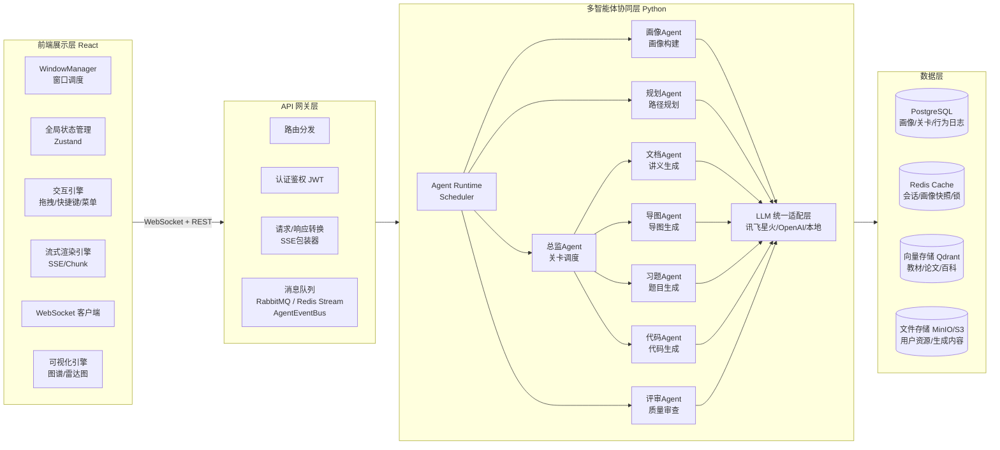

## 1.2 核心设计原则

1. **异步优先**：所有Agent间通信走消息队列，前端与后端之间走WebSocket/SSE，避免同步阻塞
2. **可观测性**：每条Agent消息都携带唯一TraceID，支持全链路追踪
3. **容错降级**：每类Agent都有超时熔断和降级方案，评审不通过可回退重试
4. **无状态Agent**：Agent实例本身无状态，上下文从消息体或Redis中加载，支持水平扩展
5. **Skill优先**：Agent能力的注册与发现基于Skill声明，调度器按Skill匹配而非按Agent类型硬编码
6. **前端局部更新**：任何交互只更新受影响的窗口状态，不刷新全页面

---

# 第二部分：智能体交互详细设计

## 2.1 智能体通信架构

### 2.1.1 通信拓扑

```
 ┌────────────────────────────────────────────────────────┐
 │              核心控制层（Master Agents）                 │
 │  ┌─────────┐    ┌─────────┐    ┌─────────┐             │
 │  │ 画像Agent│    │ 规划Agent│    │ 总监Agent│             │
 │  └────┬────┘    └────┬────┘    └────┬────┘             │
 └───────┼──────────────┼──────────────┼──────────────────┘
         │              │              │
         └──────────────┼──────────────┘
                        │ (pub/sub + rpc)
                ┌───────▼──────────────────────┐
                │     Agent Event Bus          │
                │  (RabbitMQ Topic交换器)       │
                │  routing_key = agent.type.action│
                └───────┬───────┬─────────────┘
                        │       │
 ┌──────────────────────┼───────┼─────────────────────────┐
 │              内容生成层（Sub Agents）                    │
 │  ┌─────────┐ ┌─────────┐ ┌─────────┐ ┌─────────┐      │
 │  │ 文档Agent│ │ 导图Agent│ │ 习题Agent│ │ 代码Agent│      │
 │  └────┬────┘ └────┬────┘ └────┬────┘ └────┬────┘      │
 └───────┼──────────┼──────────┼──────────┼──────────────┘
         │          │          │          │
         └──────────┴────┬─────┴──────────┘
                        │
                ┌───────▼──────────────────────┐
                │       评审Agent              │
                │    （防幻觉/安全审查）         │
                └─────────────────────────────┘

 ┌────────────────────────────────────────────────────────┐
 │              注册与发现层（Registry）                    │
 │  ┌──────────────┐ ┌──────────────┐ ┌──────────────┐    │
 │  │ Agent Registry│ │ Skill Registry│ │ MCP Tool Reg  │    │
 │  │  (Redis)      │ │  (Redis)      │ │  (Redis)      │    │
 │  └──────────────┘ └──────────────┘ └──────────────┘    │
 └────────────────────────────────────────────────────────┘

 ┌────────────────────────────────────────────────────────┐
 │            LLM 统一适配层 (LLM Gateway)                  │
 │       讯飞星火 / OpenAI / 本地模型  — 统一接口             │
 └────────────────────────────────────────────────────────┘
```

### 2.1.2 通信模式

| 模式 | 用途 | 实现 |
|------|------|------|
| **发布/订阅** | 广播事件（如"画像更新了""关卡完成"） | RabbitMQ Topic Exchange / Redis PubSub |
| **工作队列** | 任务分发（如"生成讲义""审查内容"） | RabbitMQ Work Queue + Skill匹配路由 |
| **RPC** | 同步查询（如"获取画像""查询知识库"） | RabbitMQ Direct Reply-To + 超时等待 |
| **流式推送** | 向前端推送生成进度 | WebSocket → SSE 适配层 |
| **MCP Invoke** | Agent间按MCP协议调用对方的工具 | MCP JSON-RPC over 消息队列 |

### 2.1.3 Agent 注册与发现

每个Agent启动时向 **Agent Registry**（基于Redis）注册：

```json
{
  "agent_id": "doc-agent-01",
  "agent_type": "document",
  "agent_version": "1.2.0",
  "status": "idle",
  "queue": "agent.document.work",
  "llm_model": "spark-4.0",
  "max_concurrency": 3,
  "last_heartbeat": "2026-06-18T10:00:00Z",
  "skills": ["skill.doc.generate", "skill.doc.summarize", "skill.doc.collate"],
  "mcp_tools": ["rag.query", "knowledge.retrieve", "template.render"]
}
```

- 心跳间隔：10秒，3次失联标记为下线
- 调度器根据Agent的 `skills` 和当前负载分发任务，而非按 `agent_type` 硬编码
- 支持同一技能注册多个Agent实例，实现负载均衡

### 2.1.4 Skill 技能注册机制

#### 设计目标

将Agent的能力从"按类型硬编码"升级为**按Skill声明式注册**，调度器根据任务的Skill需求动态匹配最合适的Agent。新增Agent只需注册Skill即可接入现有任务流，无需修改调度逻辑。

#### Skill 定义与注册

每个Skill遵循统一Schema，由Agent在启动时声明：

```json
{
  "skill_id": "skill.doc.generate",
  "name": "文档生成",
  "description": "根据知识点描述生成结构化Markdown讲义文档",
  "version": "1.0.0",
  "category": "content_generation",
  "tags": ["document", "markdown", "lecture"],
  "parameters": {
    "type": "object",
    "required": ["knowledge_point", "difficulty"],
    "properties": {
      "knowledge_point": { "type": "string", "description": "知识点名称" },
      "difficulty": { "type": "number", "description": "难度 0.0-1.0" },
      "style": { "type": "string", "enum": ["standard", "detailed", "concise"] }
    }
  },
  "output": {
    "type": "object",
    "properties": {
      "content": { "type": "string", "description": "Markdown格式讲义" },
      "word_count": { "type": "number" }
    }
  },
  "llm_required": true,
  "estimated_duration_ms": 8000
}
```

Agent注册Skill的伪代码：

```python
class BaseAgent:
    async def register_self(self):
        # 注册到 Agent Registry
        await agent_registry.register(agent_id, agent_type, status="idle", ...)
        # 注册所有声明的 Skill
        for skill in self.declare_skills():
            await skill_registry.register(skill)
        # 注册所有声明的 MCP Tool
        for tool in self.declare_mcp_tools():
            await mcp_tool_registry.register(tool)

class DocumentAgent(BaseAgent):
    def declare_skills(self) -> list[SkillDefinition]:
        return [
            SkillDefinition(
                skill_id="skill.doc.generate",
                name="文档生成",
                parameters={...},
                handler=self.handle_generate_doc
            ),
            SkillDefinition(
                skill_id="skill.doc.summarize",
                name="文档摘要",
                parameters={...},
                handler=self.handle_summarize
            ),
        ]
```

#### Skill 注册表数据结构

```json
// Redis Hash: skill:{skill_id}
{
  "skill_id": "skill.doc.generate",
  "name": "文档生成",
  "category": "content_generation",
  "description": "...",
  "parameters_schema": "{...}",       // JSON 序列化后的参数Schema
  "registered_agents": "[\"doc-agent-01\", \"doc-agent-02\"]",
  "total_invocations": 1247,
  "avg_duration_ms": 8200,
  "p99_duration_ms": 15000,
  "fail_rate": 0.02
}

// Redis Set: skill_category:{category}
// member = skill_id
// 用于按类别发现：列出 content_generation 类别的所有Skill
```

#### 基于Skill的任务路由

调度器不再写 `if agent_type == "document" then dispatch`，而是：

```python
class SkillBasedScheduler:
    async def dispatch(self, task: Task):
        # 1. 解析任务所需的 Skill
        required_skill = task.required_skill  # e.g. "skill.doc.generate"

        # 2. 查询 Skill 注册表，获取所有注册了该技能的 Agent
        candidates = await skill_registry.get_agents_for_skill(required_skill)

        # 3. 按负载和亲和度排序
        ranked = self.rank_by_load_and_affinity(candidates, task)

        # 4. 选择最优 Agent
        selected = ranked[0]

        # 5. 分发任务
        await self.send_to_agent(selected.agent_id, task)
```

#### 内置 Skill 清单

| Skill ID | 类别 | 描述 | 默认提供者 |
|----------|------|------|-----------|
| `skill.profile.build` | profile | 初始画像构建 | 画像Agent |
| `skill.profile.update` | profile | 画像维度更新 | 画像Agent |
| `skill.map.generate` | planning | 藏宝图生成 | 规划Agent |
| `skill.map.replan` | planning | 路径重规划 | 规划Agent |
| `skill.map.branch.sleep` | planning | 分支休眠 | 规划Agent |
| `skill.map.sprint` | planning | 突击模式路径抽取 | 规划Agent |
| `skill.level.start` | orchestration | 关卡启动与调度 | 总监Agent |
| `skill.doc.generate` | content_generation | 讲义文档生成 | 文档Agent |
| `skill.doc.summarize` | content_generation | 文档摘要 | 文档Agent |
| `skill.mindmap.generate` | content_generation | 思维导图生成 | 导图Agent |
| `skill.exercise.generate` | content_generation | 分层习题生成 | 习题Agent |
| `skill.code.generate` | content_generation | 代码/Notebook生成 | 代码Agent |
| `skill.review.content` | review | 内容审核与防幻觉 | 评审Agent |
| `skill.resource.parse` | resource | 上传文件解析与OCR | 文档Agent |
| `skill.resource.exercise` | resource | 从资料生成习题 | 习题Agent |

### 2.1.5 MCP 服务注册机制（Tool + Agent 统一暴露）

#### 设计目标

把 MCP（Model Context Protocol）定位为**统一的服务暴露协议**。在这个协议下有两类服务端点：

- **MCP Tool**：无状态、能力单一的原子操作（如"知识库检索"）
- **MCP Agent**：有状态、可维护会话的智能体服务（如"面试对话Agent"）

所有 MCP Server 都遵循同一套 JSON-RPC 2.0 调用协议，都注册到同一个 **MCP Registry**，由 **MCP Client**（内嵌在每个 Agent 中）发现并调用。这样无论调用方需要的是一个简单函数还是一个完整 Agent 能力，**调用形式完全一致**。

#### 两类 MCP Server 的差异

| 维度 | MCP Tool | MCP Agent |
|------|----------|-----------|
| 状态 | 无状态 | 有状态（维护 session / 对话历史 / 中间变量） |
| 协议方法 | `tools/call`（必选）<br>`tools/call_stream`（可选） | `tools/call`（必选）<br>`tools/call_stream`（可选）<br>`agent/resume`（恢复会话）<br>`agent/inspect`（查看状态） |
| 调用语义 | 函数式：输入→输出 | 协作式：可多轮、可中途插话、可注入上下文 |
| 注册示例 | `rag.query`、`template.render` | `interview.agent`、`tutor.agent` |
| 典型使用 | 资源生成、知识查询 | 面试陪练、互动辅导、苏格拉底引导 |

#### MCP Tool 定义

```json
{
  "server_id": "rag.query",
  "server_type": "tool",            // 必填，标识这是 Tool 类服务
  "name": "知识库检索",
  "description": "对权威知识库进行向量检索，返回最相关的N条知识片段",
  "owner_agent": "knowledge-agent-01",
  "version": "1.0.0",
  "tags": ["knowledge", "rag", "retrieval"],
  "input_schema": {
    "type": "object",
    "required": ["query", "top_k"],
    "properties": {
      "query": { "type": "string", "description": "检索查询文本" },
      "top_k": { "type": "integer", "default": 5, "maximum": 20 },
      "filter": { "type": "object", "description": "可选的元数据过滤条件" }
    }
  },
  "output_schema": {
    "type": "array",
    "items": {
      "type": "object",
      "properties": {
        "chunk_id": { "type": "string" },
        "content": { "type": "string" },
        "score": { "type": "number" },
        "source": { "type": "string" }
      }
    }
  },
  "execution": {
    "mode": "sync",
    "timeout_ms": 5000,
    "rate_limit": 100,
    "auth_required": false,
    "idempotent": true
  }
}
```

#### MCP Agent 定义

MCP Agent 是一种**有状态**的 MCP Server。除了输入输出 schema，还声明 session 管理能力。

```json
{
  "server_id": "interview.agent",
  "server_type": "agent",          // 关键差异：标识为 Agent
  "name": "AI 面试官",
  "description": "按预设岗位/难度，与学生进行多轮模拟面试，给出评分和改进建议",
  "owner_agent": "interview-agent-01",
  "version": "1.0.0",
  "tags": ["interview", "dialogue", "assessment"],

  // 启动参数：用于开启新会话
  "start_schema": {
    "type": "object",
    "required": ["student_id", "role"],
    "properties": {
      "student_id":        { "type": "string" },
      "role":              { "type": "string", "description": "目标岗位，如后端/算法/前端" },
      "difficulty":        { "type": "string", "enum": ["easy", "medium", "hard"] },
      "duration_minutes":  { "type": "integer", "default": 30 }
    }
  },
  // 启动响应：返回新会话的标识
  "start_response_schema": {
    "type": "object",
    "properties": {
      "session_id": { "type": "string" },
      "welcome":    { "type": "string", "description": "面试官的初始问候语" }
    }
  },
  // 单轮输入：用户/调用方发送的消息
  "input_schema": {
    "type": "object",
    "required": ["session_id", "message"],
    "properties": {
      "session_id": { "type": "string" },
      "message":    { "type": "string", "description": "学生回答" },
      "context":    { "type": "object", "description": "可选上下文注入" }
    }
  },
  // 单轮输出：Agent 的回复
  "output_schema": {
    "type": "object",
    "properties": {
      "reply":    { "type": "string" },
      "score":    { "type": "number", "description": "当前轮次评分 0-1" },
      "hints":    { "type": "array", "items": { "type": "string" } },
      "is_final": { "type": "boolean", "description": "是否结束面试" }
    }
  },
  // Agent 特有能力
  "agent_capabilities": {
    "supports_stream":         true,
    "supports_resume":         true,
    "supports_inspect":        true,
    "max_turns":               20,
    "max_session_ttl_minutes": 120
  },
  "execution": {
    "mode":          "stream",      // Agent 通常是流式的
    "timeout_ms":    60000,
    "rate_limit":    10,
    "auth_required": true
  }
}
```

#### MCP 调用协议

所有调用走 JSON-RPC 2.0。**Tool 与 Agent 共享 method 前缀** `tools/call`，调用方在 `params.server_id` 中指明目标。

```json
// 1. 调用 Tool（同步模式）
{
  "jsonrpc": "2.0",
  "method": "tools/call",
  "params": {
    "server_id": "rag.query",
    "arguments": {
      "query": "自注意力机制的数学定义",
      "top_k": 3
    }
  },
  "id": "req_001"
}
// 响应
{
  "jsonrpc": "2.0",
  "result": [
    {"chunk_id": "ch_001", "content": "...", "score": 0.95, "source": "教材/transformer/ch3.md"}
  ],
  "id": "req_001"
}

// 2. 调用 Tool（流式）
{
  "jsonrpc": "2.0",
  "method": "tools/call",
  "params": {
    "server_id": "chat.stream",
    "mode": "stream",
    "arguments": { "message": "解释自注意力机制", "session_id": "sess_001" }
  },
  "id": "req_002"
}
// 逐块响应
// {"jsonrpc":"2.0","result":{"chunk":"注意力机制的核心是..."},"id":"req_002"}
// {"jsonrpc":"2.0","result":{"chunk":"为每个词计算..."},"id":"req_002"}
// {"jsonrpc":"2.0","result":{"chunk":"","final":true},"id":"req_002"}

// 3. 调用 Agent（启动新会话）
{
  "jsonrpc": "2.0",
  "method": "tools/call",
  "params": {
    "server_id": "interview.agent",
    "operation": "start",           // Agent 特有：声明操作类型
    "arguments": {
      "student_id": "s1001",
      "role": "后端工程师",
      "difficulty": "medium"
    }
  },
  "id": "req_010"
}
// 响应
{
  "jsonrpc": "2.0",
  "result": {
    "session_id": "interview_sess_001",
    "welcome": "你好，我是面试官张三，今天我们来聊聊后端开发..."
  },
  "id": "req_010"
}

// 4. 调用 Agent（继续会话）
{
  "jsonrpc": "2.0",
  "method": "tools/call",
  "params": {
    "server_id": "interview.agent",
    "operation": "turn",            // 单轮交互
    "arguments": {
      "session_id": "interview_sess_001",
      "message": "请介绍一下 MySQL 的索引原理"
    }
  },
  "id": "req_011"
}

// 5. 恢复 Agent 会话（断线重连）
{
  "jsonrpc": "2.0",
  "method": "agent/resume",
  "params": {
    "server_id": "interview.agent",
    "session_id": "interview_sess_001"
  },
  "id": "req_012"
}

// 6. 查看 Agent 内部状态（调试/审查用）
{
  "jsonrpc": "2.0",
  "method": "agent/inspect",
  "params": {
    "server_id": "interview.agent",
    "session_id": "interview_sess_001"
  },
  "id": "req_013"
}
```

#### MCP Registry 数据结构

统一的注册表按 `server_type` 区分 Tool 和 Agent，但用同一份存储结构：

```json
// Redis Hash: mcp_server:{server_id}  (统一key，type在field中)
{
  "server_id":     "interview.agent",
  "server_type":   "agent",           // 关键：tool | agent
  "name":          "AI 面试官",
  "owner_agent":   "interview-agent-01",
  "input_schema":  "{...}",
  "output_schema": "{...}",
  "execution_mode":"stream",
  "timeout_ms":    60000,
  "tags":          "interview,dialogue"
}

// Redis Set: mcp_type:tool   → 所有 Tool 的 server_id
// Redis Set: mcp_type:agent  → 所有 Agent 的 server_id
// 按类型快速发现：
//   SMEMBERS mcp_type:agent → 列出所有 MCP Agent

// Redis Set: mcp_tag:{tag} → 该 tag 下所有 server_id
// 按标签发现：
//   SMEMBERS mcp_tag:interview → 找到所有与面试相关的服务
```

#### 内置 MCP Server 清单

##### MCP Tool（无状态）

| server_id | 提供者 | 模式 | 描述 |
|-----------|--------|------|------|
| `profile.query` | 画像Agent | sync | 查询当前画像快照 |
| `profile.update` | 画像Agent | sync | 推送画像更新 |
| `knowledge.retrieve` | 知识库服务 | sync | 知识库向量检索 |
| `knowledge.lookup` | 知识库服务 | sync | 按ID查询知识点详请 |
| `template.render` | 文档Agent | sync | Markdown模板渲染 |
| `code.execute` | 代码执行沙箱 | async | 安全执行用户代码并返回结果 |
| `chat.stream` | AI对话服务 | stream | 流式AI对话 |
| `file.store` | 文件服务 | async | 存储生成的文件 |
| `file.serve` | 文件服务 | sync | 提供文件下载URL |
| `mermaid.lint` | 评审Agent | sync | 对单段 mermaid 源码做语法检查，输出错误位置+修复建议（详见 2.5.3） |

##### MCP Agent（有状态）

| server_id | 提供者 | 模式 | 会话能力 | 描述 |
|-----------|--------|------|---------|------|
| `tutor.agent` | 辅导Agent | stream | 多轮答疑 | 上下文感知的个性化辅导，可中途插入讲义引用 |
| `interview.agent` | 面试Agent | stream | 模拟面试 | 多轮对话面试，自动评分与改进建议 |
| `socratic.agent` | 苏格拉底Agent | stream | 引导式提问 | 不直接给答案，通过反问引导学生思考 |
| `code_reviewer.agent` | 代码评审Agent | stream | 逐函数评审 | 接收代码段 → 给出可运行的评审反馈 |
| `language_practice.agent` | 口语陪练Agent | stream | 角色扮演 | 英语/技术名词口语对话陪练（加分项） |

#### 运行时服务发现与调用

```python
class MCPClient:
    """内嵌在每个Agent中的MCP调用客户端"""

    def __init__(self, agent_id: str):
        self.agent_id = agent_id
        self.cache = {}  # server_id → ServerDefinition

    async def discover_servers(
        self,
        server_type: str = None,        # 'tool' | 'agent' | None
        tag: str = None
    ) -> list[ServerDefinition]:
        """发现 MCP 服务"""
        return await mcp_registry.discover(
            server_type=server_type, tag=tag
        )

    async def call(self, server_id: str, arguments: dict, **opts) -> Any:
        """统一调用入口 — Tool 和 Agent 都走这个方法"""
        server_def = await self._resolve(server_id)
        if server_def.server_type == "tool":
            return await self._call_tool(server_def, arguments, **opts)
        elif server_def.server_type == "agent":
            op = opts.get("operation", "turn")  # turn | start | resume
            return await self._call_agent(server_def, op, arguments, **opts)

    async def call_stream(self, server_id: str, arguments: dict) -> AsyncIterator[dict]:
        """流式调用 — 适用于 chat.stream / tutor.agent / interview.agent"""
        server_def = await self._resolve(server_id)
        async for chunk in self._send_stream(server_def, {
            "jsonrpc": "2.0",
            "method": "tools/call",
            "params": {
                "server_id": server_id,
                "mode": "stream",
                "arguments": arguments
            }
        }):
            yield chunk
```

调用示例（调用方代码完全一致）：

```python
# 文档Agent 生成讲义时调用 Tool
chunks = await mcp_client.call("knowledge.retrieve", {
    "query": "自注意力机制", "top_k": 5
})

# 学生在讲义中划词 → 前端调用 Agent
async for chunk in mcp_client.call_stream("tutor.agent", {
    "session_id": "tutor_sess_001",
    "message": "请解释这段代码",
    "context": {"level_id": "lvl_transformer_01", "highlight": "..."}
}):
    push_to_frontend(chunk)
```

#### Skill、MCP Tool、MCP Agent 的三层关系

```
┌──────────────────────────────────────────────────────────────┐
│ 三者的层次关系：                                              │
│                                                              │
│  Skill（能力声明）  ──→  告诉调度器"我用什么能力做任务"           │
│         ↓ 实现                                               │
│  MCP Agent / Tool（实际服务）──→  对外提供可调用的服务         │
│         ↓ 调用                                               │
│  其他 Agent / 前端                                           │
└──────────────────────────────────────────────────────────────┘
```

**区别**：

| 维度 | Skill | MCP Tool | MCP Agent |
|------|-------|----------|-----------|
| 角色 | 能力声明 | 原子服务 | 智能体服务 |
| 状态 | 无 | 无 | 有 |
| 协议 | 注册到 Skill Registry | JSON-RPC `tools/call` | JSON-RPC `tools/call` + `agent/resume` |
| 消费者 | 调度器 | 其他 Agent/系统 | 其他 Agent/前端 |
| 多轮对话 | ❌ | ❌ | ✅（内置 session 机制） |

**联系**：

- 一个 Skill 的实现通常会**调用多个 MCP Server**（Tool 或 Agent）来完成工作
  e.g. `skill.doc.generate` 内部会调用 `knowledge.retrieve`(Tool) + `template.render`(Tool) + `tutor.agent`(Agent，用于审核润色)
- 一个 Agent **既注册 Skill**（供调度器派发任务），**也注册 MCP Server**（供其他 Agent 调用）
- 一个 MCP Server（无论 Tool 还是 Agent）**不注册 Skill**——它只暴露"我被调用的接口"，不参与任务调度分发

## 2.2 消息协议设计

### 2.2.1 统一消息信封

每条在Agent间传递的消息使用统一的JSON信封：

```json
{
  "header": {
    "message_id": "msg_20260618_a1b2c3d4",
    "trace_id": "trace_a1b2c3d4e5f6",
    "parent_message_id": "msg_20260618_z9y8x7w6",
    "source_agent": "planner-agent-01",
    "target_agent": "director-agent-01",
    "message_type": "request",
    "action": "level.start",
    "priority": 5,
    "ttl_ms": 60000,
    "timestamp": "2026-06-18T10:00:00.000Z"
  },
  "payload": { },
  "context": {
    "student_id": "s1001",
    "session_id": "sess_abc123",
    "level_id": "lvl_transformer_01",
    "profile_version": 3,
    "mode": "exploration"
  }
}
```

| 字段 | 说明 |
|------|------|
| `message_id` | 全局唯一消息ID (UUID v4) |
| `trace_id` | 全链路追踪ID，一次用户请求的全部分发共享同一trace_id |
| `parent_message_id` | 父消息ID，用于构建调用链 |
| `message_type` | `request` / `response` / `event` / `error` |
| `action` | 动作名称，Agent据此路由到具体处理函数 |
| `priority` | 优先级(1-10)，队列调度时高优先率先消费 |
| `ttl_ms` | 消息存活时间，超时未消费自动丢弃 |
| `context` | 跨Agent共享的上下文（学生ID、会话ID、模式等） |

### 2.2.2 消息类型定义

| 类型 | 方向 | 说明 |
|------|------|------|
| `request` | A → B | 请求B执行某个动作，B需回复response |
| `response` | B → A | 对request的执行结果回复 |
| `event` | A → Topic | 广播事件通知，无需回复 |
| `error` | 任意方向 | 错误信息，含错误码和可读描述 |

### 2.2.3 Agent间Action清单

| Action | 源Agent | 目标Agent/Skill | 说明 |
|--------|---------|-----------------|------|
| `profile.build` | 前端 | `skill.profile.build` | 请求初始画像构建 |
| `profile.update` | 事件总线 | `skill.profile.update` | 触发画像更新 |
| `profile.get` | 任意Agent | 画像Agent/MCP | RPC查询当前画像快照 |
| `map.generate` | 前端 | `skill.map.generate` | 生成初始藏宝图 |
| `map.replan` | 事件总线 | `skill.map.replan` | 触发路径重新规划 |
| `map.branch.sleep` | 前端 | `skill.map.branch.sleep` | 放弃某分支 |
| `map.branch.activate` | 前端 | `skill.map.branch.activate` | 重新激活休眠分支 |
| `map.sprint` | 前端 | `skill.map.sprint` | 发起突击模式 |
| `level.start` | 前端 | `skill.level.start` | 请求进入关卡并生成资源 |
| `level.resource.generate` | 总监Agent | `skill.doc/mindmap/exercise/code.*` | 按Skill分发资源生成任务 |
| `level.resource.review` | 总监Agent | `skill.review.content` | 请求内容审核 |
| `level.complete` | 前端 | 事件总线 | 通知关卡完成，触发后续更新 |
| `resource.upload` | 前端 | `skill.resource.parse` | 用户上传资源后通知解析 |
| `resource.bind` | 前端 | 总监Agent | 资源绑定到关卡 |
| `resource.summarize` | 前端 | `skill.doc.summarize` | 对上传文件生成摘要 |
| `resource.exercise.generate` | 前端 | `skill.resource.exercise` | 对上传文件生成习题 |

**注**：相较于V1，此清单将目标从"Agent类型"改为"Skill ID"，体现Skill优先的路由策略。调度器见不到Agent类型，只知道需要哪个Skill。

## 2.3 智能体生命周期管理

### 2.3.1 Agent状态机

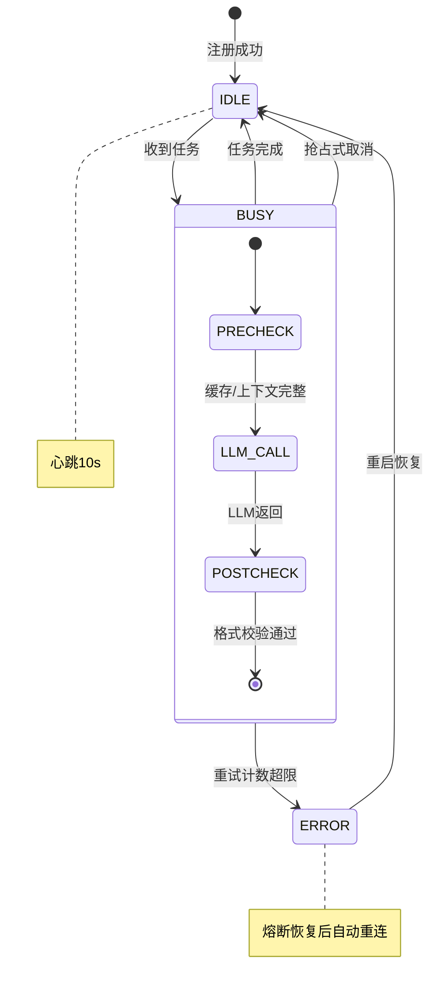

### 2.3.2 重试与熔断

| Agent类型 | 最大重试次数 | 重试间隔 | 熔断阈值 | 熔断恢复时间 |
|-----------|-------------|---------|---------|-------------|
| 文档Agent | 2次 | 指数退避(1s→3s) | 连续5次失败 | 30秒 |
| 习题Agent | 2次 | 指数退避(1s→3s) | 连续5次失败 | 30秒 |
| 代码Agent | 1次 | 2s | 连续3次失败 | 60秒 |
| 导图Agent | 2次 | 指数退避(1s→3s) | 连续5次失败 | 30秒 |
| 评审Agent | 无（幂等） | — | 连续10次失败 | 120秒 |

### 2.3.3 降级策略

当某个Agent熔断或不可用时：

| Agent | 降级方案 |
|-------|---------|
| 文档Agent | 返回知识库中的预置教材文本 + 引用列表，不做AI润色 |
| 习题Agent | 从题库中随机抽取同知识点题目 |
| 代码Agent | 返回代码模板框架 + 参考链接 |
| 导图Agent | 返回知识库预置的层级大纲文本 |
| 评审Agent | 降级为规则过滤（关键词/正则/字数校验），跳过语义审核 |

## 2.4 核心协作流程

### 2.4.1 初次登录 → 画像构建 → 藏宝图生成

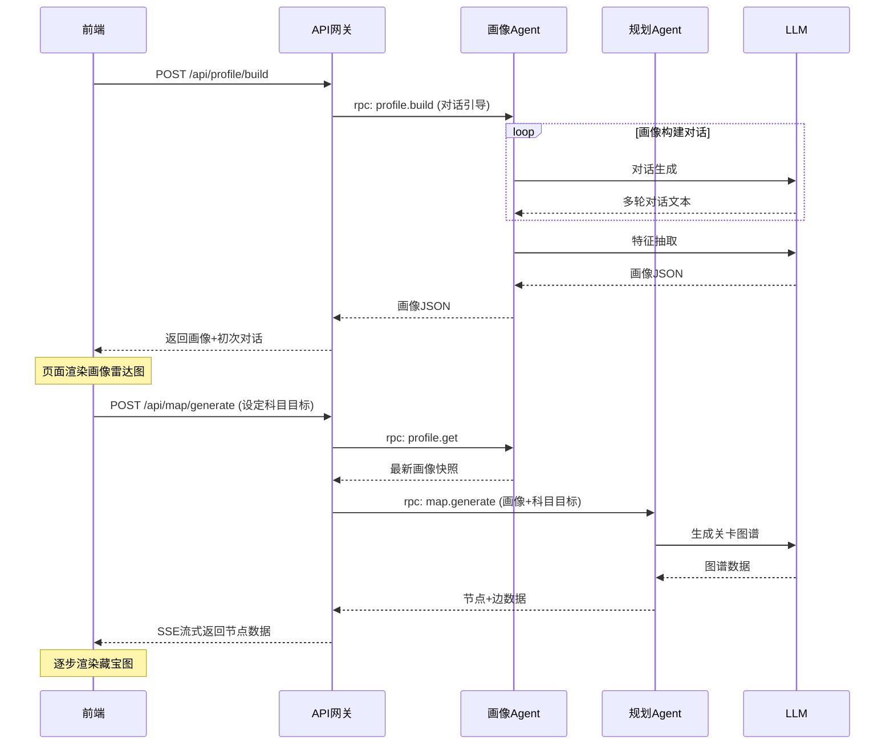

### 2.4.2 右键关卡节点 → 资源生成 → 窗口渲染（核心流程）

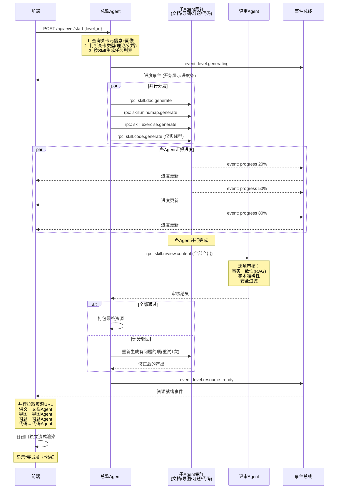

### 2.4.3 关卡完成 → 画像更新 → 藏宝图演化

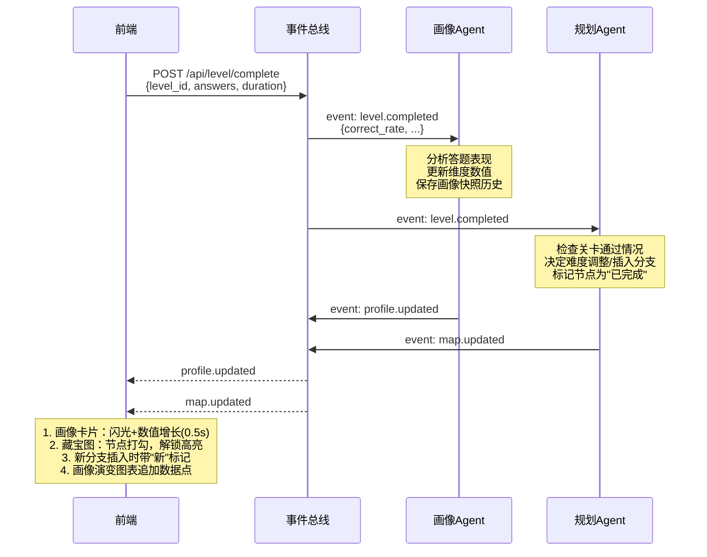

### 2.4.4 突击模式触发

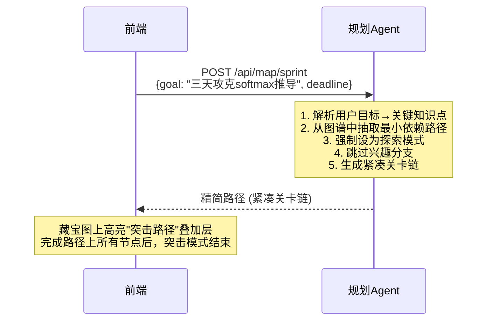

## 2.5 评审Agent审核协议

### 2.5.1 审核流程

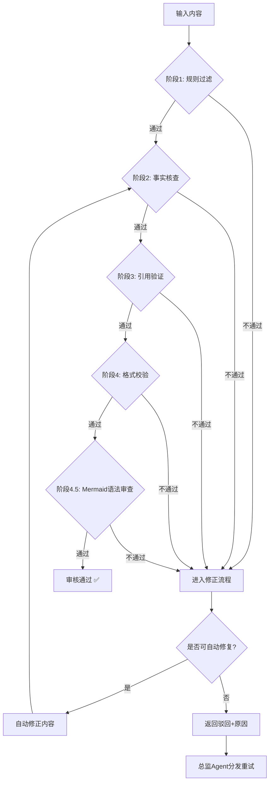

> 阶段 4.5 仅在内容包含 ```mermaid 代码块时触发；纯文本资源直接跳过。

### 2.5.2 审核结果格式

```json
{
  "review_id": "review_20260618_x1y2z3",
  "trace_id": "trace_a1b2c3d4e5f6",
  "status": "passed",
  "items": [
    {
      "item_id": "doc_001",
      "item_type": "document",
      "verdict": "pass",
      "issues": [],
      "confidence": 0.95,
      "citations": [
        {"source": "知识库/transformer/ch3.md", "content": "自注意力机制的定义..."}
      ]
    },
    {
      "item_id": "exer_003",
      "item_type": "exercise",
      "verdict": "fail",
      "issues": [
        {"severity": "error", "description": "题目答案与知识库不符", "detail": "预期B，生成答案为C"}
      ],
      "confidence": 0.3,
      "auto_fix": {
        "fixed": true,
        "changes": ["将答案从C改为B", "更新解析文本"]
      }
    }
  ],
  "summary": {
    "total": 5,
    "passed": 4,
    "auto_fixed": 1,
    "rejected": 0
  }
}
```

### 2.5.3 Mermaid 语法审查（生成式文档的必经环节）

#### 为什么需要单独的 Mermaid 审查

系统大量使用 LLM 生成 Markdown 文档，其中常常内嵌 `mermaid` 代码块。LLM 在生成时容易写出**渲染不出来的 mermaid 源码**——节点标签里带了换行 `Note over X:<br/>`、圆括号节点里嵌套了花括号、菱形 `{}` 被误用为文本容器等。这些错误在前端 GitHub/IDE 渲染时直接抛错，评委看到"parse error"会非常难堪。

因此**评审 Agent 必须在"格式校验"之后追加一道 mermaid 语法审查**，由专门的 MCP Tool 负责。

#### Mermaid 审查的 MCP Tool：`mermaid.lint`

```json
{
  "server_id": "mermaid.lint",
  "server_type": "tool",
  "name": "Mermaid 源码语法审查",
  "description": "解析一段 mermaid 源码，检测语法错误，输出错误位置和修复建议",
  "owner_agent": "review-agent-01",
  "execution_mode": "sync",
  "input_schema": {
    "type": "object",
    "required": ["source"],
    "properties": {
      "source":  { "type": "string", "description": "mermaid 代码块原文" },
      "diagram": { "type": "string", "enum": ["flowchart", "sequence", "state", "class", "er", "gantt", "auto"], "default": "auto", "description": "图类型，auto=自动推断" }
    }
  },
  "output_schema": {
    "type": "object",
    "properties": {
      "valid":      { "type": "boolean" },
      "errors":     { "type": "array", "items": { "$ref": "#/definitions/MermaidError" } },
      "warnings":   { "type": "array", "items": { "$ref": "#/definitions/MermaidError" } },
      "summary":    { "type": "string" }
    }
  }
}
```

输出 `MermaidError` 结构：

```json
{
  "line": 14,
  "column": 18,
  "severity": "error",
  "code": "BR_IN_NODE_TEXT",
  "message": "节点标签内不允许使用 <br/>，请用普通换行或换成可换行形状（如 subgraph 块）",
  "snippet": "    ALL -->|是| DONE[显示完成关卡按钮]    ALL -->",
  "fix_suggestion": "将节点 DONE[显示完成关卡按钮] 改为 DONE[显示完成关卡]  或  拆为两个独立节点"
}
```

调用示例（评审 Agent 在 review 阶段调用）：

```python
# 评审Agent 处理一个 markdown 文档
doc = get_doc_from_buffer(level_id="lvl_001")
for block in extract_mermaid_blocks(doc):
    lint_result = await mcp_client.call("mermaid.lint", {
        "source": block.source,
        "diagram": block.guessed_type
    })
    if not lint_result["valid"]:
        issues.extend([
            Issue(
                item_id=block.id,
                severity=e["severity"],
                description=e["message"],
                fix_suggestion=e["fix_suggestion"]
            )
            for e in lint_result["errors"]
        ])
```

#### 已知错误模式清单（Mermaid 编写规范）

以下为评审 Agent 长期积累的"AI 高频错模式"，会作为 lint 规则内置。生成方（无论是 LLM 还是开发者）写 mermaid 时都应规避：

| 错误码 | 触发条件 | 修复方式 |
|--------|---------|---------|
| `BR_IN_NODE_TEXT` | 节点标签 `[]` 内出现 `<br/>` | 改用 `\n` 换行，或把多行内容拆为子节点 |
| `CURLY_IN_NODE` | 节点标签 `[]` 内出现 `{` 或 `}` | 删除花括号或改用 `()` 包裹节点 |
| `DIAMOND_TEXT_MISUSE` | 用 `{...}` 写普通文字（解析器认为这是菱形判断） | 改用 `["..."]` 矩形节点 |
| `SUBGRAPH_NO_END` | `subgraph ... end` 块没闭合 | 检查并补上 `end` |
| `UNCLOSED_QUOTE` | 标签里出现成对 `"` 但解析失败 | 把 `"` 替换为 `'`，或全角 `""` |
| `INVALID_ARROW` | 使用 `-->` 之外的非法箭头语法 | 改为 `-->`, `---`, `-.->`, `==>` |
| `STATE_SYNTAX` | stateDiagram-v2 中写了 `Note over X:<br/>...` | 改用普通节点链：`X --> NOTE[内容] --> Y` |
| `SEQUENCE_ACTOR_DUP` | sequenceDiagram 重复定义 actor | 删除重复的 `participant` 行 |

#### LLM 生成 Prompt 中的强制要求

在文档生成 Agent（文档Agent、规划Agent 等）的 system prompt 中，必须注入以下规范，让 LLM **在生成时就避免错误**：

```
【Mermaid 编写铁律】
1. 节点文本严禁包含 <br/>，需要换行请直接换行（多行字符串）
2. 节点文本严禁包含 { } " 这三个字符，需要时使用全角或替换词
3. 圆角节点 ()、矩形 []、菱形 {}、六角形 {{}}、圆形 (( ))，按语义选对形状
4. 任何 subgraph 必须有配对的 end
5. 箭头只用 -->、---、-.->、==> 四种，其他不写
6. sequenceDiagram 里所有 Note 写在一行内，禁止 <br/>
7. stateDiagram 里禁止 Note over ...: 语法，改用普通节点链
8. 渲染前先在脑中模拟：把所有 <br/>、花括号、引号都删掉能否跑通
```

#### 文档生成的端到端审查流程

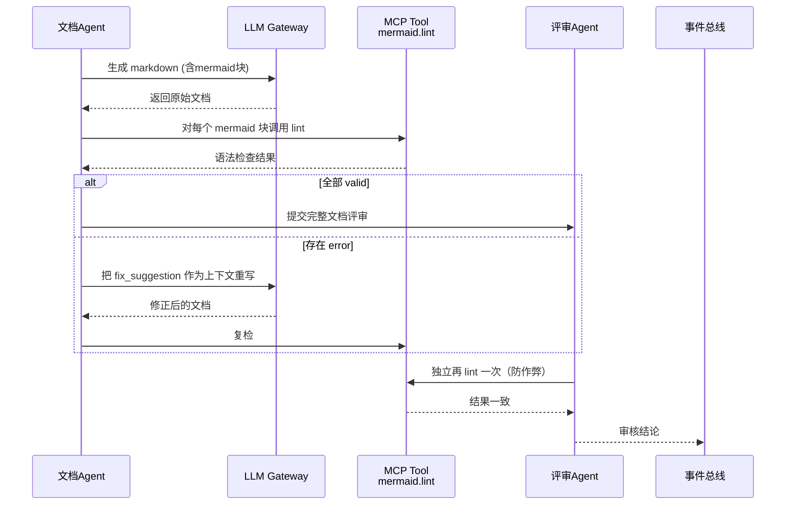

**关键设计**：
- 文档Agent **生成时**先自查，评审Agent **审查时**再查一次（独立验证）
- 评审 Agent **不直接修改文档**（如用户要求"只检测不修复"），只输出修复建议
- 修复动作由文档Agent或运维Agent根据 `fix_suggestion` 执行
- 全部通过后才允许前端展示

#### 客户端渲染保障

由于评审 Agent 负责守好"语法正确"这一关，前端在展示 AI 生成的 mermaid 块时只需做轻量兜底：

| 渲染端 | 兜底策略 |
|--------|---------|
| GitHub / IDE | 原生 mermaid 渲染，评审 Agent 已确保语法正确 |
| 自研 Web 阅读器 | 使用 mermaid.js v10+，捕获 `mermaid.parseException`，失败时降级为带"图示渲染失败，请参见上方文字描述"提示的占位块 |
| 文档打印 / 导出 PDF | 评审通过后导出，绕过客户端问题 |

## 2.6 超时与降级策略

| 场景 | 超时阈值 | 动作 |
|------|---------|------|
| 子Agent生成资源 | 15秒 | 返回当前已生成的部分，标记缺失项为"生成失败—使用预置内容" |
| 评审Agent审核 | 10秒 | 跳过语义审核，仅保留规则过滤结果 |
| 画像Agent对话回复 | 5秒 | 返回"正在思考…"占位符，继续等待（对话通道保持打开） |
| 规划Agent路径调整 | 8秒 | 退化为基于规则的简单调整（仅修改难度标记，不重新规划拓扑） |
| LLM调用 | 30秒（总时长） | 熔断，切换到备用模型或降级 |
| MCP Tool调用 | 按Tool定义（默认5秒） | 返回超时错误，调用方自行降级 |

## 2.7 用户资源注入后的Agent协作变更

当用户将"我的资源库"中的文件拖拽绑定到关卡节点后，资源生成流程发生以下变更：

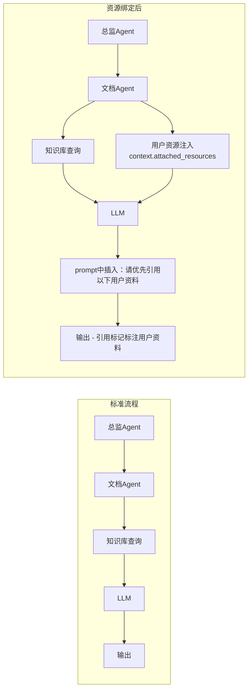

**具体变更点**：

1. **总监Agent**在创建资源生成任务时，从关卡绑定记录中查询关联资源，将文件摘要/全文片段注入到每个子Agent的 `context` 中
2. **文档Agent**：prompt中加入"用户提供了以下资料，请优先引用并基于这些资料组织讲解"，LLM输出时引用标记会标注"用户资料"
3. **习题Agent**：优先从用户资料中提取知识点出题
4. **评审Agent**：对引用用户资料的内容放宽"来源验证"要求（用户资料不在知识库中，但属于可信私域内容）

---

# 第三部分：页面交互逻辑详细设计

## 3.1 全局状态管理

使用 **Zustand** 管理前端全局状态。状态切片如下：

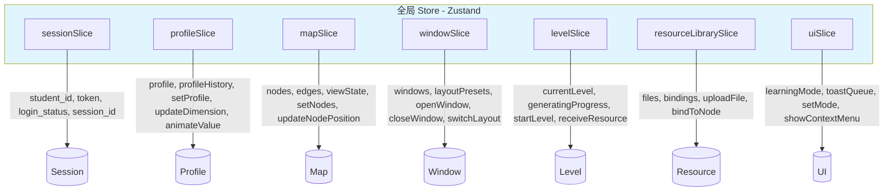

### 3.1.1 状态更新原则

1. **单向数据流**：用户操作 → dispatch action → 更新 store → React re-render
2. **局部订阅**：每个窗口订阅自己的切片，不触发全树渲染
3. **乐观更新**：拖拽节点位置先更新本地store，再异步持久化
4. **可追溯**：所有状态变更打上 timestamp，存入 action log（用于调试和回放）

## 3.2 窗口管理器（Window Manager）

### 3.2.1 窗口状态模型

```typescript
interface WindowState {
  id: string;                    // 唯一ID: 'window_doc_001'
  appId: AppId;                  // 应用标识: 'document' | 'exercise' | 'chat' | ...
  title: string;                 // 窗口标题
  position: { x: number; y: number };
  size: { width: number; height: number };
  zIndex: number;                // 层级
  minimized: boolean;            // 是否最小化
  maximized: boolean;            // 是否最大化
  contentState: Record<string, any>;  // 窗口内部状态（如翻滚位置、当前页码）
  metadata: {
    levelId?: string;            // 关联的关卡ID
    resourceId?: string;         // 关联的资源ID（如当前查看的讲义ID）
    transient?: boolean;         // 是否为临时窗口（自动关闭阈值）
  }
}

type AppId = 'treasure_map' | 'chat' | 'document' | 'exercise'
           | 'code_editor' | 'notebook' | 'mind_map'
           | 'resource_library' | 'dashboard';
```

### 3.2.2 窗口管理器核心逻辑

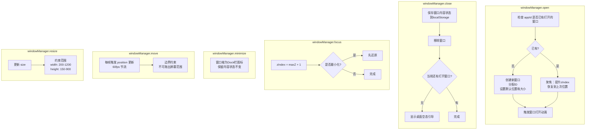

### 3.2.3 窗口层级管理

z-index 分配策略：

| 层级 | z-index 范围 | 说明 |
|------|-------------|------|
| 桌面背景 | 0 | — |
| Dock栏 | 100 | — |
| 最小化图标区域 | 200 | — |
| 普通窗口 | 1000-5000 | 每个新窗口取当前最大+10 |
| 拖拽中窗口 | +1000 | 临时提升 |
| 上下文菜单 | 9999 | — |
| Toast/通知 | 10000 | — |
| AI对话悬浮窗 | 11000 | 始终在最前 |

### 3.2.4 窗口布局快照

布局快照用于"一键切换布局"功能：

```typescript
interface LayoutSnapshot {
  id: string;                    // 'reading' | 'practice' | 'coding'
  label: string;                 // '阅读模式' | '刷题模式' | '代码实验模式'
  icon: string;                  // '📖' | '✏️' | '💻'
  isCustom: boolean;             // true = 用户自定义覆盖，false = 系统预设
  windows: Array<{
    appId: AppId;
    position: { x: number; y: number };
    size: { width: number; height: number };
    metadata?: Partial<WindowState['metadata']>;
  }>;
}
```

## 3.3 核心页面交互状态机

### 3.3.1 桌面主界面状态机

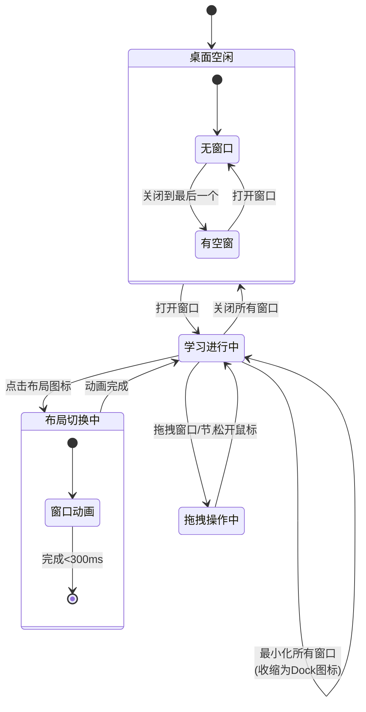

### 3.3.2 资源生成状态机（关键交互）

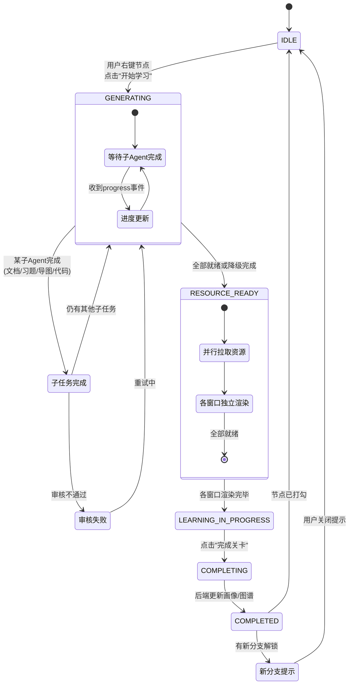

### 3.3.3 藏宝图交互状态机

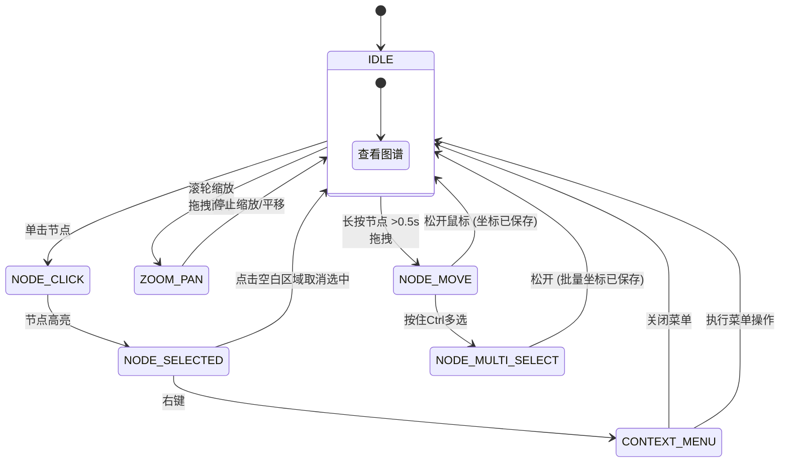

## 3.4 右键菜单系统

### 3.4.1 菜单数据模型

```typescript
interface ContextMenuState {
  visible: boolean;
  position: { x: number; y: number };
  items: ContextMenuItem[];
  targetType: 'map_node' | 'file' | 'text_selection' | 'window_title';
  targetId: string | null;
}

type ContextMenuItem = SeparatorItem | ActionItem | SubmenuItem;

interface ActionItem {
  type: 'action';
  label: string;
  icon?: string;
  shortcut?: string;         // 快捷键显示
  disabled?: boolean;
  action: () => void;
  danger?: boolean;          // 危险操作用红色
}

interface SeparatorItem {
  type: 'separator';
}

interface SubmenuItem {
  type: 'submenu';
  label: string;
  icon?: string;
  items: ContextMenuItem[];
}
```

### 3.4.2 各场景右键菜单

**藏宝图节点右键**：
```
┌──────────────────────────┐
│ 📖 开始学习               │
├──────────────────────────┤
│ ⭐ 标记为重点              │
│ 🏷️ 添加到今日计划          │
├──────────────────────────┤
│ 📄 查看详情               │
│ 💤 放弃此分支     (兴趣分支)│
│ 🔄 重新激活分支  (休眠节点) │
├──────────────────────────┤
│ 📎 关联资源...             │
└──────────────────────────┘
```

**我的资源库 - 文件右键**：
```
┌──────────────────────────┐
│ 📂 关联到关卡...           │
├──────────────────────────┤
│ 📝 生成该文件的习题        │
│ 📋 总结该文件内容          │
├──────────────────────────┤
│ 🏷️ 编辑标签               │
│ ❌ 删除文件       (红色)   │
└──────────────────────────┘
```

**文本选中后右键（任意窗口内）**：
```
┌──────────────────────────┐
│ 🤖 问AI: 解释选中内容     │
│ 🤖 问AI: 生成图解         │
│ 🤖 问AI: 提供相似例题     │
├──────────────────────────┤
│ 📝 添加到笔记             │
│ 📌 高亮/标注               │
└──────────────────────────┘
```

### 3.4.3 右键菜单触发与关闭

```
触发：
  → 节点上 contextmenu 事件（原生右键）
  → 阻止默认浏览器菜单
  → 计算菜单位置（考虑视口边界，自动调整方向）
  → 设置 visible=true, 渲染菜单

关闭：
  → 点击菜单项 → 执行 action → visible=false
  → 点击菜单外部区域 → visible=false
  → 按 Escape → visible=false
  → 再次右键 → 旧菜单关闭，新菜单弹出
```

## 3.5 拖拽交互系统

### 3.5.1 三类拖拽场景

| 场景 | 触发 | 行为 | 关联数据 |
|------|------|------|---------|
| **窗口拖拽** | 拖拽窗口标题栏 | 移动窗口位置 | windowSlice.moveWindow() |
| **节点拖拽** | 长按藏宝图节点>0.5s后拖动 | 改变节点视觉坐标 | mapSlice.updateNodePosition() |
| **资源绑定** | 从资源库拖拽文件到藏宝图节点 | 建立绑定关系 | resourceLibrarySlice.bindToNode() |

### 3.5.2 节点拖拽实现细节

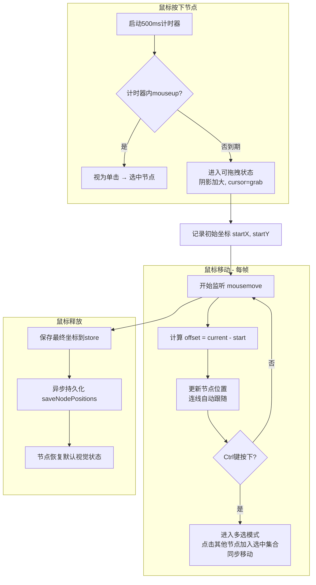

### 3.5.3 资源绑定拖拽实现细节

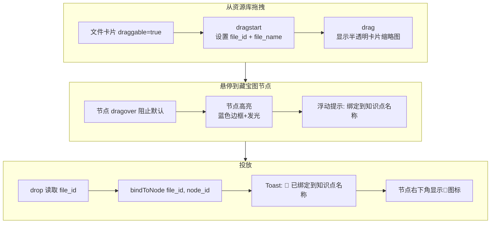

### 3.5.4 拖拽边界与性能

```
边界约束：
  节点拖拽：不可超出画布边界（留20px内边距）
  窗口拖拽：窗口至少保留标题栏在屏幕可见范围内
  多选拖拽：以选中集合的包围盒为整体施加边界约束

性能优化：
  - 拖拽中使用 transform: translate(X, Y) 而非修改 left/top
  - mousemove 事件用 requestAnimationFrame 节流
  - 拖拽结束前不触发 store 持久化（仅在 mouseup 时写入）
```

## 3.6 流式渲染协议

### 3.6.1 WebSocket 事件通道

```
WebSocket 连接路径: /ws/student/{student_id}

消息格式 (所有消息遵循统一信封):
{
  "type": "event_type",
  "trace_id": "trace_xxx",
  "payload": { },
  "timestamp": "2026-06-18T10:00:00.000Z"
}
```

### 3.6.2 资源生成事件流

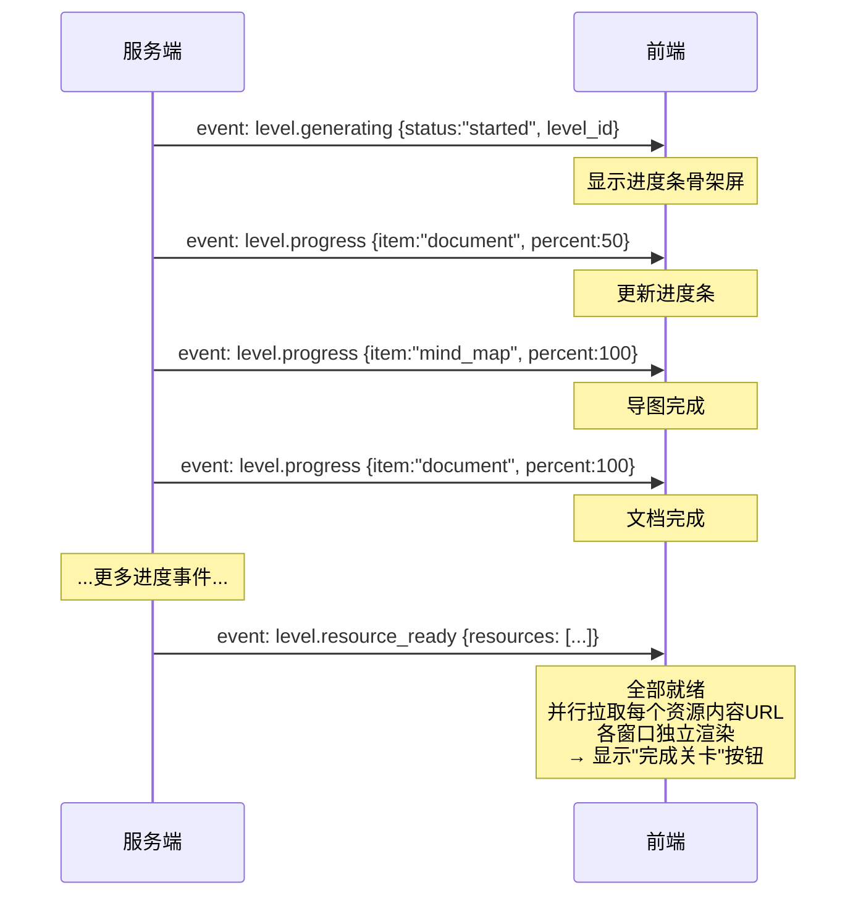

### 3.6.3 AI对话流式输出

AI对话通过独立的 WebSocket 或 SSE 通道：

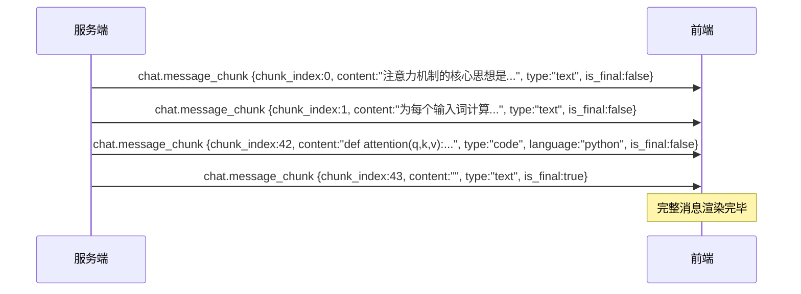

### 3.6.4 流式渲染管线

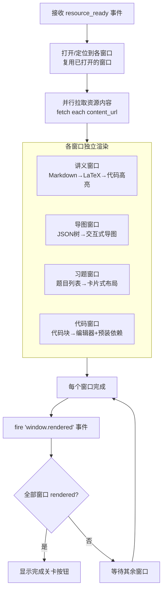

## 3.7 布局切换状态流转

### 3.7.1 切换流程

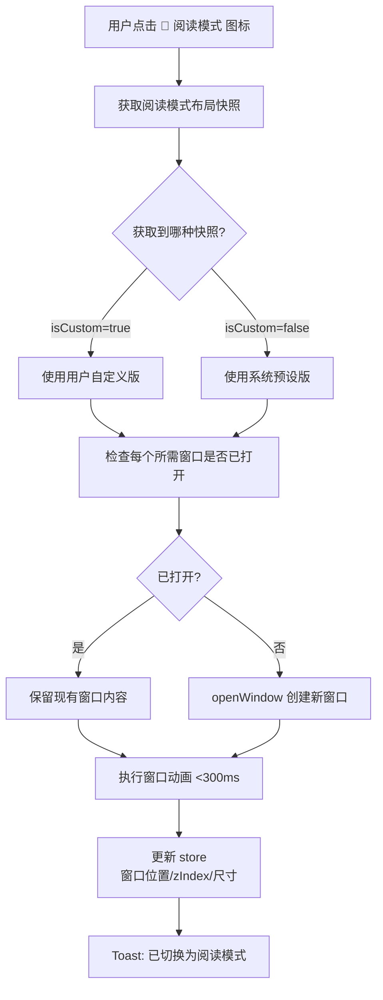

### 3.7.2 自定义保存流程

```mermaid
flowchart TD
    HOLD[用户长按 📖 图标]

    T0[0ms: 开始计时]
    T300[300ms: 图标周围出现环形进度反馈]
    T1500[1500ms: 环形进度80%<br/>图标轻微震动]
    T2000[2000ms: 计时到期]

    HOLD --> T0 --> T300 --> T1500 --> T2000

    T2000 --> DIALOG[弹出确认框<br/>是否将当前布局保存为阅读模式？]

    DIALOG --> YES{点击?}
    YES -->|是| SAVE[读取当前所有窗口<br/>appId, position, size]
    SAVE --> OVERWRITE[覆盖 localStorage 中的快照<br/>isCustom = true]
    OVERWRITE --> TOAST[Toast: ✅ 阅读模式已更新]

    YES -->|否| CANCEL[关闭确认框<br/>不做修改]
    YES -->|Escape| CANCEL
```

### 3.7.3 布局切换与窗口内容的隔离

```
重要原则：布局切换只改变窗口的位置和尺寸，不改变窗口内部内容。

实现方式：
  - 窗口组件的 key 使用 appId + levelId 复合键（如 "document|transformer_01"）
  - 布局切换只触发 position/size props 变更
  - 窗口内部 contentState 保持在 store 中，切换时复用

示例：
  用户在"transformer_01"关卡的讲义中翻到第5页
  → contentState: {document|transformer_01: {scrollY: 2400, currentPage: 5}}
  → 切换到阅读模式 → 讲义窗口移到左侧
  → 内容仍然在第5页，scrollY=2400
  → 再切换回刷题模式 → 讲义窗口回到原来的位置和大小
  → 内容还是第5页（进度不丢失）
```

## 3.8 键盘快捷键系统

### 3.8.1 快捷键注册机制

```typescript
interface ShortcutRegistry {
  [key: string]: {
    handler: () => void;
    description: string;        // 显示在快捷键帮助面板中
    scope?: string;             // 'global' | 'treasure_map' | 'code_editor' | ...
    enabled?: () => boolean;    // 条件启用
  }
}
```

### 3.8.2 快捷键映射表

| 快捷键 | 作用域 | 功能 | 说明 |
|--------|--------|------|------|
| `Ctrl+K` | global | 唤起AI对话悬浮窗 | 聚焦输入框 |
| `Ctrl+1` | global | 切换阅读模式 | 等同于点击📖图标 |
| `Ctrl+2` | global | 切换刷题模式 | 等同于点击✏️图标 |
| `Ctrl+3` | global | 切换代码实验模式 | 等同于点击💻图标 |
| `Ctrl+S` | global | 保存当前笔记 | 仅在笔记本窗口打开时生效 |
| `Ctrl+F` | global | 在当前窗口内搜索 | 委托给窗口内部搜索组件 |
| `Ctrl+Shift+F` | global | 全局搜索 | 打开搜索对话框 |
| `Ctrl+Z` | notebook | 撤销笔记编辑 | 仅笔记本窗口聚焦时 |
| `Ctrl+Enter` | exercise | 提交当前习题答案 | 仅习题窗口聚焦时 |
| `Escape` | global | 关闭顶层弹窗/菜单 | 递归关闭：菜单→对话框→侧栏 |
| `?` | global | 打开快捷键帮助面板 | 显示所有快捷键 |

### 3.8.3 作用域管理

```
快捷键的"作用域"决定了哪些快捷键在当前上下文中生效：

global (始终有效) → Ctrl+K, Ctrl+1/2/3, Escape, ?

当藏宝图窗口聚焦时 → 额外注册:
  Ctrl+F → 藏宝图内搜索节点名
  Ctrl+Shift+Z → 撤销节点移动

当代码编辑器聚焦时 → 额外注册:
  Ctrl+Enter → 运行代码 (覆盖全局行为)
  Ctrl+S → 保存代码片段 (覆盖全局行为)

作用域优先级：当前聚焦窗口 > 全局
```

## 3.9 前端事件总线

### 3.9.1 事件列表

| 事件名 | 触发者 | 消费者 | 说明 |
|--------|--------|--------|------|
| `window.opened` | WindowManager | 各窗口订阅者 | 窗口打开时广播 |
| `window.closed` | WindowManager | 各窗口订阅者 | 窗口关闭时广播 |
| `window.focused` | WindowManager | 快捷键系统 | 聚焦窗口变更时更新快捷键作用域 |
| `layout.changed` | WindowManager | 动画系统 | 布局切换完成时广播 |
| `level.started` | levelSlice | 资源渲染引擎 | 开始生成关卡资源 |
| `level.progress` | WebSocket | 进度条组件 | 资源生成进度更新 |
| `level.ready` | WebSocket | 窗口渲染系统 | 资源就绪，开始填充内容 |
| `level.completed` | levelSlice | 画像更新监听器 | 关卡完成触发后续更新 |
| `profile.updated` | WebSocket | 画像卡片组件 | 画像变更后触发动画 |
| `profile.animated` | 画像卡片 | — | 动画完成后触发（供测试用） |
| `map.updated` | WebSocket | 藏宝图组件 | 图谱变更后触发重绘 |
| `map.node.moved` | 藏宝图组件 | 持久化服务 | 节点位置变更后触发保存 |
| `resource.bound` | resourceLibrarySlice | 藏宝图组件 | 资源绑定后更新节点图标 |
| `mode.changed` | uiSlice | 全局组件 | 学习模式切换后广播 |
| `shortcut.triggered` | 快捷键系统 | 帮助面板 | 快捷键触发时记录（用于帮助面板高亮） |

### 3.9.2 事件总线接口

```typescript
// 使用 mitt 实现轻量级事件总线
import mitt from 'mitt';

type Events = {
  'window.opened': WindowState;
  'window.closed': { windowId: string };
  'layout.changed': LayoutSnapshot;
  'level.progress': { levelId: string; item: string; percent: number };
  'profile.updated': Profile;
  'map.updated': { nodes: LevelNode[]; edges: Edge[] };
  'mode.changed': 'exploration' | 'proficiency';
  // ... (其余事件)
};

const eventBus = mitt<Events>();

// 发布
eventBus.emit('level.progress', { levelId: 'lvl_001', item: 'document', percent: 100 });

// 订阅
eventBus.on('level.progress', (data) => { /* 更新进度条 */ });

// 取消订阅
eventBus.off('level.progress', handler);
```

## 3.10 用户偏好持久化

系统自动记录的用户偏好数据存放在 `localStorage`：

```typescript
interface UserPreferences {
  version: 2;                                // 数据版本号（用于迁移）
  // 窗口布局偏好：学习模式窗口组合
  windowPreferences: {
    [theoryLevelAutoOpen]: {
      document: true,
      mind_map: false,                        // 用户连续关闭导图3次 → 默认不开
      exercise: true
    },
    [practiceLevelAutoOpen]: {
      document: true,
      code_editor: true,
      terminal: true
    }
  };
  // 窗口位置记忆
  windowPositions: {
    [windowId: string]: { width, height, x, y }
  };
  // 自定义布局快照
  customLayouts: {
    [layoutId: string]: LayoutSnapshot
  };
  // 学习模式记忆
  lastLearningMode: 'exploration' | 'proficiency';
  // 其他设置
  settings: {
    fontSize: 14,
    theme: 'light',
    autoSaveInterval: 30,
    showProfileAnimation: true
  };
}
```

---

# 第四部分：接口设计

## 4.1 WebSocket 事件表

### 客户端 → 服务端

| 事件类型 | 载荷 | 说明 |
|---------|------|------|
| `chat.message` | `{session_id, content}` | 发送AI对话消息 |
| `chat.typing` | `{session_id}` | 用户正在输入指示器 |

### 服务端 → 客户端

| 事件类型 | 载荷 | 说明 |
|---------|------|------|
| `level.generating` | `{level_id, status: "started"}` | 资源生成启动 |
| `level.progress` | `{level_id, item, percent}` | 资源生成进度 |
| `level.resource_ready` | `{level_id, resources[]}` | 所有资源就绪 |
| `profile.updated` | `{profile, trigger_event?}` | 画像更新通知 |
| `map.updated` | `{nodes, edges, changes[]}` | 藏宝图变更通知 |
| `chat.message_chunk` | `{session_id, chunk_index, content, content_type, is_final}` | AI回复流式推送 |
| `notification` | `{type, title, message}` | 系统通知（如新分支解锁、模式变更） |

## 4.2 REST API 端点

| 方法 | 路径 | 说明 |
|------|------|------|
| POST | `/api/profile/build` | 初始画像构建 |
| GET | `/api/profile/{student_id}` | 获取当前画像 |
| GET | `/api/profile/{student_id}/history` | 获取画像演变历史 |
| PUT | `/api/profile/{student_id}/dimension` | 手动编辑画像维度 |
| POST | `/api/map/generate` | 生成初始藏宝图 |
| GET | `/api/map/{student_id}` | 获取当前藏宝图数据 |
| PUT | `/api/map/node/position` | 保存节点位置 |
| POST | `/api/map/branch/sleep` | 放弃某分支 |
| POST | `/api/map/branch/activate` | 重新激活分支 |
| POST | `/api/map/sprint` | 发起突击模式 |
| POST | `/api/level/start` | 启动关卡资源生成 |
| GET | `/api/level/{level_id}/resources` | 获取已生成的资源内容 |
| POST | `/api/level/complete` | 关卡完成上报 |
| POST | `/api/resource/upload` | 上传文件到资源库 |
| POST | `/api/resource/bind` | 绑定资源到关卡 |
| POST | `/api/resource/summarize` | 对资源生成摘要 |
| POST | `/api/resource/generate-exercise` | 对资源生成习题 |
| GET | `/api/dashboard/overview` | 获取学习仪表盘数据 |
| PUT | `/api/preferences` | 保存用户偏好 |

---

# 第五部分：数据模型

## 5.1 核心数据结构

### 画像

```json
{
  "student_id": "s1001",
  "dimensions": {
    "knowledge_base": 0.65,
    "visual_preference": 0.8,
    "analytic_style": 0.5,
    "goal_employment": 0.9,
    "error_prone_type": "conceptual",
    "focus_duration": 25
  },
  "tags": ["Python熟练", "数学较好", "注意力分散"],
  "last_updated": "2026-06-18T10:00:00Z",
  "history": [
    {"timestamp": "2026-06-18T09:00:00Z", "dimensions": {...}, "trigger": "init"},
    {"timestamp": "2026-06-18T10:00:00Z", "dimensions": {...}, "trigger": "level_complete:transformer_01"}
  ],
  "edit_log": [
    {"timestamp": "2026-06-18T10:30:00Z", "field": "tags", "old": "注意力分散", "new": "注意力集中", "source": "manual"}
  ]
}
```

### 藏宝图节点

```json
{
  "id": "lvl_transformer_01",
  "name": "自注意力机制",
  "type": "theory",
  "difficulty": 0.7,
  "estimated_minutes": 45,
  "status": "unlocked",
  "position": {"x": 320, "y": 240},
  "dependencies": ["lvl_word_embedding"],
  "children": ["lvl_multi_head", "lvl_transformer_block"],
  "branch_type": "core",
  "branch_status": "active",
  "resources": [
    {"type": "document", "generated_id": "doc_001"},
    {"type": "mind_map", "generated_id": "map_001"},
    {"type": "exercise", "generated_id": "exer_001"}
  ],
  "bound_files": ["file_001", "file_002"],
  "completion_data": {
    "attempts": 1,
    "best_score": 0.85,
    "completed_at": null,
    "time_spent_minutes": 0
  }
}
```

### 窗口快照

```json
{
  "window_id": "window_doc_001",
  "app_id": "document",
  "title": "自注意力机制 - 讲义",
  "position": {"x": 50, "y": 100},
  "size": {"width": 600, "height": 500},
  "z_index": 1010,
  "minimized": false,
  "maximized": false,
  "content_state": {
    "level_id": "lvl_transformer_01",
    "resource_id": "doc_001",
    "scroll_position": 1200,
    "current_page": 3
  }
}
```

### 资源绑定

```json
{
  "file_id": "file_001",
  "file_name": "Transformer论文笔记.pdf",
  "file_type": "pdf",
  "file_size": 2048576,
  "uploaded_at": "2026-06-18T10:00:00Z",
  "summary": "本文详细解释了Transformer架构中的自注意力机制...",
  "tags": ["期末考试重点", "Transformer"],
  "bound_to_levels": ["lvl_transformer_01", "lvl_multi_head"],
  "parsed_status": "completed",
  "parsed_content_url": "/parsed/file_001_content.json"
}
```

## 5.2 本地存储模型

前端使用 `localStorage` + `IndexedDB` 实现离线兼容和缓存：

| 存储键 | 存储位置 | 内容 | 策略 |
|--------|---------|------|------|
| `profile_cache` | localStorage | 最新画像快照 | 每次更新时覆盖 |
| `map_cache` | localStorage | 最新藏宝图数据 | 每次更新时覆盖 |
| `user_preferences` | localStorage | 用户偏好设置 | 每次变更时写入 |
| `window_states` | localStorage | 窗口位置/尺寸 | 窗口关闭时写入 |
| `chat_history_{session}` | IndexedDB | AI对话历史 | 每轮对话追加 |
| `resource_cache_{level}` | IndexedDB | 关卡资源内容 | 资源就绪后缓存，关卡完成可清除 |
| `action_log` | IndexedDB | 用户操作日志（用于错误重放） | 每次操作追加，上限1000条 |

---

> 文档结束。本详细设计规格说明书与《个性化学习多智能体系统需求规格说明书 V2.0》配套使用，前者聚焦"做什么"，后者聚焦"怎么做"。
